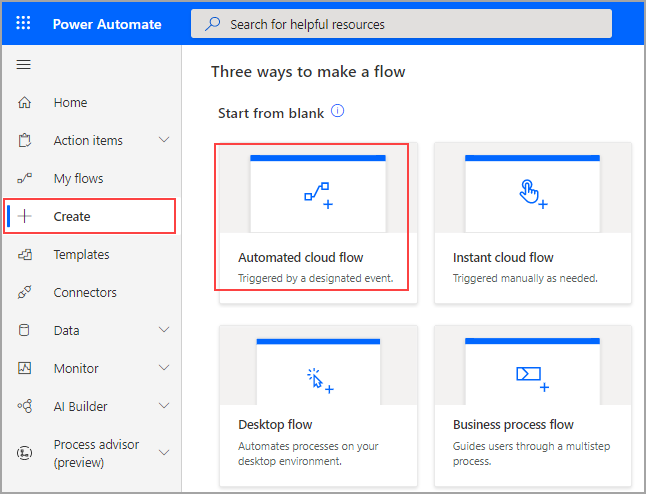
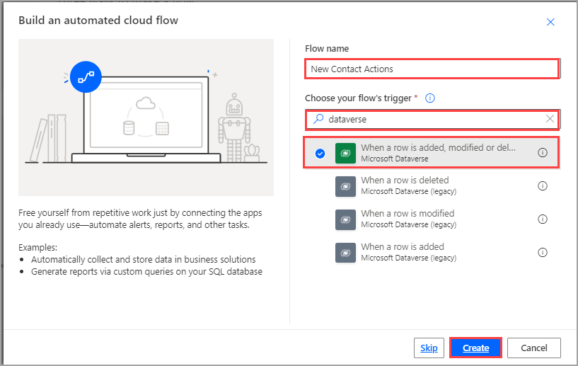
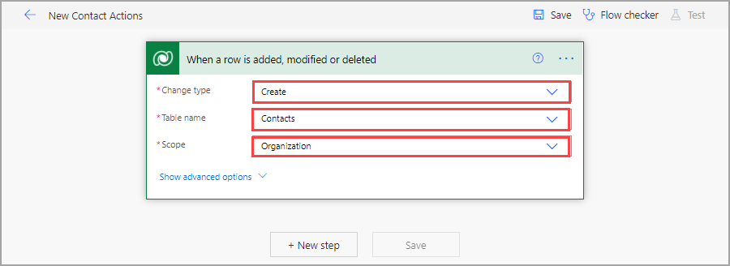

Many scenarios exist in which you would benefit from integrating your data with other programs. To consider the concepts of integration through Power Automate, consider a scenario where you've acquired a new customer. Business relationships are important for any company, but some businesses are built on them. In this scenario, you want to be alerted immediately when a contact is added to your database so that you can act on it. The first step is to create a flow and assign a trigger.

Begin in [Power Automate](http://www.powerautomate.com/?azure-portal=true). Select **Create** and then **Automated cloud flow**.

> [!div class="mx-imgBorder"]
> 

Name your flow and then search for and select the **When a row is added, modified, or deleted** trigger, which will trigger the flow when a row is added to a table in Dataverse. Select **Create**.

> [!div class="mx-imgBorder"]
> 

Configure your trigger with the **Change type**, **Table name**, and **Scope** parameters. The **Change type** parameter allows you to specify what type of change on a row will trigger your flow. The environment will be whichever environment that you are building your flow in. Environments are like buckets to help organize tables, flows, apps, and more. Dataverse is built on Common Data Model, a standardized data schema of more than 250 tables that fit most business needs to help companies organize data between applications. The **Scope** parameter allows you to specify when the flow runs, according to the owner of the record. 

For this flow, select **Create** for the **Change type**, select **Contacts** for the **Table name**, and then select **Organization** as the **Scope**.

> [!div class="mx-imgBorder"]
> 

Now that you've configured a trigger for your flow, you can continue to learn how to act on it.
