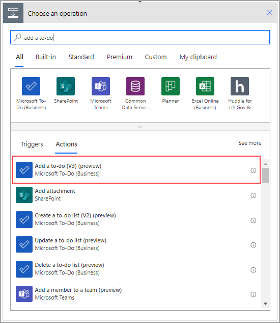

Acquiring a new contact is an excellent accomplishment, but you need to take more action on this information. When you explore a new business relationship, you need to complete many tasks, such as adding the new contact on LinkedIn and sending a personalized email. This unit explores how to integrate Dataverse with another program: Microsoft To Do.

Select **New step**. Search for and select **Add a to-do (V3)**.

> [!div class="mx-imgBorder"]
> 

Select the list that you want to update. Microsoft To Do already comes with a list called **Tasks** that you'll use in this scenario. The **Title** field is the only required field, but by using a combination of text and dynamic content, you can set all available fields.

> [!div class="mx-imgBorder"]
> 

You can add more to-do actions by repeating the previous steps.
