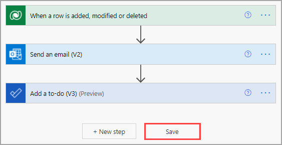
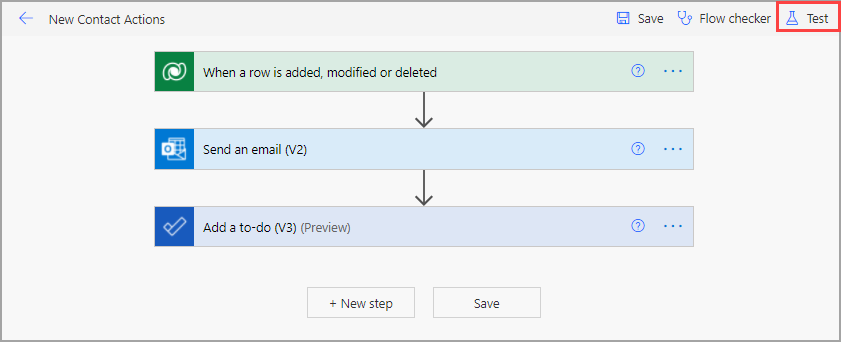
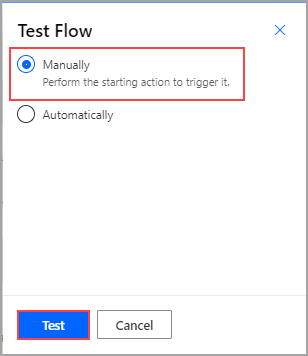
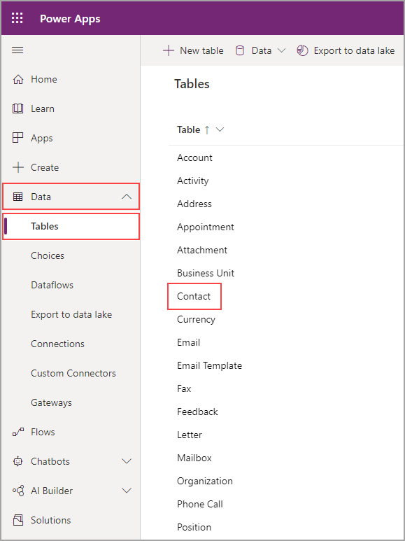
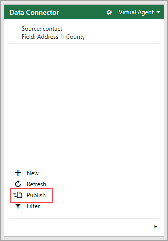
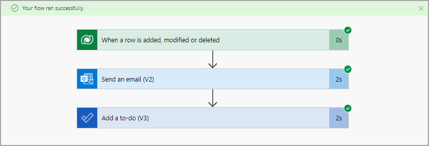
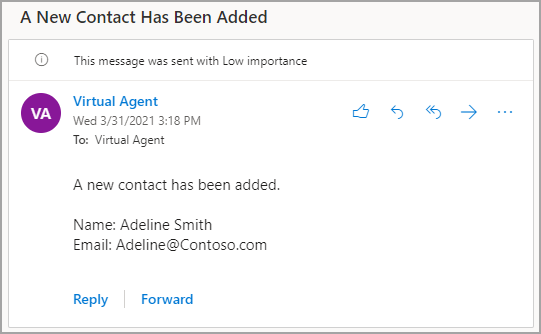
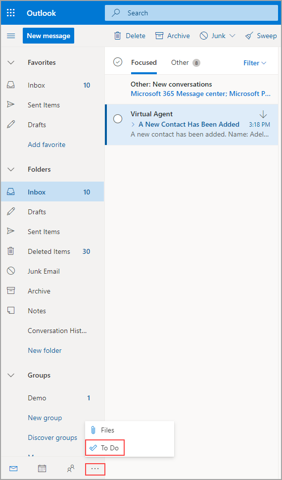
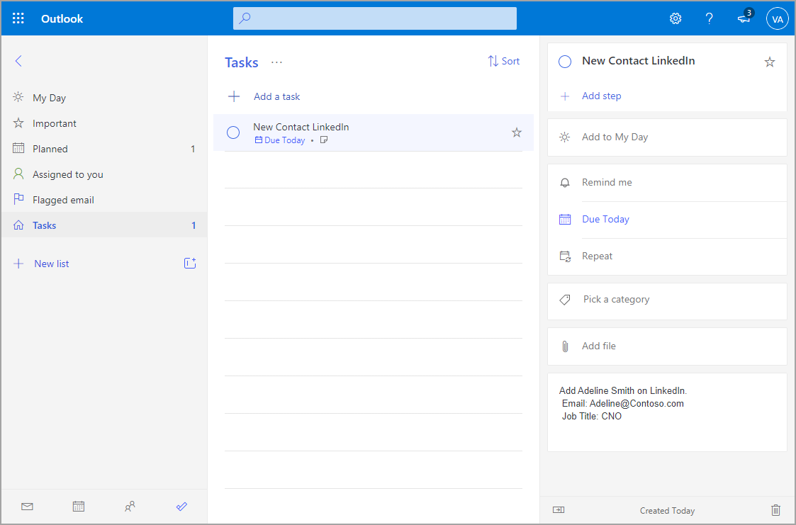

Now that you have a useful flow, it's time to test it.

Start by selecting **Save**.

> [!div class="mx-imgBorder"]
> 

Select **Test** in the upper-right corner.

> [!div class="mx-imgBorder"]
> 

If you would have triggered the flow previously, you could test automatically. However, because this is the first time that you're initiating the flow, you need to test it manually. Select the **Manually** option and then select **Test**.

> [!div class="mx-imgBorder"]
> 

Next, you need to add a record to the table. In a new tab, go [Power Apps](https://make.powerapps.com/?azure-portal=true) and select **Data** and then **Tables**. You can search for the table that you want or select **Contact**.

> [!div class="mx-imgBorder"]
> 

Select **Data > Edit data in Excel**.

> [!div class="mx-imgBorder"]
> 

Sign in and add at least one row of data. No need to add every field, but try to add at least the first name, last name, job title, and email address. These fields are referenced in the flow. When you're done, select **Publish**.

> [!div class="mx-imgBorder"]
> 

Switch to the **Power Automate** tab to check on your flow. You should have a success message.

> [!div class="mx-imgBorder"]
> 

Check your inbox in Outlook. You should have a new email.

> [!div class="mx-imgBorder"]
> 

Select the ellipsis (**...**) in the lower-left corner and then select **To Do**.

> [!div class="mx-imgBorder"]
> 

A new to-do action will display under the list that you specified.

> [!div class="mx-imgBorder"]
> 

Now, you know how to take actions on data that is held in Dataverse.
