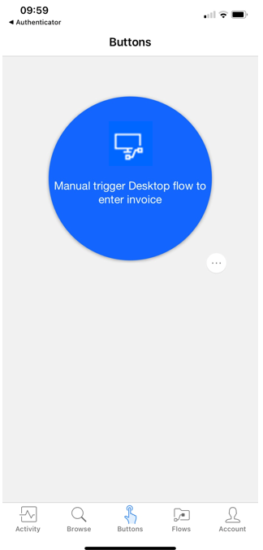

Because you won't be able to see the flow run, it's important that you go to your desktop app and note its current state, whether you write down the most recent ID number or the last line in a Microsoft Excel sheet. Whatever actions your desktop flow performs should make notable impact.

If you are signed in to and using the machine that will run the desktop flow, make sure that you save your work, close out of all programs, and then sign out. If you are running the desktop flow on a virtual machine, ensure that the virtual machine is still running. Sign in to another device to trigger the flow or do so from the Power Automate app on your phone.

> [!div class="mx-imgBorder"]
> 

After the flow has completed, sign in to your device again and ensure that the unattended desktop flow ran properly.
