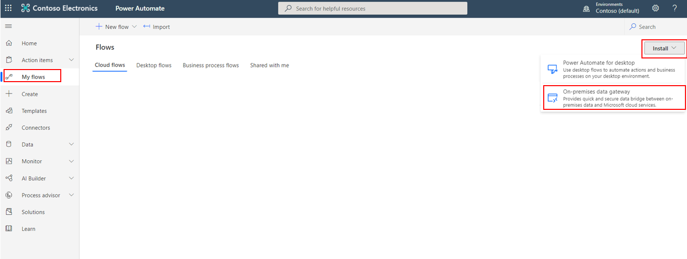
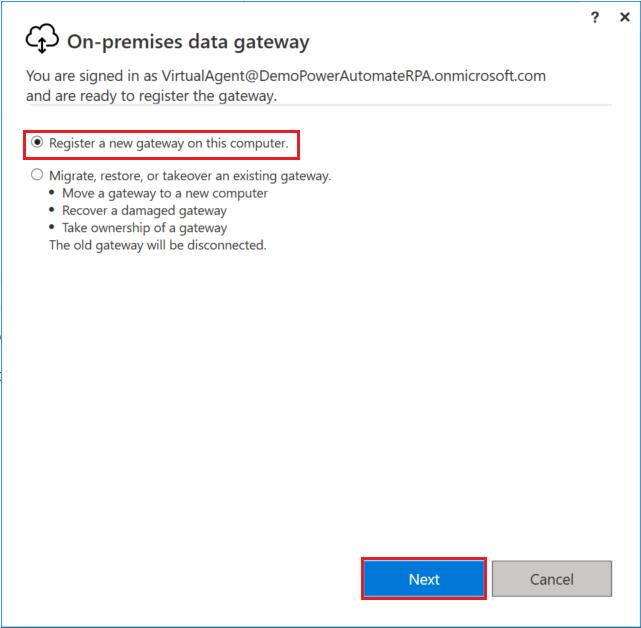
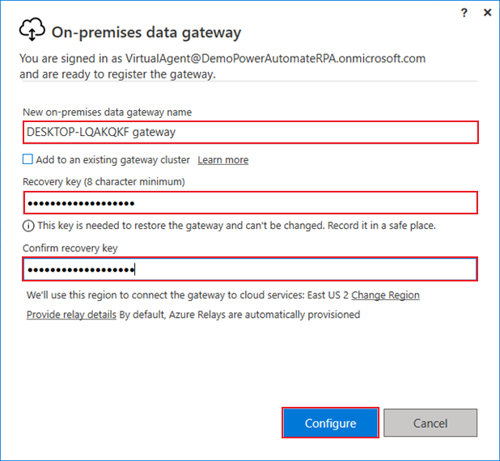

Cloud flows use an API as a bridge to send information back and forth to data sources and issue commands. You can use this method with Power Automate to send emails, grab files, and generate approvals. Desktop flows are contained on your desktop and can't be accessed through API. For these flows, you need to create a gateway. A gateway allows services in the cloud, such as Outlook, to connect to and trigger events and information that are located on your specific desktop. You will need to define a gateway for any desktop that you will be using to run desktop flows.

Go to [Power Automate](https://flow.microsoft.com/?azure-portal=true) and select **My flows > Install > On-premises data gateway**.

> [!div class="mx-imgBorder"]
> 

When the download completes, select the file to open and run the installer. After completing installation, enter your email address to sign in. Next, select the **Register a new gateway on this computer** option and then select **Next**.

> [!div class="mx-imgBorder"]
> 

Choose a name for your gateway. The recommended name is the name of your computer followed by the word *gateway*. Next, choose a recovery key. Keep this key in a safe location so that you can use it later to recover your gateway, if necessary. Select **Configure**.

> [!div class="mx-imgBorder"]
> 

Your data gateway is installed and ready to use, and you can close out of the dialog box.
