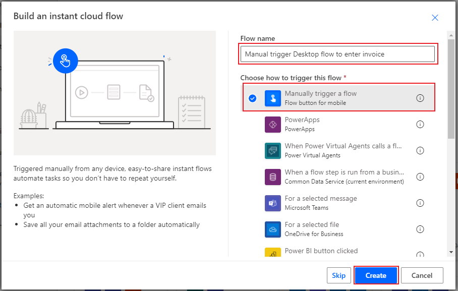
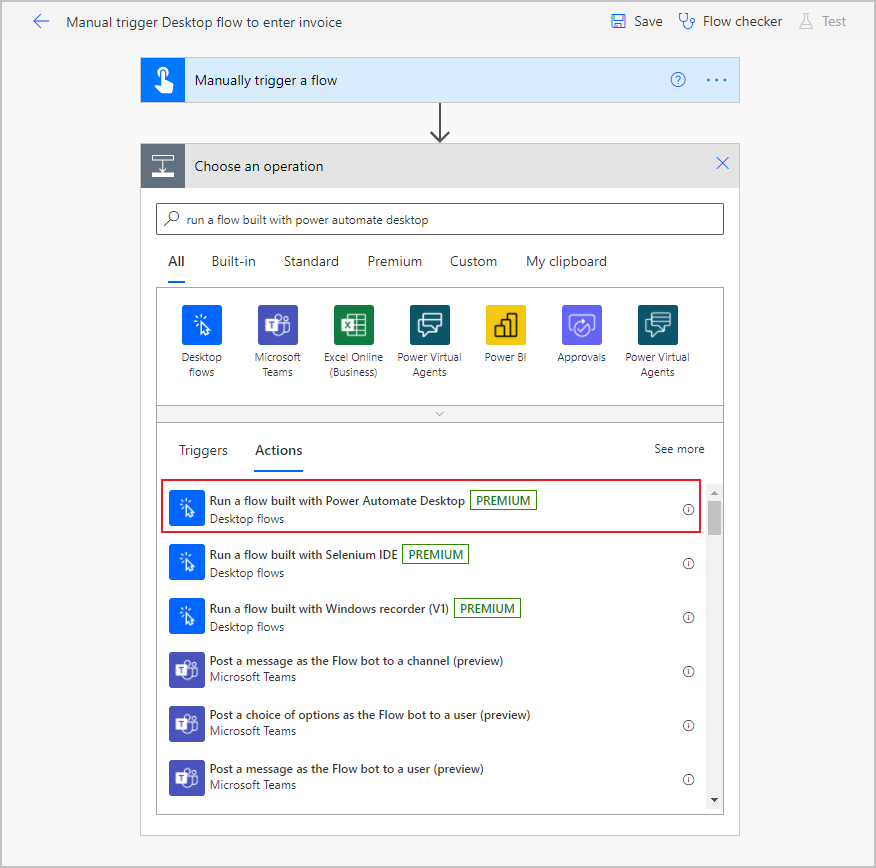
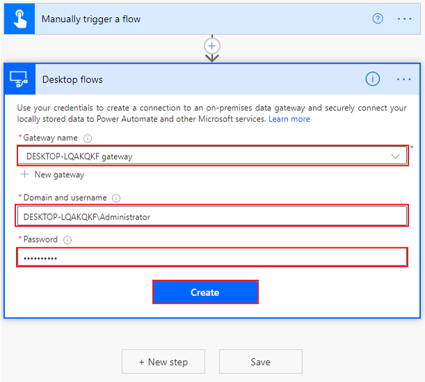

Now that you've established a gateway connection and built a desktop flow, it's time to build a cloud flow with which to connect. Cloud flows are stored and run on the cloud, as opposed to desktop flows, which are stored and run on a desktop. Cloud flows have the advantage of hundreds of predefined connections with thousands of triggers and actions at your disposal. However, desktop flows can work in desktop programs without a predefined connection or existing actions. Both flows have their benefits. By combining these two types of flows, you'll gain the benefits of both.

To begin creating your cloud flow, open [Power Automate](https://flow.microsoft.com/?azure-portal=true) and select **My flows > Cloud flows**.

> [!div class="mx-imgBorder"]
> 

Next, select **New flow > Instant cloud flow**.

> [!div class="mx-imgBorder"]
> 

Name your flow. The following screenshot shows the name as "Manual trigger Desktop flow to enter invoice." Select the **Manually trigger a flow** option and then select **Create**.

> [!div class="mx-imgBorder"]
> 

When the screen changes to the flow builder, select **New step** and then search for and select **Run a flow built with Power Automate for desktop**.

> [!div class="mx-imgBorder"]
> 

In the **Gateway name** drop-down menu, select the gateway that you defined in the previous unit.

If you can't find your gateway, you might need to delete this step and re-create the gateway to refresh the list. If your gateway still doesn't appear, you might need to restart the gateway on your PC and then retry the process.

The next two fields request your credentials to sign in to your computer. If you're unsure what to enter in the **Domain and username** field, you can open a command prompt window by opening the **Start** menu in the taskbar, entering **CMD** in the search box, and then pressing the **Enter** key. When the command prompt opens, enter **Set user** and then press the **Enter** key.

Several lines of code will appear. Separate the **user domain** and the **username** with a backslash (\), as shown in the following screenshot. Select **Create**.

> [!div class="mx-imgBorder"]
> 

Now you've configured the basic connection to your desktop from your cloud flow. The next unit will configure the specific desktop flow that you previously created.
