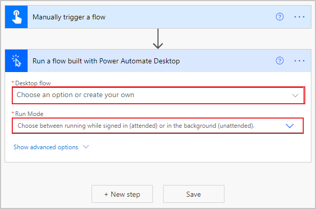
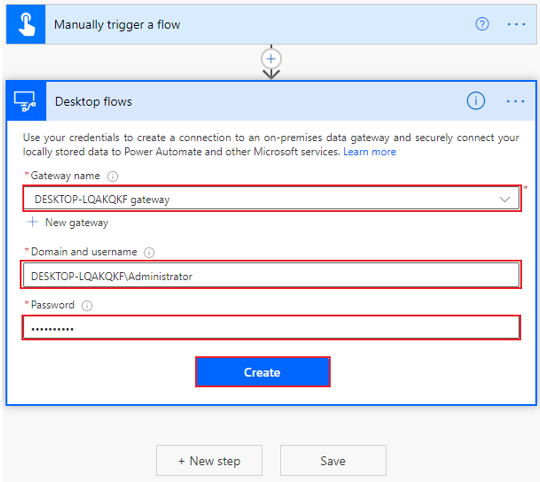

After you have connected to your desktop, Power Automate will prompt you for information that is specific to your desktop flow. From the **Desktop flow** drop-down menu, select the name of your desired flow, and then in the **Run Mode** drop-down menu, select **Attended - Runs when you're signed in**.

> [!div class="mx-imgBorder"]
> 

When you have chosen your desktop flow, input variables that you have defined in your flow will be requested. The following screenshot shows that the invoice flow requests an **Amount**, a **Contact email**, and an **Account name** to feed into the Contoso Invoicing app. Enter placeholders in these fields to test your flow before connecting it to other data sources such as Teams, Outlook, or SharePoint. **Save** your flow.

> [!div class="mx-imgBorder"]
> 

Now that you have configured your desktop connection and created a cloud flow to trigger your desktop flow and provide inputs, you can test that everything is functioning properly.
