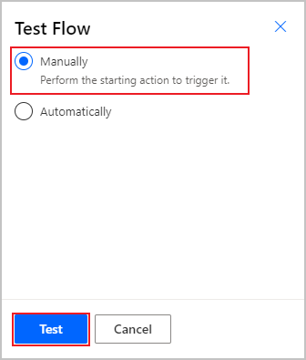
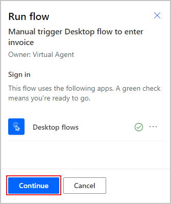
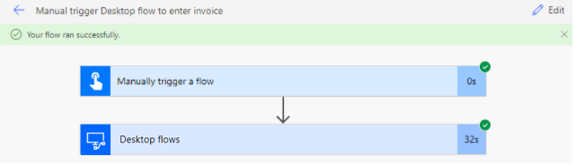

The simplest way to build robotic process automation (RPA) is to take one small step at a time and then build and test that step. First, you created the desktop flow to perform actions on the invoicing app. Next, you created the input and output variables, or the information that would change every time that the flow ran. Then, you configured a gateway and built a cloud flow that will allow you to connect to other resources that exist in your organization. Now, you will test these connections to ensure that everything is performing as expected.

Select **Test** in the upper-right corner of the screen, select the **Manually** option, and then select **Test**.

> [!div class="mx-imgBorder"]
> 

After a moment, a green check mark should appear by your flow to indicate that it's ready for testing. Select **Continue**.

> [!div class="mx-imgBorder"]
> 

Select **Run flow** and **Done** to watch your flow at work. The flow will appear with indications on each step to show your flow's progress. Avoid interacting with your mouse or keyboard while the flow is running because it might interrupt the process. When testing is complete, the following screen will indicate that your flow ran successfully.

> [!div class="mx-imgBorder"]
> 

Now, you have completed the process to build a cloud flow and connect it to a desktop flow through a gateway.
