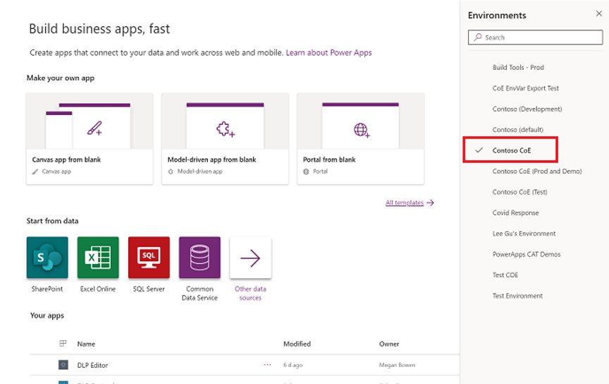
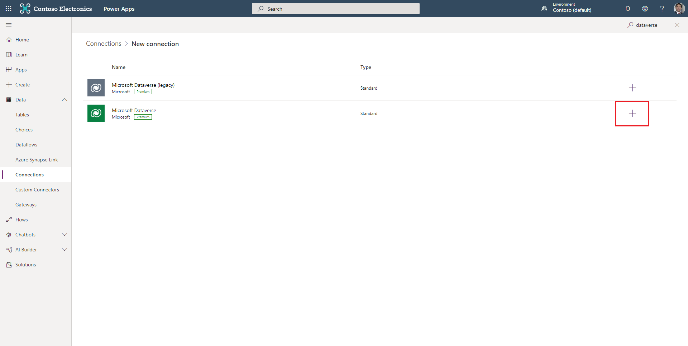

Core components are set up to sync all your resources from Microsoft Power Platform into tables to get more visibility into the apps, flows, and makers that exist in your environment. The core components contain assets that are relevant to admins only.

The following information is available for each app: 

-   Display name

-   App ID

-   Environment

-   Owner

-   Created on

-   Modified on

-   Published on

-   Last launched on (if collecting audit log information is configured)

-   App plan classification (standard, premium, extended)

-   Shared users

-   Shared groups

-   Shared with tenant (yes/no)

-   App type (canvas, model-driven, SharePoint form app)

-   App orphaned

PowerApps Connector represents a standard or custom connector. The following information is available for each connector:

-   Connector ID

-   Display name

-   Icon background color and URI

-   Is custom connector (yes/no)

-   Maker (for custom connectors)

-   Publisher

-   Tier (standard/premium)

Maker represents a user who has created an app, flow, custom connector, or environment. The following information is available for each maker (retrieved from Microsoft 365 user profiles):

-   Display name

-   ID

-   Email (user principal name)

-   City

-   Country

-   Department

-   Job title

-   Office

-   Number of apps (rollup)

-   Number of flows (rollup)

Audit Log represents session details for Power Apps. The following information is available for each audit log entry:

-   Operation (launched app, deleted app, deleted flow)

-   App/cloud flow ID

-   User city, country, department, job title (from Microsoft 365)

-   Audit log event time

With Power BI reports, you can get a holistic view of Dataverse data with visualizations and insights for Environments, Apps, Flows, Connector, Connection Reference, Maker, and Audit Log tables.

> [!div class="mx-imgBorder"]
> 

## Import the solution

Importing the solution is a required installation process that helps ensure that all non-core components in the starter kit work. You'll need to create an environment in which to set up the CoE.

1.  Download the [CoE Starter Kit compressed file](https://aka.ms/CoeStarterKitDownload).

	> [!IMPORTANT]
	> Extract the zip file after downloading and before moving on to the next step. The CoE Starter Kit compressed file contains all solution components and non-solution aware components that make up the CoE Starter Kit.
	> For more information, see [Set up core components](/power-platform/guidance/coe/setup-core-components).

1.  Create an environment in which to set up the CoE.

	1.  Go to Microsoft Power Platform admin center.
	
	1.  Select **Environments > + New**, and then enter a name, type, and purpose.
	
	1.  Select **Yes** for creating the database and then select **Next**.
	
	1.  Leave Sample apps and data set to **No**.
	
	1.  Select **Save**.

1.  Go to your new environment.

    1.  Go to make.powerapps.com.

    1.  Go to the environment that you created where the CoE solution will be hosted. The example in the following screenshot shows that you are importing to the environment named **Contoso CoE**.

        > [!div class="mx-imgBorder"]
		> 

1.  Create connections to all connectors that are used as part of the solution.

	1.  Go to **Data > Connections**.
	
	1.  Select **+ New Connection**.
	
	1.  Select **Dataverse**.
	
		> [!div class="mx-imgBorder"]
		> 
	
	1.  Select **Create**.
	
	1.  Complete the same steps for the following connectors:
	
		-   Dataverse (legacy)
		
		-   Power Apps for Admins
		
		-   Power Apps for Makers
		
		-   Power Platform for Admins
		
		-   Power Automate for Admins
		
		-   Power Automate Management (select **First Party** for authentication type)
		
		-   Office 365 Users
		
		-   Office 365 Outlook
		
		-   Office 365 Groups
		
		-   SharePoint (select **Connect directly (cloud-services)**)
		
		-   Microsoft Teams (preview)

		-   HTTP with Azure AD (use **https://graph.microsoft.com/** for the Base Resource URL and the Azure AD Resource URI)

			> [!div class="mx-imgBorder"]
			> 

1.  On the left pane, select **Solutions**.

1.  Select **Import > Browse**.

1.  Select the Center of Excellence core components solution from File Explorer (CenterOfExcellenceCoreComponents_x_x_x_xx_managed.zip).

1.  When the compressed (.zip) file has been loaded, select **Next**.

1.  Review the information and then select **Next**.

	> [!div class="mx-imgBorder"]
	> 

1. Establish connections to activate your solution. If you create a new connection, select **Refresh**. You won't lose your import progress.

1. Update environment variable values. The environment variables are used to store application and flow configuration data with data that is specific to your organization or environment. As a result, you only need to set the value once for each environment, and it will be used in all necessary flows and apps in that environment. All flows in the solution depend on all environment variables that are being configured.

1. Configure the following variables for the core components solution and then select **Save**. (If you need to change the value of an environment variable after you import the solution, go to Update environment variables.)

	|     Name                                     |     Current Value                                                                                                                                                                                                                                                  |
	|----------------------------------------------|--------------------------------------------------------------------------------------------------------------------------------------------------------------------------------------------------------------------------------------------------------------------|
	|     Power   Automate environment variable    |     For a US   environment: [https://us.flow.microsoft.com/manage/environments/](https://us.flow.microsoft.com/manage/environments/?azure-portal=true)         For an EMEA environment: [https://emea.flow.microsoft.com/manage/environments/](https://emea.flow.microsoft.com/manage/environments/?azure-portal=true)            For a GCC   environment: [https://gov.flow.microsoft.us/manage/environments/](https://gov.flow.microsoft.us/manage/environments/?azure-portal=true)          |
	|     Admin eMail                              |     Email address   that is used in flows to send notifications to admins; this should be either your   email address or a distribution list                                                                                                                               |
	|     Also Delete from CoE                              |     Recommend Yes here to delete objects from the CoE inventory when they are deleted from the tenant. No will keep a record that an app or flow existed in the past.                                                                                                                               |
	|     Approval Admin                              |     The email address used in flows to send approvals to admins; this cannot be a distribution list.                                                                                                                               |
	|     Community URL                             |     Link to your internal Microsoft Power Platform community (for example, Yammer or Teams).                                                                                                                               |
	|     Developer Compliance Center URL                              |     Leave empty on Import and do the following to populated after set up of the Governance components.    Navigate to the details page of the Developer Compliance Center (canvas app) included with this solution, and copy the web link (to launch the app) and paste it into this variable.                                                                                                                               |
	|     Environment Request Admin App Url                              |     Link to the Admin - Power Platform Resource RMS canvas app included in this solution. Leave empty on Import and fill it in once the app is installed.  To do that, navigate to the details page of the Admin - Power Platform Resource RMS (canvas app) included with this solution, and use the web link (to launch the app).                                                                                                                        
	|     PowerApp Maker environment variable                              |     The maker URL used by PowerApps for your cloud, including trailing slash. Here are examples: For a US environment: [https://make.powerapps.com](https://make.powerapps.com)  For a GCC environment: [https://make.gov.powerapps.us](https://make.gov.powerapps.us)  For a GCC High environment: [https://make.high.powerapps.us/](https://make.high.powerapps.us/)                                                                                                                               |
	|     PowerApp Player environment variable                              |     The player URL used by PowerApps for your cloud, including trailing slash. Here are examples: For a US environment: [https://app.powerapps.com](https://app.powerapps.com)  For a GCC environment: [https://app.gov.powerapps.us](https://app.gov.powerapps.us)  For a GCC High environment: [https://app.gov.powerapps.us/](https://app.gov.powerapps.us/)                                                                                                                            |
	|     PowerApp Player environment variable                              |     The player URL used by PowerApps for your cloud, including trailing slash. Here are examples: For a US environment: [https://app.powerapps.com](https://app.powerapps.com)  For a GCC environment: [https://app.gov.powerapps.us](https://app.gov.powerapps.us)  For a GCC High environment: [https://app.gov.powerapps.us/](https://app.gov.powerapps.us/)    
	|
	|     Power Platform Maker Microsoft 365 Group                              |     The Admin \| Welcome Email flow sends a welcome email to onboard new makers and adds them to a Microsoft 365 group. You can use this group to send communications to your makers or invite them to a Yammer or Teams group. Configure the group ID here.                                                                                                                        
	|     TenantID                              |     Your Azure Tenant ID.

	> [!div class="mx-imgBorder"]
	> 

1. Select **Import**.

The import can take up to 10 minutes to be completed.

## Activate the sync template flows

The flows with the prefix **Sync** are required for populating and cleaning up data in the Dataverse tables (Environment, Power Apps, Flow, Flow Action Detail, Connector, and Maker). The sync flows are used to write or delete data from the admin connectors to the Dataverse tables. These flows run on a schedule.

The first run of these will be long running. To avoid issues, enable the flows in an explicit order and repeat this order on each upgrade as well.

1.  Select the **Center of Excellence - Core Components** solution

1. Turn on **CLEANUP - Admin | Sync Template v2 (Check Deleted)**.

1.  Wait until it finishes before you turn on any other flows.

1.  Ensure that the Sync Template v2 flows are already turned on for the following object types: Apps, Connectors, Custom Connectors, Flows, Model Driven Apps, Power Virtual Agents, Robotic Process Automation.

1.  Turn on **Admin | Sync Template v2**. When it completes, turn it off again.

1.  The previous action will cause the flows for the objects that are listed in step 3 to run. Wait until all are complete.

1.  Turn on **Admin | Sync Template v2**.

1.  Turn on the rest of the flows that are listed in the solution.

## Configure the CoE Settings table

This section explains how to enter data in the CoE Settings table. This table will hold a single row of information that contains your logo, brand colors, and so on, that different applications will reference.

The following assets depend on the CoE Settings table:

- **Canvas apps** - The optional branding details (logo, brand colors) in all canvas apps are pulled from this table. Optional support and community channel links are also used.

- **Optional flows** - The optional branding details and support channel links are used in communication flows. You'll also configure links to canvas apps in the settings. (The main flow that syncs data to the resource tables doesn't depend on this setting configuration.)

To configure CoE settings:

1.  Go to make.powerapps.com, select **Apps**, and then open Microsoft Power Platform Admin View model-driven app in Play mode.

1.  On the left pane, select **Configure**.

1.  On the **Configure view** screen, select **+ New**.

1.  Provide values, as shown in the following table.

	|     Setting                           |     Value                                                                                                                                                                                                                                               |
	|---------------------------------------|---------------------------------------------------------------------------------------------------------------------------------------------------------------------------------------------------------------------------------------------------------|
	|     Company Name                      |     Your company   name as it will appear in dashboards                                                                                                                                                                                                 |
	|     Brand Logo                        |     Link to your   logo as an image file                                                                                                                                                                                                                |
	|     Brand Primary   Color             |     Hexadecimal   value of your primary brand color (#CCCCCC)                                                                                                                                                                                           |
	|     Brand   Secondary Color           |     Hexadecimal   value of your secondary brand color (#DDDDDD)                                                                                                                                                                                         |
	|     Email End-User Support          |     Email address   for your helpdesk or user computing support team                                                                                                                                                                                    |
	|     Tenant Type                       |     The type of   tenant you have. Possible values:     Commercial   (use if your URL is [https://make.powerapps.com](https://make.powerapps.com/?azure-portal=true))     GCC (use if   your URL is [https://make.gov.powerapps.us](https://make.gov.powerapps.us/?azure-portal=true))     GCC High (use   if your URL is [https://make.high.powerapps.us](https://make.high.powerapps.us/?azure-portal=true))    |
	|     Link to   Community Channel       |     Link to your   internal Microsoft Power Platform community (for example, Yammer or Teams)                                                                                                                                                           |
	|     Link to   Learning Resource       |     Link to   internal Microsoft Power Platform learning resources, or you can link to [Create a canvas app in Power Apps](/learn/paths/create-powerapps/?WT.mc_id=twitter-social-donasa/?azure-portal=true)                                                                                                                                                   |
	|     Link to   Policy Documentation    |     Link to   internal Microsoft Power Platform policies; for example, a Teams channel or   SharePoint site                                                                                                                                             |
	|     Version                           |     Set to 1.0                                                                                                                                                                                                                                          |

1.  Select **Save**.

You don't need to add more records to the CoE Settings table. Any dependent components will always get values from the first record.

## Set up audit log sync

The Audit Log Sync flow connects to the Microsoft 365 audit log to gather telemetry data (unique users, launches) for apps. The CoE Starter Kit will work without this flow; however, usage information (app launches, unique users) in the Power BI dashboard will be blank.

## Set up the Power BI dashboard

The CoE Power BI dashboard provides a holistic view with visualizations and insights into resources in your tenant: environments, apps, Power Automate flows, connectors, connection references, makers, and audit logs. Telemetry from the audit log is stored from the moment you set up the CoE Starter Kit, so over time, you can look back and identify trends for longer than 28 days.

## Share apps with other admins

The core components solution doesn't contain apps for makers or users, only admin-specific apps. These components are designed to give admins better visibility and overview of resources and usage in their environments. None of the components are to be shared with makers or users.

The user account who uploaded the solution, and the environment admin of the environment the solution exists in, will have full access to the solution; however, you might want to share these apps with specific other users. For more information, see Share a canvas app in Power Apps.

## Wait for flows to finish

After the sync flows have finished running (depending on the number of environments and resources, this can take a few hours), you're ready to use the core components of the CoE Starter Kit.

To check the status of a flow:

1.  Select **Admin | Sync Template v2**, which will open a new tab on the **Flow detail** page.

1.  View Runs.

## Update environment variables

> [!IMPORTANT]
> You don't have to complete this step during setup, only when you need to change the value of an environment variable that you configured during import.

Environment variables are used to store application and flow configuration data with data that is specific to your organization or environment.

> [!IMPORTANT]
> To edit environment variables in the environment, open the default solution for the environment and then set the **Type** filter to **Environment variable**.

1. Select a variable and then configure its current value.

1. Configure the variables in the following table for the core components solution and then select **Save**.

	|     Name                                     |     Current value                                                                                                                                                                                                                                        |
	|----------------------------------------------|----------------------------------------------------------------------------------------------------------------------------------------------------------------------------------------------------------------------------------------------------------|
	|     Power   Automate environment variable    |     For a US   environment: [https://us.flow.microsoft.com/manage/environments/](https://us.flow.microsoft.com/manage/environments/?azure-portal=true)    For an EMEA environment: [https://emea.flow.microsoft.com/manage/environments/](https://emea.flow.microsoft.com/manage/environments/?azure-portal=true)     For a GCC   environment: [https://gov.flow.microsoft.us/manage/environments/](https://gov.flow.microsoft.us/manage/environments/?azure-portal=true)          |
	|     Admin eMail                              |     Email address   that is used in flows to send notifications to admins; this should be either your   email address or a distribution list                                                                                                                     |
	|     eMail Header   Style                     |     CSS style   that is used to format emails that are sent to admins and makers. A default value is   provided                                                                                                                                                  |
	|     Also Delete   from CoE                   |     When the   Admin \| Sync Template v2 (Check Deleted) flow is run, it denotes whether   you want the items deleted from CoE (Yes, which is the default) or   marked as deleted (No).                                                           |

