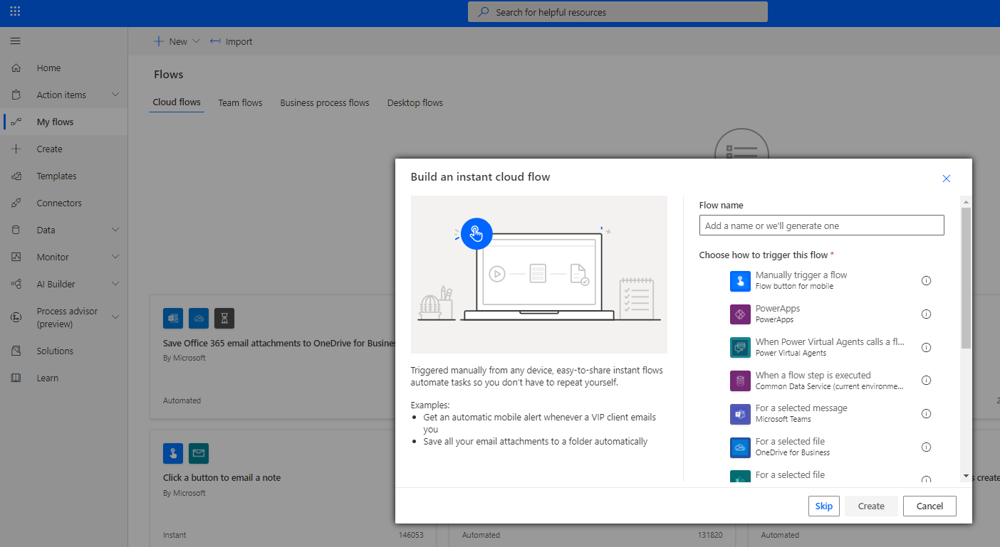
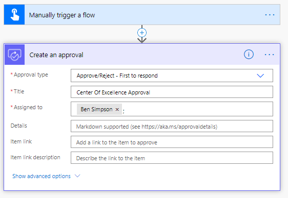

Governance processes for your apps are the next step to start thinking about after you have become familiar with your environments and resources. This requires gathering additional information about your apps from your makers, or audits specific connectors or app usage.

Here is a breakdown of the governance components for the audit process:

-   Developer Compliance Center (canvas app)

-   Compliance Detail Request (flow)

Multiple governance components are provided in the CoE Starter Kit; each will require some configuration to install. The installation instructions in this article have been segmented based on the set of components that should be grouped and installed together, and dependencies on other segments are outlined in each section.

## Import the solution

The Core Components solution is required for the Audit and Report Components solution, or any other component in the starter kit, to work.

1.  Follow the instructions detailed under Set up core components.

1.  Import the CenterOfExcellenceAuditComponents_x_x_x_xx_managed.zip file.

1.  Create a new connection to the all connectors.

	> [!div class="mx-imgBorder"]
	> 

1.  Update the Environment Variable values. Environment variables are used to store application and flow configuration data. This means that you only have to set the value once per environment and it will be used in all necessary flows and apps in that environment.

	|     Name                             |     Current value                                                                                                                                                                                                                                                                                          |
	|--------------------------------------|------------------------------------------------------------------------------------------------------------------------------------------------------------------------------------------------------------------------------------------------------------------------------------------------------------|
	|     Auto Delete   On Archive         |     Determines   whether apps are deleted when they're archived in the following flow: Admin |   App Archive and Clean Up - Check Approvals and Archive.                                                                                                                                                  |
	|     Developer   Compliance Center    |     Leave this   blank on import and update the environment variable after the import has   finished by first navigating to the details page of the Developer Compliance   Center (canvas app) included with this solution and copy the web link (to   launch the app) and paste it into this variable.    |
	|     Production   Environment         |     Determines if   the environment is Production or Dev/Test. True (the default) will mean that   the approvals are sent to app/flow owners. False will send those approvals to   the admin email.                                                                                                        |

1.  Select Import without adding values to the Environment Variables, as we will update them later - see update environment variables.

Update environment variables
----------------------------

This step should be completed after you import the solution. Environment variables are used to store application and flow configuration data. This means that you only have to set the value once per environment and it will be used in all necessary flows and apps in that environment.

All flows in this solution depend on all environment variables' being configured.

Select See Environment Variables to set the values as described in the following table.

|     Name                             |     Current value                                                                                                                                                                                                              |
|--------------------------------------|--------------------------------------------------------------------------------------------------------------------------------------------------------------------------------------------------------------------------------|
|     Auto Delete   On Archive         |     Determines   whether apps are deleted when they're archived in the following flow: Admin |   App Archive and Clean Up - Check Approvals and Archive.     Value must be   Yes or No. A default value of No is provided.    |
|     Developer   Compliance Center    |     Navigate to   the details page of the Developer Compliance Center (canvas app) included   with this solution and copy the web link (to launch the app) and paste it   into this variable.                                  |
|     Production Environment           |     Determines if   the environment is Production or Dev/Test. True (the default) will mean that   the approvals are sent to app/flow owners. False will send those approvals to   the admin email.                            |
## Initialize flow approval tables in your environment

The following flows use the built-in Approval actions of Power automate. In the background, the built-in Approval actions use Dataverse. If you've installed the solution in a new environment, the Approval tables must be initialized. The easiest way to do this is to create a "dummy" approval flow.

-   Admin

-   App Archive and Clean Up - Start Approval, Admin

-   Flow Archive and Clean Up - Start Approval, Admin

-   App Archive and Clean Up - Check Approval, and Admin

-   Flow Archive and Clean Up - Check Approval) Collect audit log data

1.  Go to [flow.microsoft.com](flow.microsoft.com/?azure-portal=true).

1.  Select + New > Instant (From Blank).

1.  Pick manually trigger a flow as the trigger and enter Admin | Dummy Approval Flow as the name.

	> [!div class="mx-imgBorder"]
	> 

1.  Select + New Step to add an approval action to the flow, and then search for and select Create an approval.

1.  Select a dummy title and enter your email address under Assigned To.

	> [!div class="mx-imgBorder"]
	> 

1.  In the upper-right corner, select Test, and then select I'll perform the trigger action.

1.  Select Save & Test

1.  Select Run Flow.

1.  Select Solutions on the left side panel, and you should now see two new Flow Approvals solutions. The presence of these solutions was the point of this step, and the way you know it succeeded.

    > [!div class="mx-imgBorder"]
	> 

## Activate the flows

This Governance Components solution contains flows that you will need to manually turn on once you are ready to use them.

-   Admin | App Archive and Clean Up - Start Approval

-   Admin | Approval Clean Up

-   Admin | Check Approvals

-   Admin | Flow Archive and Clean Up - Start Approval

-   Admin | Compliance detail request

-   Teams Admin | Ask for Business Justification when Microsoft Teams environment is created

-   Teams Admin | Weekly Clean Up of Microsoft Teams environments

