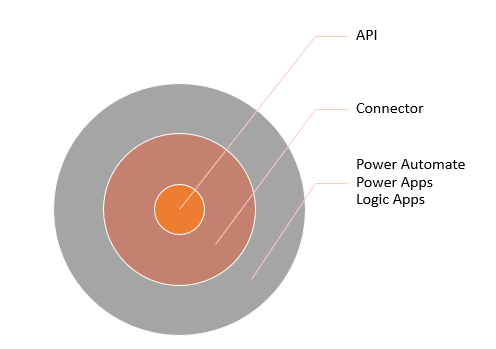

This module explores custom connectors and explains how to configure and use them with Microsoft Power Apps, Microsoft Power Automate, and Microsoft Azure Logic Apps.

In this module, you will:

- Learn about the role of custom connectors.

- Build a connector and use it in a Power Automate flow.

Connectors help make it easier for app and flow makers to connect to other apps, data, and devices in the cloud in the following ways:

- Connection is done in a consistent, repeatable way that is discoverable by makers.

- Connectors have actions that allow makers to control when an operation is performed.

- Connectors can have triggers that allow automation to start when the triggering event occurs.

> [!div class="mx-imgBorder"]
> 

A connector is a proxy, or a wrapper, around an API that allows Power Automate, Power Apps, and Logic Apps to communicate with the underlying service. Many connectors are predefined and available for use without you having to define anything. These built-in connector definitions include services from Microsoft and others. When the service or API that you want to use doesn't have a prebuilt connector, you can create your own custom connector. If a prebuilt connector doesn't expose all triggers and actions that you need from the API, you can build a custom connector in addition to the available one to handle these extra requirements. After the custom connector has been defined, it becomes available for use when you are building apps and flows in that environment, similar to the built-in connectors.

> [!div class="mx-imgBorder"]
> 

## Identify or build the API

Your first task is to check the [connector reference](/connectors/connector-reference/?azure-portal=true) to determine if a suitable connector already exists for the API/service. If a suitable connector doesn't already exist, then you can make your own custom connector. You can define the custom connector to describe any REST API that is public (one that is available on the internet) or private (one that is only on your internal network). Private APIs require the [on-premises data gateway](/power-automate/gateway-reference/?azure-portal=true) to access internal resources.

This factor assumes that an API is available for you to use. However, if a compatible API doesn't already exist, developers can build one by using any technology of choice that is capable of hosting a REST API, including [Microsoft Azure Functions](https://azure.microsoft.com/services/functions/?azure-portal=true) and [Azure App Services](https://azure.microsoft.com/services/app-service/api/?azure-portal=true). You can also use [Azure API Management](https://aka.ms/apimrocks/?azure-portal=true) to increase manageability and governance of the APIs.

## Describe the API

For Power Apps and Power Automate to discover what triggers and actions are available from the API, you must identify them when you create your custom connector. You can accomplish this task by manually editing the connector definition in the maker portal or by importing a definition in a supported format. This process includes identifying the authentication requirements for the API.

## Use the connector

After they have been created in an environment, custom connectors can be used in the same way as built-in connectors. These connectors can also be used in an environment other than the one that you used to create it. The connector definition needs to be exported from the environment where it was created and then imported into any environment that needs it. You can also share the connector with other people to allow them to use it like other shared resources.

## Certify and share the connector as an open source

Because custom connectors are only available in environments where their definition exists, they are not available to other Microsoft customers. By sharing a custom connector definition as an open source, you make it available on GitHub for other customers to import into their environments. By certifying your connector, you can make the custom connector that you created available as a prebuilt connector in all customer environments. Certifying a connector requires that you own the API or have explicit permission to publish a connector from the API owner.

For more information, see [Certification process](/connectors/custom-connectors/certification-submission/?azure-portal=true).

This step in the process is optional and only required if you want to share your connector and have it listed as certified. Internal-facing connectors don't need to complete this certification process.

## Describe the connector

To define a connector's actions and triggers, you need to describe the connector. A custom connector can be defined by describing only the API triggers and actions that you need. For example, if an API has 100 actions and 10 triggers that are available, you could build a custom connector with a single action. You can also describe more later as your needs change.

When you describe the API, you will use at least one of the following approaches. If you choose to import either an Open API definition or a Postman collection, you can still manually manipulate your connector's definition in the portal.

- **Manually create in the portal** - When using this approach, you would use the API documentation and examples of inputs and outputs and then define each action and trigger. This approach is good for simple APIs where you don't have the ability to import the definition. You can also use this approach to refine the definitions after you import them.

- **Import Open API definition** - [Open API](https://swagger.io/resources/open-api/?azure-portal=true) is a specification that describes REST, simplifying the tasks of developing and consuming an API by effectively mapping all resources and operations that are associated with it. Many services/APIs publish an Open API definition, and you can import it to describe the API in the custom connector. Importing version 2.0 is supported, but version 3.0 is not currently supported. This approach is beneficial if an Open API definition is available from the API publisher or, if you are developing the API, you can publish one.

- **Import Postman collection** - [Postman](https://www.postman.com/downloads/?azure-portal=true) is a tool for testing REST APIs. You can use this tool to perform the actions on the API that you want to describe and then save them as a [Postman collection](/connectors/custom-connectors/create-postman-collection/?azure-portal=true). This collection is then imported to describe the API in the custom connector. Currently, you can use this approach with v1 collections.

- **Export from Azure** - If your API is built as an Azure App Service, Microsoft Azure Functions, or is managed by Microsoft Azure API Management, you can export from those services and it will automatically create the initial custom connector definition.

## Work with authenticated APIs

The custom connector architecture supports working with authenticated APIs. When you define the custom connector, you will identify how it should authenticate to the API. Authentication choices support anonymous, password protected, OAuth 2.0, and API key access.

- **No authentication** - This choice is for APIs that allow anonymous access, and it is the default if you don't configure a specific authentication type.

- **Basic authentication** - This choice is for APIs that require a user and password to be sent with each request.

- **OAuth 2.0** - [OAuth 2.0](https://oauth.net/2/?azure-portal=true) is the industry-standard protocol for authorization. This option can be configured for any API that uses OAuth 2.0. Prebuilt configurations are available for you to select from for Microsoft services like Azure Active Directory (Azure AD), GitHub, and Azure DevOps. Similar prebuilt configurations are available for other services like Dropbox, Slack, Stripe, and more. The prebuilt configurations simplify what you need to provide to configure the identity provider.

- **API key** - An API key is a token that a client provides when making API calls. The API publisher typically provides the key, and it must be included in each request from the custom connector.

Custom connectors help make it easier for app and flow makers to use APIs/services. Mostly, makers could directly invoke the API without a connector; however, they would have to know how to compose the request and interpret the results and then handle authentication. This process would have to be completed each time the app or flow used custom connectors.

Additionally, it's not always easy for a maker to achieve the ability of having custom connectors that include triggers that enable flows to be started by events. Custom connectors help you more easily discover how to use actions and their results when you are building an app or flow that uses the connector.

The next unit explains how to build a custom connector.
