In this exercise, you will create your first custom connector for an existing API called Contoso Invoicing.

> [!IMPORTANT]
> Use a test environment with Microsoft Dataverse provisioned. If you don't have a test environment, you can sign up for the [Power Apps Community Plan](https://powerapps.microsoft.com/communityplan/?azure-portal=true).

### Task 1: Review the API

To review the API, follow these steps:

1. Go to [Contoso Invoicing](https://contosoinvoicing.azurewebsites.net/?azure-portal=true).

1. Select the documentations link.

    > [!div class="mx-imgBorder"]
    > [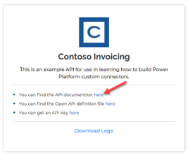](../media/docs.png#lightbox)

1. Review the available operations.

1. Select to expand and review each operation.

1. Close the documentation browser tab or window.

1. Select the **Open API definition** link.

1. The following image shows an example of the Open API version of what was shown on the documentations page. Right-click and select **Save as**.

    > [!div class="mx-imgBorder"]
    > [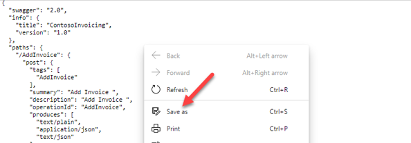](../media/save.png#lightbox)

1. Save the file locally. You will use this file later in the exercise.

1. Close the definition browser tab or window.

1. Select the **API Key** link.

1. Copy and save your API key because you will need it later.

    > [!div class="mx-imgBorder"]
    > [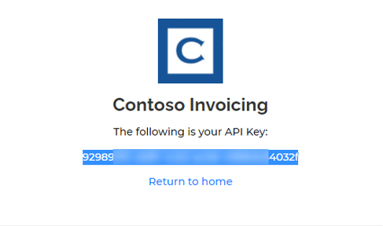](../media/key.png#lightbox)

1. Select **Return to home**.

1. Select **Download Logo**.

1. Save the logo image locally; you will use it later.

### Task 2: Create a new solution

To create a new solution, follow these steps:

1. Go to [Power Apps maker portal](https://make.powerapps.com/?azure-portal=true) and make sure that you are in the correct environment.

1. Select **Solutions > + New solution**.

1. Enter **Contoso invoicing** for the **Display name**, select **CDS Default Publisher** for **Publisher**, and then select **Create**. When you are working with a real project, it's best to create your own publisher.

    > [!div class="mx-imgBorder"]
    > [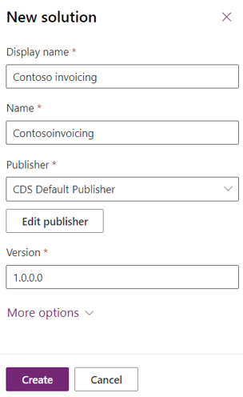](../media/solution.png#lightbox)

1. Do not navigate away from this page after selecting **Create**.

### Task 3: Create a new connector

To create a new connector, follow these steps:

1. Select to open the **Contoso invoicing** solution that you created.

1. Select **+ New > Other > Custom connector**.

    > [!div class="mx-imgBorder"]
    > [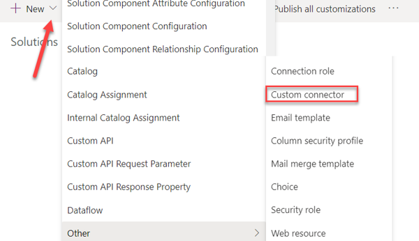](../media/custom.png#lightbox)

1. Enter **Contoso invoicing** for the **Connector name** and then select to **Upload** the image.

    > [!div class="mx-imgBorder"]
    > [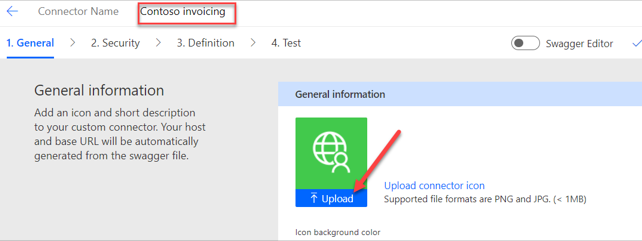](../media/upload.png#lightbox)

1. Select the connector logo image that you downloaded in **Task 1: Review the API**.

1. Enter **#175497** for **Icon background color**.

1. Enter **Contoso Invoicing API** for **Description**.

1. Enter **contosoinvoicingtest.azurewebsites.net** for **Host**.

1. Select **Create connector**.

    > [!div class="mx-imgBorder"]
    > [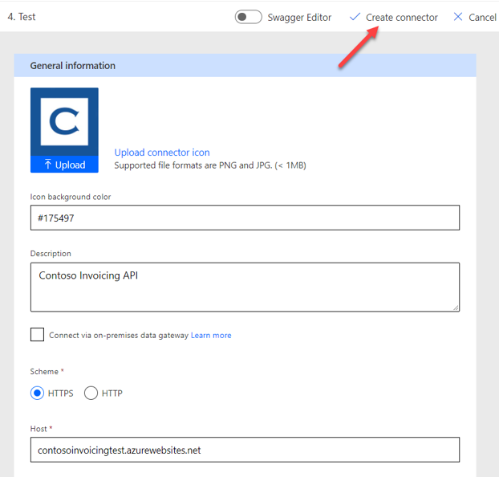](../media/create.png#lightbox)

1. Do not navigate away from this page.

### Task 4: Import the Open API definition

To import the Open API definition, follow these steps:

1. Select the arrow next to **Connector Name**.

    > [!div class="mx-imgBorder"]
    > [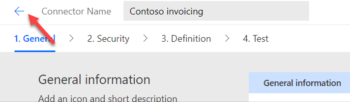](../media/arrow.png#lightbox)

1. Select the ellipsis (**...**) button of the connector and then select **Update from OpenAPI file**.

    > [!div class="mx-imgBorder"]
    > [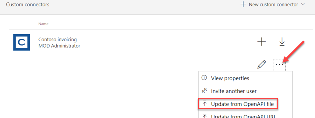](../media/ellipsis.png#lightbox)

1. Select **Import**.

1. Select the **swagger.json** file that you downloaded in **Task 1: Review the API** and then select **Open**.

1. Select **Continue**.

1. Fill in the host URL as **`contosoinvoicingtest.azurewebsites.net`** and then select **Security**.

    > [!div class="mx-imgBorder"]
    > [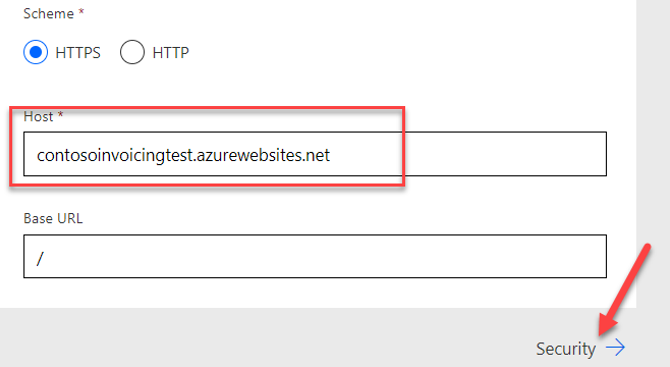](../media/host.png#lightbox)

1. Notice that the field is filled out from the imported file.

1. Do not navigate away from this page.

### Task 5: Review and adjust definitions

To review and adjust definitions, follow these steps:

1. Select the **Definition** tab.

1. Take a few minutes to review the operations that were imported.

1. Notice the orange triangle next to **GetInvoice** that indicates a warning.

1. Select the **GetInvoice** operation.

    > [!div class="mx-imgBorder"]
    > [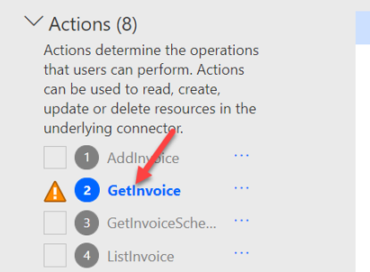](../media/get.png#lightbox)

1. Notice that the operation indicates a missing **Summary**.

1. Enter **Get Invoice** as the **Summary** to improve the usability.

    > [!div class="mx-imgBorder"]
    > [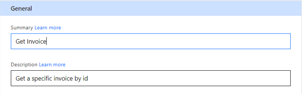](../media/summary-get.png#lightbox)

1. Notice the blue information circle on the **PayInvoice** operation and that it indicates a missing **Description**.

1. Enter **Pay an invoice** as the **Description**.

1. Delete both **NewInvoice** operations because you won't use them.

    > [!div class="mx-imgBorder"]
    > [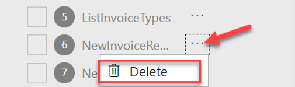](../media/delete.png#lightbox)

1. Select the **GetInvoiceSchema** operation.

1. Modify the **Visibility** option to **internal** so that people don't see it in their action list.

1. Select **Update connector**.

    > [!div class="mx-imgBorder"]
    > [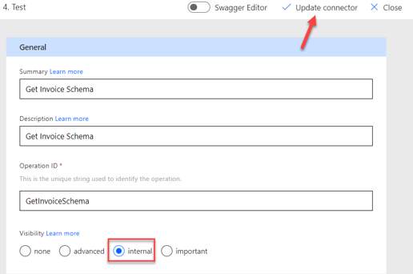](../media/update.png#lightbox)

1. Do not navigate away from this page.

### Task 6: Test the connector

To test the connector, follow these steps:

1. Select the **Test** tab.

1. Select **+ New connection**.

    > [!div class="mx-imgBorder"]
    > [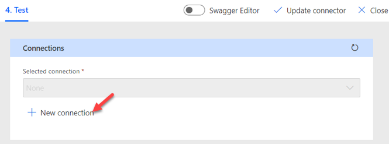](../media/test.png#lightbox)

1. Paste in the **API Key** that you saved in **Task 1: Review the API** and then select **Create connection**.

1. Select the **Refresh** button.

    > [!div class="mx-imgBorder"]
    > [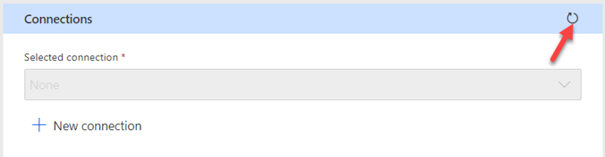](../media/connections.png#lightbox)

1. Select **ListInvoice > Test Operation**.

    > [!div class="mx-imgBorder"]
    > [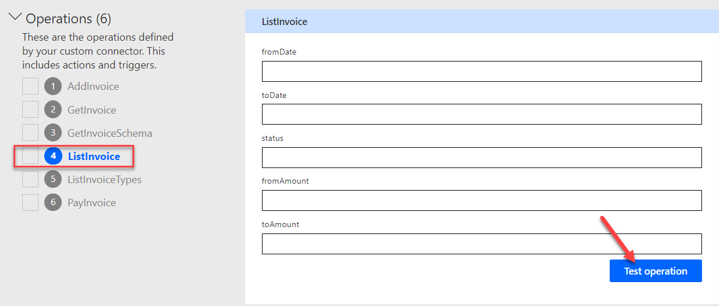](../media/test-operation.png#lightbox)

> You should see some invoice data in the body area.
