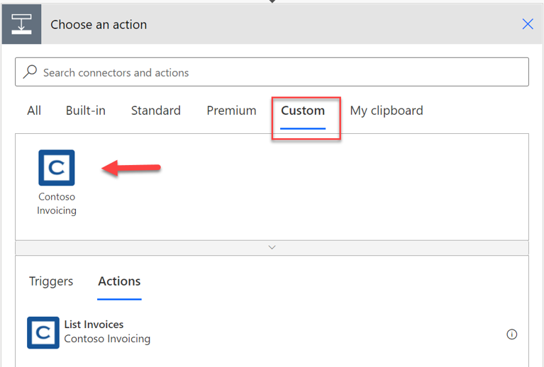

Custom connectors can be used by Power Apps, Power Automate, and Azure Logic Apps. After you have selected a custom connector, using it is no different than using a built-in connector. To use the custom connector with Power Apps and Power Automate, you must configure or deploy it in the same environment where you are building your apps and flows. If you know that it is a custom connector, the quickest way to add triggers or actions from it is by selecting the **Custom** tab because it will show only the custom connectors in the environment. From the environment, you can select triggers and actions like you would a built-in connector.

> [!div class="mx-imgBorder"]
> 

Ensure that your custom connector actions and triggers have a descriptive summary so that users can more easily find it with the search feature.

The first time that you use the custom connector in your app or flow, you will be prompted to provide the app key or credentials, depending on the connector's authentication type. This action will establish a connection with the connector that can be reused if you use the connector again in the same environment.

If you want to use your custom connector in other environments, make sure that you deploy or configure the custom connector in each of those environments. A common example of this scenario would be having a development, test, and production set of environments for your project.

You can choose from the following options to deploy the custom connector into each of the environments:

- **Download and import** - From the list of custom connectors, you can select the download icon and then download the open API definition. This downloaded open API definition file can be used to import into another environment to create a custom connector, similar to the way you would have originally created this definition if you had imported from Open API. If using this option, you must still provide some configuration in the target environment to get the custom connector fully created. You would choose this option most frequently when you don't have the ability to use a solution.

- **Solutions** - Custom connectors that are created in the context of a solution, such as the connector that you created in the previous exercise, can be exported and imported into another environment for reuse. After the solution has been imported, no extra configuration of the connector is required. This option requires Microsoft Dataverse to be available in the source and target environments. This option provides the most robust application lifecycle management (ALM) capability, including the ability to use build automation tooling for deployment.

- **Command line** - By using Microsoft Power Platform Connectors Command Line Interface (CLI), you can also download and import the custom connector definitions. For more information, see [Microsoft Power Platform Connectors CLI](/connectors/custom-connectors/paconn-cli/?azure-portal=true). You would use this option when you want to automate the manual download and import process and are not using solutions. Additionally, you can use this option when preparing your connector for certification and sharing it as an open source.

To use the same custom connector for an app in Azure Logic Apps, make sure that you recreate the connector in your Azure subscription. This task can be accomplished by using the download or the previously mentioned command-line interface approach. During the creation process of the Azure Logic Apps custom connection, you will be prompted to import the Open API file that you downloaded. After the custom connector has been configured, you can use it in Azure Logic Apps in the same way that you would use it in Power Apps or Power Automate.
