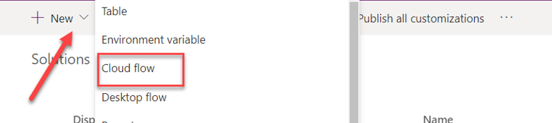
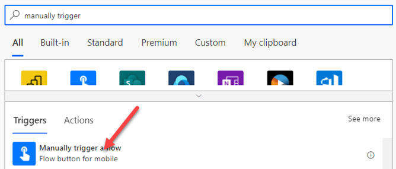
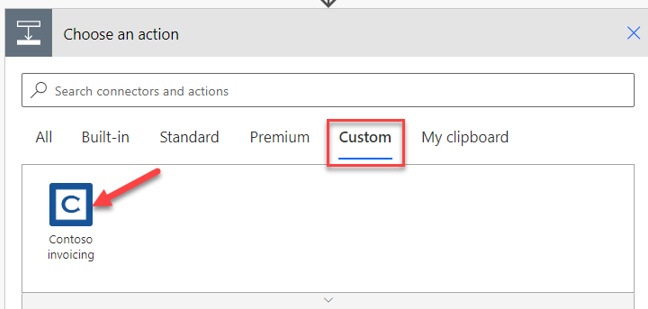
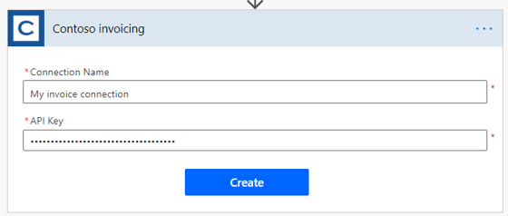
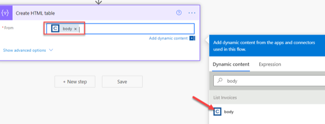
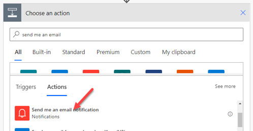
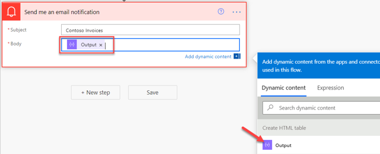
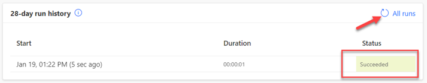

In this exercise, you will create a manually triggered Power Automate cloud flow that will use the Contoso invoicing custom connector that you created in the previous exercise in this module.

> [!IMPORTANT]
> Complete the **Exercise: Create a new connector in a solution** unit before starting this exercise.

### Task 1: Create a Power Automate cloud flow

In this task, you will create a Power Automate flow inside the Contoso invoicing solution that you previously created.

1. Get an API key from [Contoso Invoicing](https://contosoinvoicing.azurewebsites.net/?azure-portal=true).

1. Select the **API Key** link.

1. Copy and save your API key because you will need it later.

    > [!NOTE]
    > If you still have the API key that you previously used, it would still be usable at this time. If not, you can get a new one.

1. Go to [Microsoft Power Platform maker portal](https://make.powerapps.com/) and select the environment that you used in the **Exercise: Create a new connector in a solution** unit.

1. Select **Solutions** and then select to open the **Contoso invoicing** solution.

1. Select **+ New > Cloud flow**.

    > [!div class="mx-imgBorder"]
    > 

1. Name the flow **Email invoice list**.

1. Enter **manually trigger** in the search box and then select **Manually trigger a flow**.

    > [!div class="mx-imgBorder"]
    > 

1. Select **+ New step**.

1. Select the **Custom** tab and then select the **Contoso invoicing** custom connector. Using the **Custom** tab to locate custom connectors is the fastest way to find them.

    > [!div class="mx-imgBorder"]
    > 

1. Select **List invoices** for the action.

1. Enter **My invoice connection** for **Connection Name**. Use a name for the connection that makes sense to you.

1. Paste the API key link that you copied into the **API Key** field and then select **Create**.

    > [!div class="mx-imgBorder"]
    > 

1. Select **+ New step**.

1. Search for **create html** and then select **Create HTML table**.

    > [!div class="mx-imgBorder"]
    > 

1. Select the **From** field and then select **body** from the **Dynamic content** pane.

    > [!div class="mx-imgBorder"]
    > 

1. Select **+ New step**.

1. Search for **send me an email** and then select **Send me an email notification**.

    > [!div class="mx-imgBorder"]
    > 

1. Enter **Contoso Invoices** for **Subject**.

1. Select the **Body** field and then select **Output** from the **Dynamic content** pane.

    > [!div class="mx-imgBorder"]
    > 

1. Select **Save**.

1. Select the arrow button located next to the flow name.

1. Select **OK** if prompted.

1. Do not navigate away from this page.

### Task 2: Test the cloud flow

In this task, you will test the cloud flow that you created in **Task 1: Create a Power Automate cloud flow**.

1. Select **Run**.

1. Select **Continue**.

1. Select **Run flow**.

1. Select **Done**.

1. Refresh the run history.

   The flow run should succeed.

   > [!div class="mx-imgBorder"]
   > 

1. Select the **App launcher** button and then select **Outlook**. You can also go to your [Outlook](https://outlook.office.com/mail/inbox/?azure-portal=true) inbox.

1. You should receive an email from Power Automate. Open the email.

   The email body should show a list of invoices.
