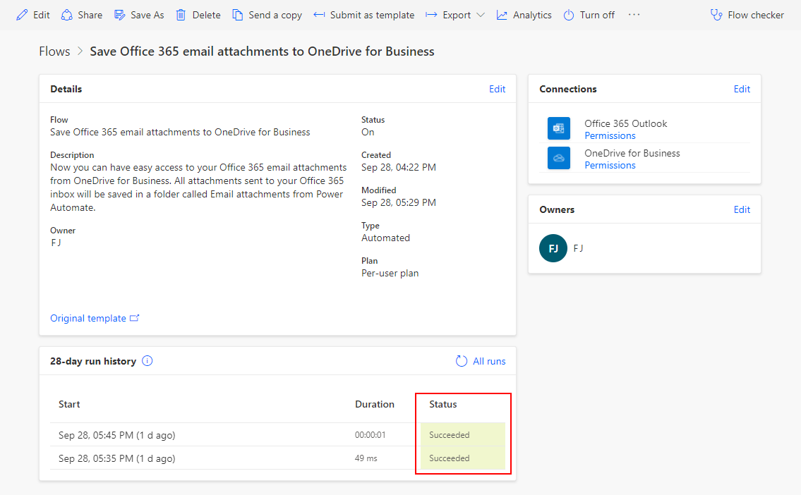

In this unit, you'll see more of Power Automate as you build your first flow.

It can be time consuming to search for attachments through email. The flow that you'll build saves time by storing all your email attachments in a folder on your Microsoft OneDrive for Business account.

If you'd like to see the process of creating flows, see the following video. The steps that follow guide you through the process of creating flows.

> [!VIDEO types of flows videos.] 

## Choose a template

Our many templates will get your flows flowing quickly. They'll help you connect the services you're already using in more meaningful ways.

Sign in to [Power Automate](https://ms.flow.microsoft.com), and select the **Templates** menu. You can sign up for Power Automate with a Microsoft account.

Select the **Save Office 365 email attachments to OneDrive for Business** template.

## Create the flow

**Save Office 365 email attachments to OneDrive for Business** is one of our one-click templates, in which you can answer questions that are necessary to build the flow, so that you don't have to write a line of code.

On the template graphic, there's a description of what the template does and what it needs to succeed.

You'll be asked to provide credentials for the Microsoft Office 365 Outlook and Microsoft OneDrive for Business services. If you regularly use both services, you'll already be signed in.

1. Click on the template and select **Create Flow**.

2. On the next page, Power Automate creates the flow for you.
    - It will connect to your work email to get any attachments.
    - It will then create a folder on your OneDrive for Business account to automatically put every attachment that's sent to your work email address in that folder.

    

3. Select the **My flows** menu.

4. Select the flow you just created and click **Edit** to see how it works.

    

5. Send an email with an attachment, or have another user send an email with an attachment. You then should see a green check mark, which indicates that the flow succeeded.

6. Select the arrow towards the top to go back to the flow definition page.

7. The run history and the results are listed below.

     

    In this case, all parts of the flow were successful.

    

## Important concepts in Power Automate

Keep these concepts in mind when building flows:

- Every flow has two main parts: a *trigger*, and one or more *actions*.
- You can think of the trigger as the starting action for the flow. The trigger can be something like a new email arriving in your inbox or a new item being added to a SharePoint list.
- Actions are what you want to happen when a trigger is invoked. For example, the new email trigger will start the action of creating a new file on OneDrive for Business. Other examples of actions include sending an email, posting a tweet, and starting an approval.

These concepts will come into play later, when you build your own flows from scratch. In the next unit, we'll look at the Power Automate mobile app and its capabilities.
