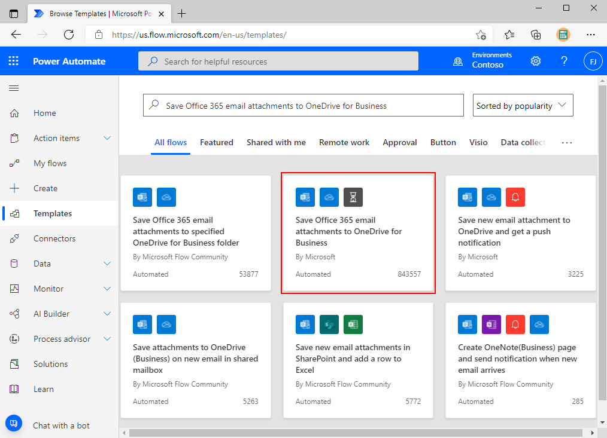
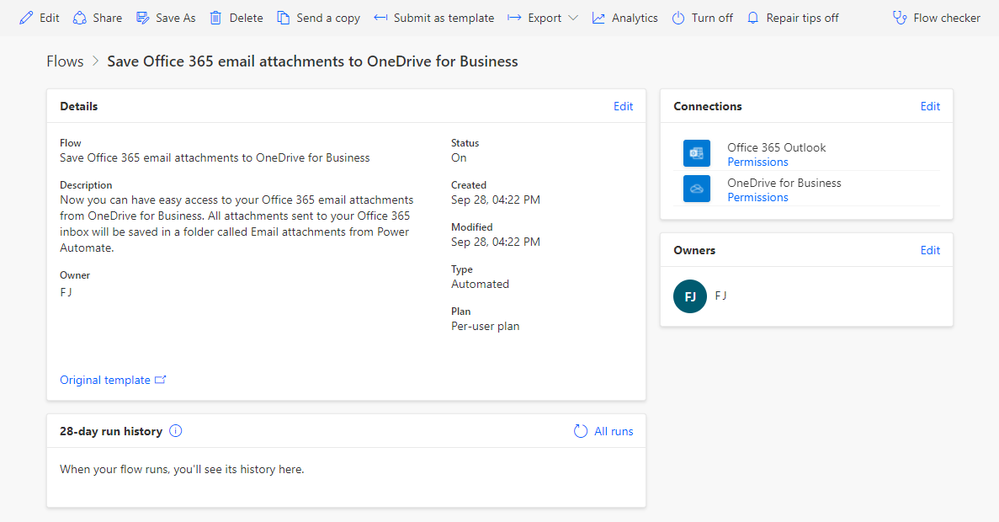
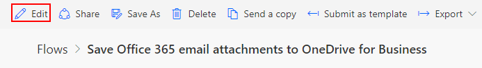
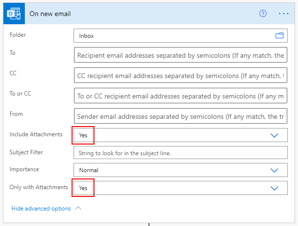
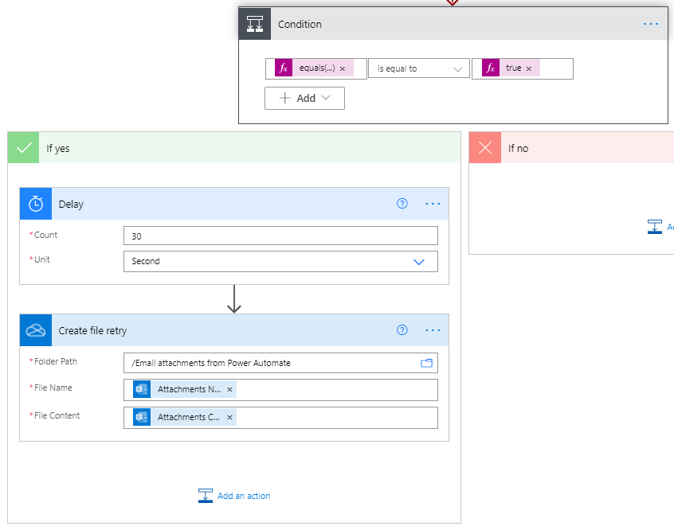
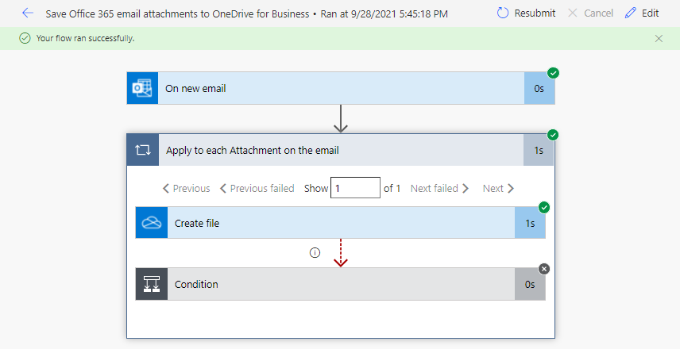

In this unit, you'll learn more about Power Automate as you build your first flow.

Since it can be time consuming to search for attachments in your emails, creating a flow can save you time by storing all your email attachments in a folder in your Microsoft OneDrive for Business account.

If you would like to see the process of creating flows, watch the following video.

> [!VIDEO https://www.microsoft.com/videoplayer/embed/RWGzyZ]

The following steps will guide you through the process of creating flows.

## Create a flow

For your first flow, you'll create a flow by using a template.

1. Sign in to [Power Automate](https://ms.flow.microsoft.com), and select the **Templates** on the left menu.

1. Search for and select the **Save Office 365 email attachments to OneDrive for Business** template.

    

1. Once the connections to the **Office 365 Outlook** and **OneDrive for Business** connectors are created, select **Create flow**. The page will navigate to the **Details** of the new flow.

    If you regularly use both the **Office 365 Outlook** and **OneDrive for Business** connectors, flow will connect to them automatically. If you don't, you will be prompted to provide your credentials.

1. In the next page, Power Automate will display the new flow with the following information:
    - **Details** displays information such as Flow Name, Description, Owner, Status, and Created and Modified dates.
    - **Connections** displays information about the connectors used in the flow.
    - **Owners** displays information about the flow owners.
    - **28-day run history** displays all the flow runs for the last 28 days.

        

1. Select **Edit** to see how the flow works.

    

    1. The flow uses the **Outlook - On new email** trigger. Select **Show advanced options** to view more parameters. You will see the **Include Attachments** and the **Only with Attachments** parameters are set to **Yes**.

        

    1. The next action is an **Apply to each** loop and it has been renamed to **Apply to each Attachment on the email**. This loop contains the rest of the actions because each one will be executed for each of the attachments.

    1. The next action is the **OneDrive for Business - Create file**. It creates a file in the specified location with the provided **File Name** and **File Content**.

        

    1. The next action is a **Condition**. It checks if the **statusCode** of the **Create file** action is equals to **409**.

        This action is only executed if the **Create file** action is skipped.

    1. If the **Condition** is true, the **Delay** action is executed to delay the flow for 30 seconds. After the 30 seconds are complete, the **Create file retry** action is executed.

        The **Create file retry** action is the same **OneDrive for Business - Create file** action. It has been renamed to distinguish it from the **Create file** action above the **Condition**.

        

## Test the flow

1. Send yourself an email with an attachment, or have another user send an email with an attachment. Wait until the flow is done running and select the first run history to see the results.

    

## Important concepts in Power Automate

Keep these concepts in mind when building flows:

- Every flow has two main parts: a *trigger*, and one or more *actions*.
- You can think of the trigger as the starting action for the flow. The trigger can be something like a new email arriving in your inbox or a new item being added to a SharePoint list.
- Actions are what you want to happen when a trigger is invoked. For example, the new email trigger will start the action of creating a new file on OneDrive for Business. Other examples of actions include sending an email, posting a tweet, and starting an approval.

These concepts will come into play later, when you build your own flows from scratch. In the next unit, we'll look at the Power Automate mobile app and its capabilities.