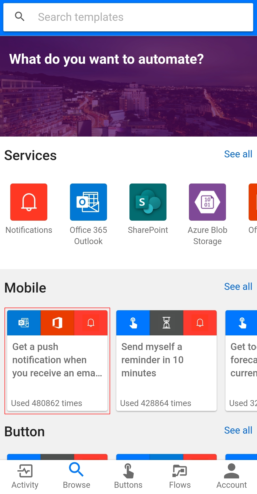
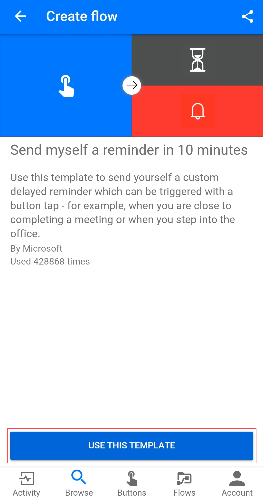
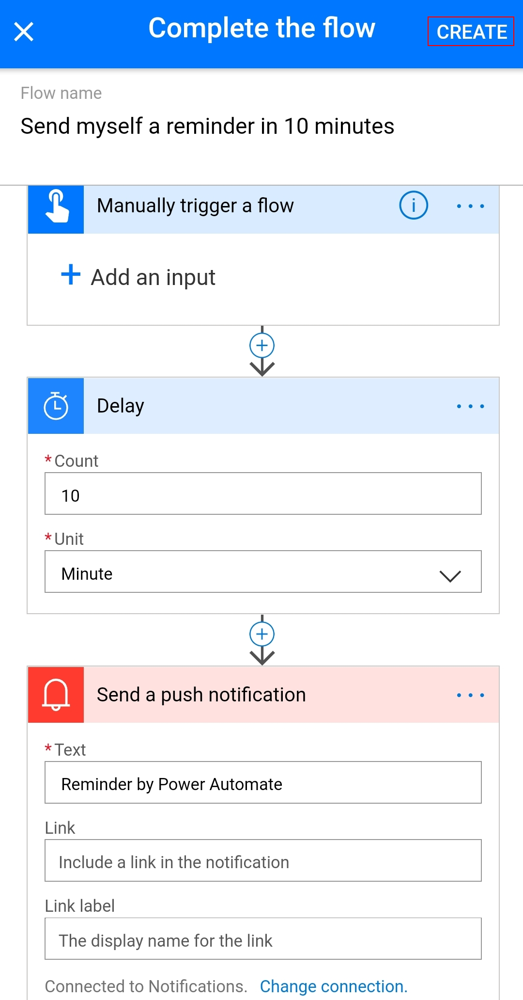
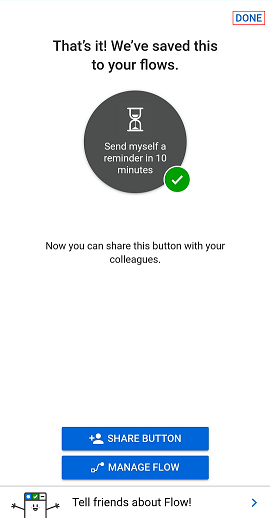
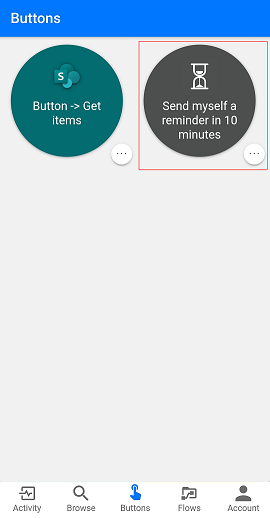
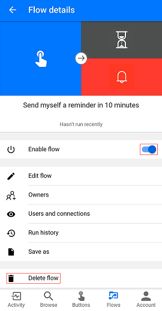

Of course, we have an app, the Power Automate mobile app! From this app, you can access these features:

- Activity Feed
- Browsing
- Buttons
- Managing Flows

First, you'll need to download and install the Power Automate mobile app from your app store.

After it's installed, start it and sign in.

When you first start the app, you'll see the Activity Feed. The Activity Feed is the place to see what's happening with your flows. It won't be the full experience you'd expect from your PC, but it will show you useful details.

For example, you'll see a flow's last activity. You can see whether the flow succeeded or failed. If it failed, you'll see which step it failed on.

## How button flows are started

Buttons are flows that are started through a manual action. For example, you can create a button to send a *Working from home today* email to your manager. If you live far from your workplace, you can then use this button on days when the traffic is a mess!

- Select **Buttons** to use some of these flows.

- Select **Browse** to check out templates for more button flows that you can add to your collection.

To show you how you can use buttons, we'll use the **Send myself a reminder in 10 minutes button** template.

1. Select **Browse**.
2. Select the **Send myself a reminder in 10 minutes button** flow.

    

3. Select **Use this template**.

    

4. Select **Create**, and then select **Done**.

    

    The flow is saved.

    

5. Select **Buttons** to see the new flow.

    

6. Select the flow. In 10 minutes, you'll get a reminder.

It's simple to add more buttons to your collection.

## Modify or delete a flow

If you want to change or delete one of your flows, it's easy.

1. Select **Flows**.

2. Select one of your flows.

3. Select one of the options:

    - To enable or disable the flow, toggle the **Enable flow** option on or off.
    - To change the flow, select **Edit flow**.
    - To get an idea of the successful and unsuccessful runs of the flow, select **Run history** to view the history of the flow.
    - To delete a flow, select **Delete flow**.

    

The next unit shows how to create recurring flows.