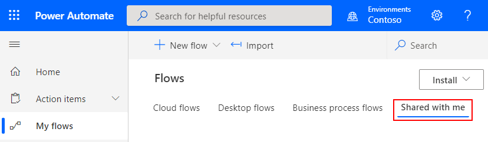
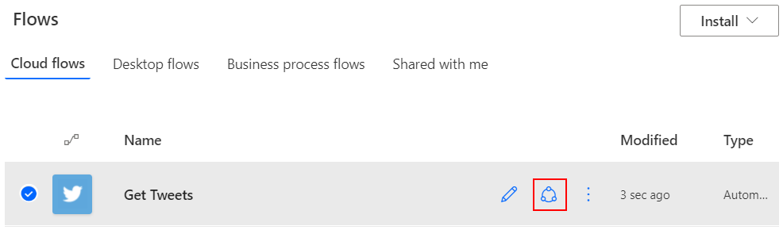

Shared flows extend the potential of Power Automate to groups of people. After all, why should just one person enjoy the benefits of increased automation in his or her work environment?

Here are some advantages of shared flows:

- Multiple people can own and manage a flow together.
- If the creator of a shared flow leaves the organization, the other owners of the flow can continue to run it.
- All owners of a shared flow can view its history, manage its properties, edit it, add and remove owners, and delete it.

If you're the creator or an owner of a shared flow, you'll find it listed on the **Shared with me** tab in [Power Automate](https://flow.microsoft.com).

> [!NOTE]
> - Shared connections can be used only in the flow in which they were created.
> - Owners can use services in a flow, but they can't change the credentials for a connection that another owner created.

## Prerequisites

To create a shared flow, you must have a [paid Power Automate plan](https://flow.microsoft.com/pricing/). Also, to add more owners to a shared flow or remove owners from it, you must be the creator or an owner.

## Create a shared flow

You create a shared flow by adding more owners to an existing flow. After new owners are added to a flow, the flow appears on the **Shared with me** tab.

1. Sign in to [Power Automate](https://flow.microsoft.com) using your organizational account.

1. Select **My flows**.

1. Select the **Share** button for the flow that you want to change.

    

1. In the **Owners** section, enter the name, email address, or group name of the person or group that you want to add as an owner.

1. In the list that appears, select the user or group to add.

    The user or group becomes an owner of the flow.

Keep in mind that when you share a flow, it appears on the **Shared with me** tab. It no longer appears on the **Cloud flows** tab.

## Add Microsoft Lists as a co-owner of a flow

You can add a list created using Microsoft Lists as a co-owner of a flow. In that way, everyone who has edit access to the list automatically gets edit access to the flow. After the flow is shared, you can just distribute a link to it.

> [!IMPORTANT]
>SharePoint users must have Edit permission or be a member of the Members or Owners group to run flows in SharePoint.

## Restrictions on changes to flows

Adding an owner to a cloud flow is the most common way to share a cloud flow. The new owner of the cloud flow can also perform these actions:

1. View the run history.

1. Manage the properties of the flow (for example, start or stop the flow, add owners, or update credentials for a connection).

1. Edit the definition of the flow (for example, add or remove an action or condition).

1. Add or remove other owners (but not the flow's creator).

1. Delete the flow.

Once a flow has been shared it is no longer in the **Cloud flows** but in the **Shared with me**.

> [!IMPORTANT]
> Owners can use services in a cloud flow but can't modify the credentials for a connection that another owner created. Also, shared connections can be used only in the flow in which they were created.

## Remove an owner

> [!IMPORTANT]
> If you remove an owner whose credentials are used to access Power Automate services, be sure to update the credentials for those connections, so that the flow continues to work correctly.

1. On the **Shared with me** tab, select the **Share** button for the flow that you want to change.

    

1. Select the **Delete** button for the owner that you want to remove.

## Embedded and other connections

The connections that are used in a flow fall into two categories:

- **Embedded**: These connections are used in the flow.
- **Other**: These connections have been defined for the flow, but they aren't used in it.

If you stop using a connection in a flow, that connection appears in the **Other** connections list. It will remain there until an owner includes it in the flow again.

To view the list of connections, change the shared flow.

- On the **Shared with me** tab, select the **Share** button for the flow that you want to change.

    The list of connections appears under the list of owners in the flow's properties.
