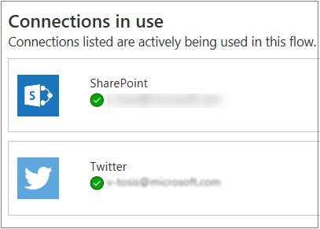

Team flows extend the power of Microsoft Flow to groups of people. After all, why should just one person enjoy the benefits of increased automation in his or her work environment?

Here are some advantages of team flows:

- Multiple people can own and manage a flow together.
- If the creator of a team flow leaves the organization, the other owners of the flow can continue to run it.
- All owners of a team flow can view its history, manage its properties, edit it, add and remove owners, and delete it.

If you're the creator or an owner of a team flow, you'll find it listed on the **Team flows** tab in [Microsoft Flow](https://flow.microsoft.com).

> [!NOTE]
> - Shared connections can be used only in the flow that they were created in.
> - Owners can use services in a flow, but they can't change the credentials for a connection that another owner created.

## Prerequisites

To create a team flow, you must have a [paid Microsoft Flow plan](https://flow.microsoft.com/pricing/). Additionally, to add other owners to a team flow or remove owners from it, you must be the creator or an owner.

## Create a team flow

You create a team flow by adding other owners to an existing flow. After new owners are added to a flow, the flow will appear on the **Team flows** tab.

1. Sign in to [Microsoft Flow](https://flow.microsoft.com) by using your organizational account.
1. Select **My flows**.
1. Select the **Invite another owner** button for the flow that you want to change.

    

1. Enter the name, email address, or group name of the person or group that you want to add as an owner.

    

1. In the list that appears, select the user or group.

    The user or group becomes an owner of the flow.

Keep in mind that when you create a team flow, it appears on the **Team flows** tab. It no longer appears on the **My flows** tab.

## Add a SharePoint list as a co-owner of a flow

You can add Microsoft SharePoint lists as co-owners of a flow. In that way, everyone who has edit access to the list automatically gets edit access to the flow. After the flow is shared, you can just distribute a link to it.

## Restrictions on changes to flows

Any owner of a team flow can contribute connections to a flow. After another person has access to the flow, that person can use any connections in it, but only within the scope of that flow.

For example, John creates a flow that updates items in SharePoint with his account, and he shares the flow with Mary. In this case, Mary will be able to change the use of SharePoint inside that flow, but not in any of her personal flows. Likewise, Mary can change the flow so that it uses her SharePoint connection, but John still won't able to use that new SharePoint connection in any of his flows. 

To view all the connections that are used by a flow, select the **Invite another owner** button, and inspect the list of embedded connections.

## Remove an owner

> [!IMPORTANT]
> If you remove an owner whose credentials are used to access Microsoft Flow services, be sure to update the credentials for those connections, so that the flow continues to work correctly.

1. On the **Team flows** tab, select the **Invite another owner** button for the flow that you want to change.

    

1. Select the **Delete** button  for the owner that you want to remove.

## Embedded and other connections

The connections that are used in a flow fall into two categories:

* **Embedded**: These connections are used in the flow.
* **Other**: These connections have been defined for the flow, but they aren't used in it.

If you stop using a connection in a flow, that connection appears in the **Other** connections list. It will remain there until an owner includes it in the flow again.

To view the list of connections, change the team flow.

- On the **Team flows** tab, select the **Invite another owner** button for the flow that you want to change.

    The list of connections appears under the list of owners in the flow's properties.

    
