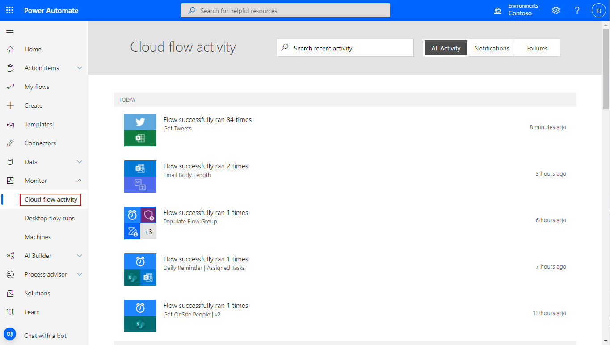
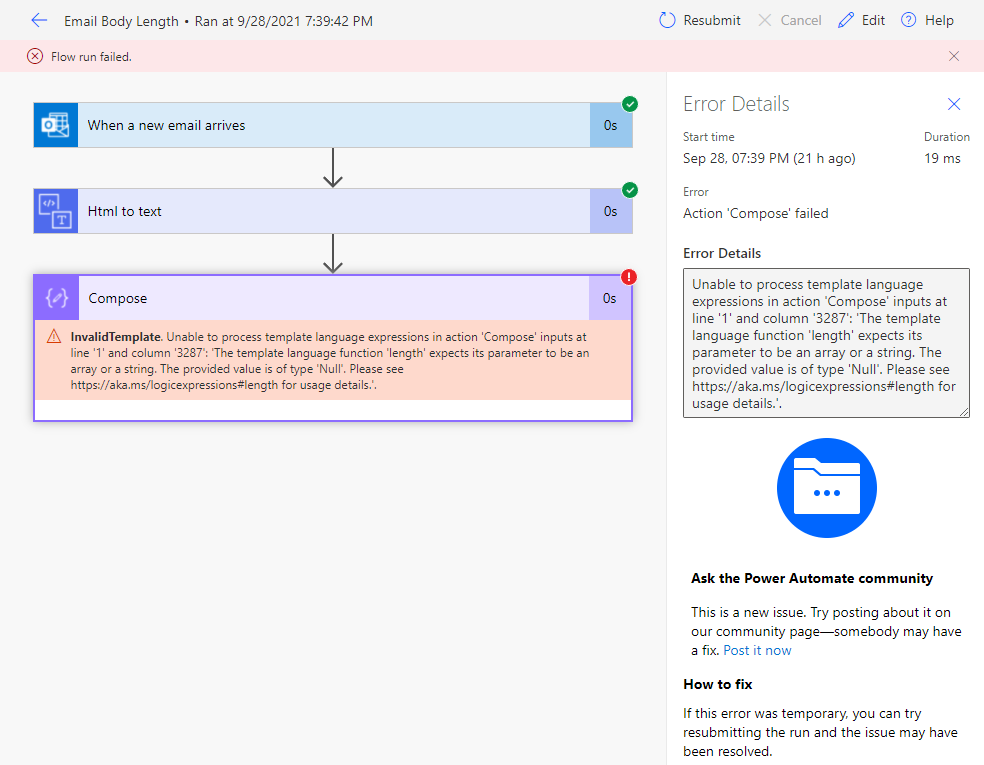
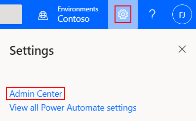

In this unit, you'll learn how to troubleshoot common issues that might occur while you run your flows.

## Identify the error

Before you can fix a flow, you must identify why it failed. You will get an email with a list of failures each week.

1. Select the **Settings** button (the gear symbol) at the top of the web portal and select **Activity** (or select the **Activity** tab in the mobile app), and then select your flow in the list that appears.

    

2. Details about the flow appear, and at least one step has a red exclamation point (!) symbol. Open that step, and review the error message.

    

## Authentication failures

In many cases, flows fail because of an authentication error. If this type of error occurs, the error message includes the word "Unauthorized," or an error code of 401 or 403 appears. You can usually fix authentication errors by updating the connection.

1. You can view the connections by opening up the flow details by selecting the flow from **My Flows**.
2. Scroll to the connection that you saw the "Unauthorized" error message for.
3. Next to the connection, select the **Verify password** link in the message that states that the connection hasn't been authenticated.
4. Verify your credentials by following the instructions that appear. Then return to your flow-run failure, and select **Resubmit**.

The flow should now run as expected.

## Action configuration issues

Flows sometimes fail if a setting in one of the flow's actions doesn't work as expected. In this case, the error message includes the phrase "Bad request" or "Not found," or an error code 400 or 404 appears.

The error message should indicate how to fix the failure.

1. Select the **Edit** button, and then fix the issues inside the flow definition.
1. Save the updated flow, and then select **Resubmit** to try to run the flow again with the updated configuration.

## Temporary issues

If error code 500 or 502 appears, the failure is temporary or transient.

- Select **Resubmit** to try to run the flow again.

## Issues with your pricing plan

Sometimes your flows might behave unexpectedly because you aren't using the correct plan.

- To view your plan, in Power Automate, select **Learn**. It will redirect you to another page. Here select **Learn**, and then select **Pricing**.

Learn more about [pricing and how to switch plans](https://flow.microsoft.com/pricing/).

## Issues with data usage

You might have run out of data that you can use.

- If you're on a free plan or a trial plan, select the **Settings** button (the gear symbol) to show your current usage against your plan.

    

- If you're on a paid plan, runs are pooled across all users in your organization. We're working on features that will show information about available quotas and usage across an organization.

> [!IMPORTANT]
> If you exceed your data limit, Power Automate throttles your flow runs.

Learn more about [usage limits](https://flow.microsoft.com/pricing/).

## You might be running flows too often

Your plan determines how often your flows run. For example, your flows might run every 15 minutes if you're on the free plan. If a flow is triggered less than 15 minutes after its last run, it's queued until 15 minutes have passed.

Whenever a flow is triggered, whether by an automatic trigger or because you manually start it, the action counts as a run. Checks for new data don't count as runs.

Learn more about [usage limits](https://flow.microsoft.com/pricing/).

## You might be using an incorrect account

If you sign in by using a Microsoft account (for example, an account that ends with *@outlook.com* or *@gmail.com*), you can use only the free plan. To take advantage of the features of the paid plan, sign in by using your organizational account or school email address.

To upgrade, use an organizational account or a school account, or create a [Microsoft Office 365 trial account](https://powerbi.microsoft.com/documentation/powerbi-admin-signing-up-for-power-bi-with-a-new-office-365-trial/).

## Some flows run more often than expected

Some flows might run more often than you expect. For example, you create a flow that sends you a push notification whenever your manager sends you an email. That flow must run every time you get an email from anyone, because the flow must check whether the email came from your manager. This action counts as a run.

## Other issues that are based on limits, and caveats

You might have issues that are based on other limits:

* Each account can have up to:

    * 250 flows.
    * 15 custom connectors.
    * 20 connections per application programming interface (API) and 100 connections total.

* You can install a gateway only in the default environment.
* Some external connectors, like Twitter, implement connection throttling to control the quality of service. Your flows might fail when throttling is in effect. If your flows are failing, review the details of the run that failed in the flow's run history.
