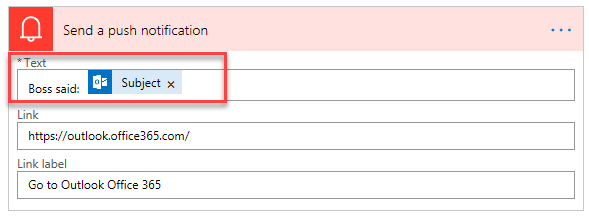

A common use of Microsoft Flow is to get a notification when something happens. Notifications can be emails, text messages, or push notifications on your phone.

In this unit, you'll create a flow that generates a push notification whenever you receive an email from your manager.

## Get the mobile app

It's easy to create a flow that sends push notifications to your mobile device. Keep in mind that you'll need the Microsoft Flow mobile app to receive push notifications. The mobile app is available for [Google Android](https://play.google.com/store/apps/details?id=com.microsoft.flow), [Apple iOS](https://itunes.apple.com/app/apple-store/id1094928825), and [Windows Phone](https://www.microsoft.com/p/microsoft-flow/9nkn0p5l9n84).

If you're using an unsupported mobile device, consider using Short Message Service (SMS) messages (that is, text messages) instead of push notifications to receive notifications.

## Create a flow that sends push notifications

Microsoft Flow comes with many templates to get you started with creating flows. Let's create a flow by using a template.

1. Sign in to [Microsoft Flow](https://ms.flow.microsoft.com) by using your organizational account.
1. Select **My flows**.
1. Select **New**, and then select **Create from template**.

    

1. Scroll down, and select **Get a push notification when you receive an email from your boss**.

    You can also quickly find this template by entering *notifications* in the search field.

1. Select **Continue**.

    In the flow, you'll see the steps that will be used to get your email profile and your boss's before the flow is started.

1. Scroll to the bottom of the flow steps to find the **Check if it is my manager** section. Your email address and your manager's are automatically filled in from the profile information that you entered.
1. In the **Send a push notification** section, select **Edit** to change the text of the notification that you'll get when an email is received from your boss.

    

1. To change the text of the email, in the **Text** field, enter a new message. You can also select dynamic content fields in the list.

    

1. Select **Save** to save and test the flow.
1. To change the flow, select **Edit flow**.

Now, when emails arrive from your boss, you'll get a push notification on your phone.
