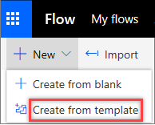

At some point, most of us have needed to copy files from one storage service to another. Microsoft Flow makes it easy to automatically move and copy files between two services, like Microsoft OneDrive and Google Drive.

In this unit, you'll use a flow template to copy files from your personal OneDrive to Microsoft OneDrive for Business. Microsoft Flow must have permissions to your OneDrive folders to do this.

## Create a flow that copies files

1. Sign in to [Microsoft Flow](https://ms.flow.microsoft.com) by using your organizational account.
1. Select **My flows**.
1. Select **New**, and then select **Create from template**.

    

1. Scroll down, and select **Copy files to OneDrive for Business when they're added to OneDrive**.

    You can also quickly find this template by entering *OneDrive for Business* in the search field.

1. Select **Continue**.
1. In the **OneDrive Folder** field, select the folder button.

    

1. Select the OneDrive folder that files should be copied from.

    

1. In the **OneDrive for Business Folder Path** field, select the folder button, and then select the folder that files should be copied to.
1. Select **Create Flow**.
1. To change the flow, select **Edit flow**.

Now, whenever a file is put in the selected folder on OneDrive, it will be copied to the selected folder on OneDrive for Business.
