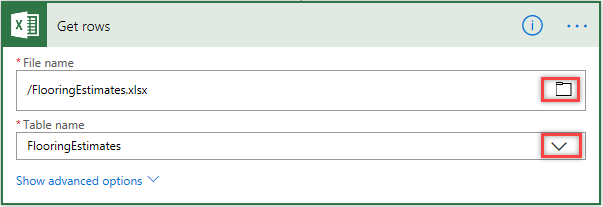

In this unit, you'll learn how to build prescheduled flows by using a trigger called *recurrence*. You'll build a flow for the Contoso marketing team that automatically pulls customer email addresses from a Microsoft Excel workbook on Microsoft OneDrive. You'll then set up the flow so that, once a day, any new email addresses that were added to the workbook are added to a MailChimp customer list.

## Create a scheduled flow

1. Sign in to [Microsoft Flow](https://ms.flow.microsoft.com) by using your organizational account.
1. Select **My flows**.
1. Select **New**, and then select **Create from blank**.

    

1. Select **Search hundreds of connectors and triggers**.
1. In the search field, enter *schedule*, select the **Schedule** service, and then select the **Schedule – Recurrence** trigger.
1. Set the **Frequency** field to *Day* and the **Interval** field to *1*. Then select **New step**, to add an action.

    

1. In the search field, enter *excel*, select the **Excel** service, and then select the **Excel – Get rows** action.

    > [!NOTE]
    > Be sure to select **Get rows**, not **Get row**.

1. In the **File name** field, select the folder button, and then select the Excel file to use.
1. In the **Table name** box, select the drop-down arrow, and then browse to and select the worksheet to use.

    

1. Select **New step**, and then select **Add an action**. 
1. In the search field, enter *chimp*, select the **MailChimp** service, and then select the **MailChimp - Add member to list** action.

    

    > [!NOTE] 
    > MailChimp is a premium connector. Depending on your Microsoft Flow license, you might need to sign up for a trial to use this connector.

1. In the **List Id** field, select the desired MailChimp mailing list. In the **Status** field, select *subscribed*.

    

1. In the **Email Address** field, use the dynamic content feature to add the **ContactEmail** field.

    

    Notice that the flow automatically creates an additional step. Flow detects that you're setting up an action that requires an additional action. Whenever the flow reads a new email address, it will also create a new action for each row.

    

1. Use the dynamic content feature to fill in the **First name** and **Last name** fields.

    

And there you have it!

This flow will now run once a day, get the new rows from the Excel worksheet, grab the email address and name from each row, and enter the email address and name in the Contoso MailChimp mail list, saving you both time and money.
