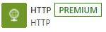
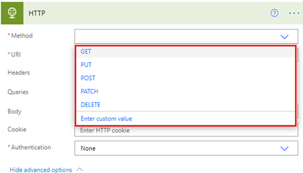
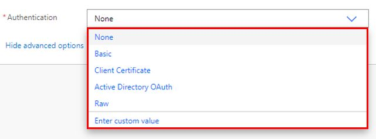
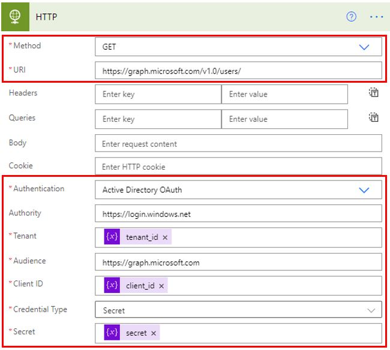
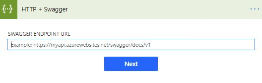

The Premium HTTP connection is built into Microsoft Power Apps and Microsoft Power Automate.

> [!div class="mx-imgBorder"]
> 

The HTTP connector provides users with the option to connect to a service or a data source that a direct connector is not available for. You can create the connection as either a **GET**, **PUT**, **POST**, **PATCH**, or **DELETE** method. It uses a uniform resource identifier (URI) to connect.

> [!div class="mx-imgBorder"]
> 

Authentication options for the HTTP connector are **Basic**, **Client Certificate**, **Active Directory OAuth**, and **Raw**, as shown in the following image.

> [!div class="mx-imgBorder"]
> 

An example of using an HTTP connector is making a connection to Microsoft Graph to gather user information. As the following screenshot shows, you can use the **GET** method, enter **graph.microsoft.com/v1.0/users/** in the **URI** field, and then select **Active Directory OAuth** authentication to get the information that you need.

> [!div class="mx-imgBorder"]
> 

You can also use **HTTP + Swagger**, which allows you to describe the structure of your API so that you can get the desired data and receive it in a format that can be easily manipulated.

> [!div class="mx-imgBorder"]
> 

