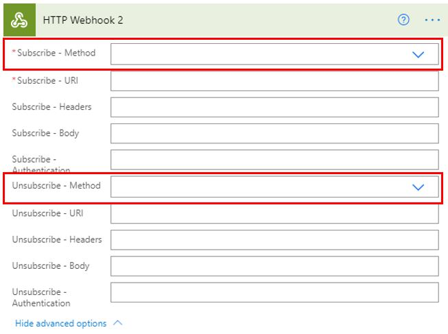
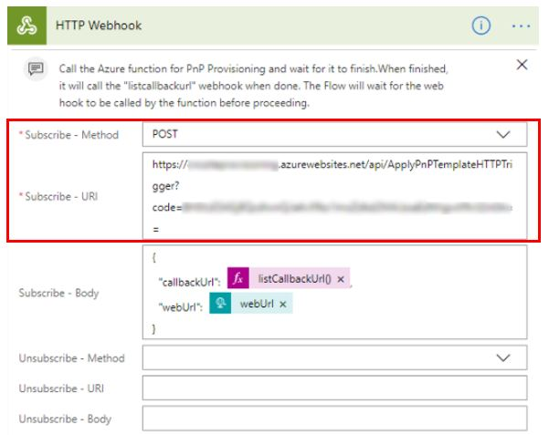

The premium **HTTP Webhook** connection is part of Power Apps and Power Automate and is provided by Microsoft.

> [!div class="mx-imgBorder"]
> 

**HTTP Webhook** is similar to the HTTP connector in that it uses similar methods to make calls and it requires a URI.

> [!div class="mx-imgBorder"]
> 

You can use **HTTP Webhook** for connecting with services that require you to subscribe and then unsubscribe. This concept is similar to an email subscription service that you would use with websites to get the latest information. You must first subscribe to officially acknowledge that you are ready to get the information, and after you're finished, you need to unsubscribe.

To connect the URI to the **HTTP Webhook** connector, you will use the **Subscribe Method** and the **Subscribe Authentication** options. The same steps are needed to unsubscribe.

An example of using an **HTTP Webhook** connector is making calls to Microsoft Azure functions.

> [!div class="mx-imgBorder"]
> 
