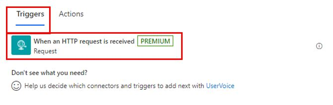
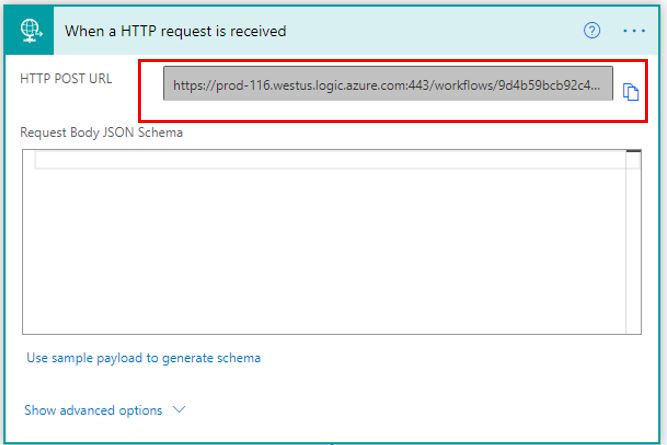
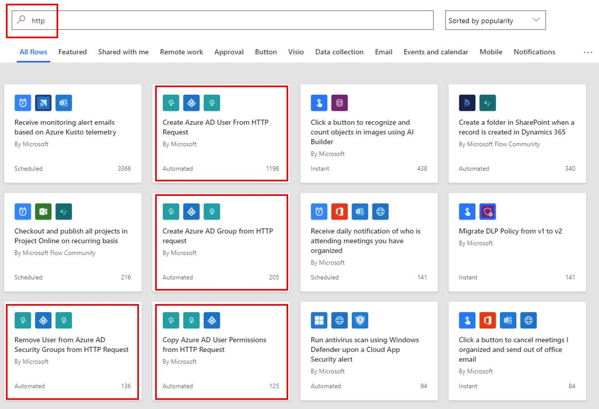
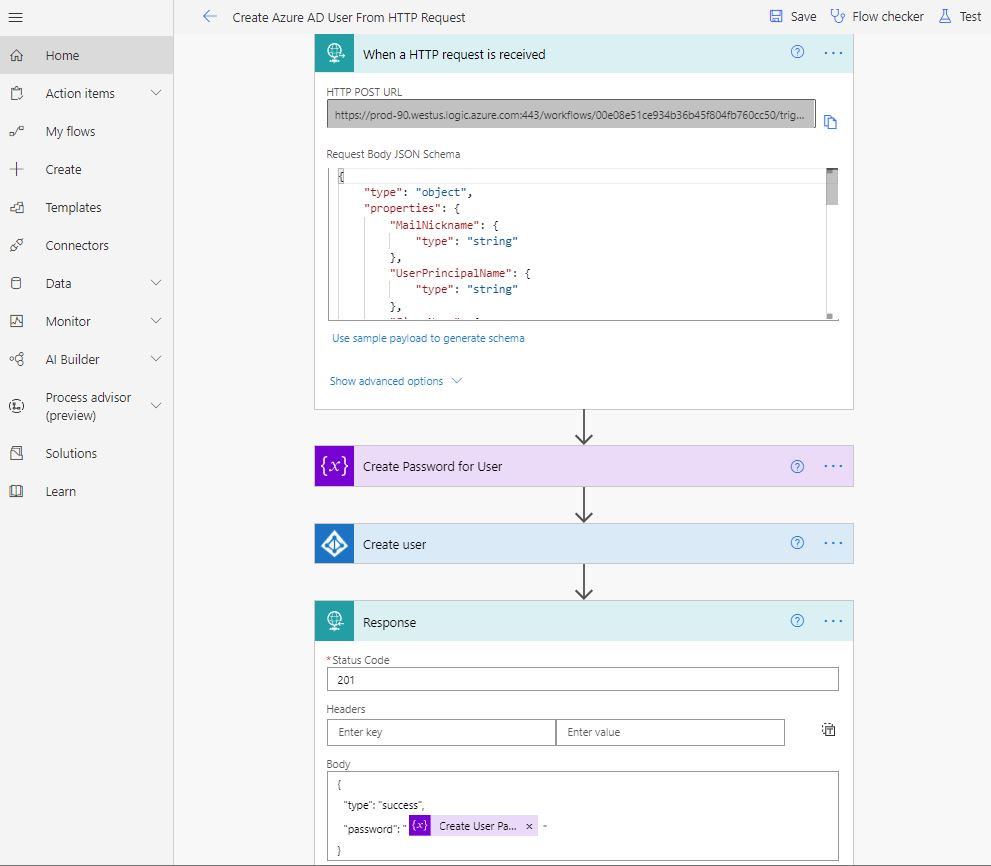

The **When an HTTP request is received** connector can use incoming API calls as triggers and actions.

> [!div class="mx-imgBorder"]
> 

When used as a trigger, the **When an HTTP request is received** connector will automatically generate the URL, which can be used as a **POST** method.

> [!div class="mx-imgBorder"]
> 

After it has been saved, the URL will be generated.

> [!div class="mx-imgBorder"]
> 

A few templates are available in Power Automate that use the **When an HTTP request is received** and **Response** connectors.

> [!div class="mx-imgBorder"]
> 

> [!div class="mx-imgBorder"]
> 
