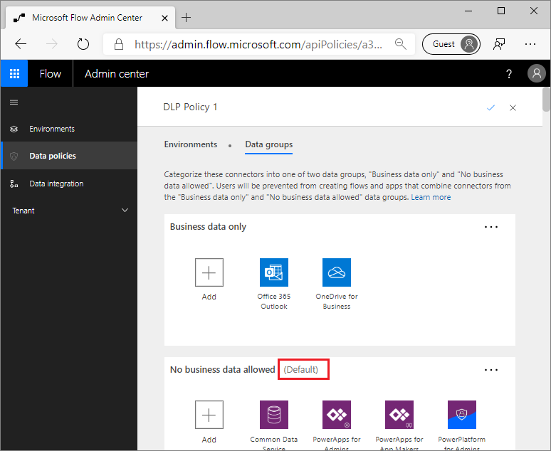
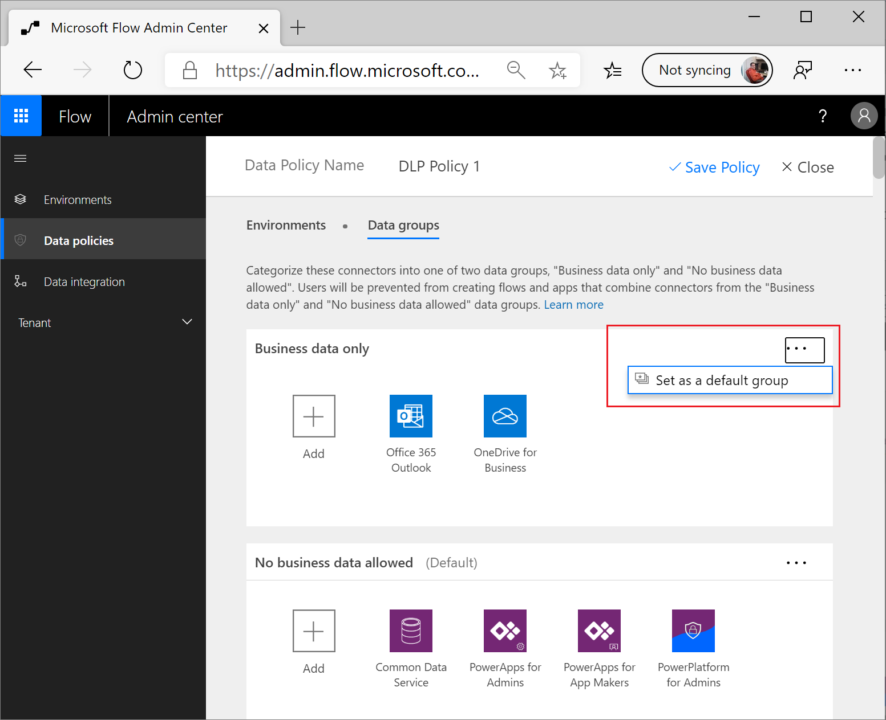

The introduction module of this learning path explained the 
DLP **Business data only** and **No business data allowed** data groups. 
You can use these data groups to separate connectors that share similar 
characteristics when it comes to their applicability to the business. 
For flows and apps that are processing business-related data, you will 
want to ensure that these connectors are placed within the **Business data only** 
data group. When you have connectors that don't support valid business 
use cases, these connectors are best placed in the **No business data allowed** 
data group.

When a DLP policy is created, Microsoft will designate a default data group, 
which will be assigned automatically to the **No business data allowed** 
data group.

An administrator can change the default data group by selecting the
ellipsis (**...**) beside the data group that they want to
designate as the default data group.

Changing the default data group does have implications; therefore, administrators
should understand the impact that their action will have. Whenever a new
connector is made available for Power Automate (and Power Apps), it will
automatically reside within the default data group. These new connectors
can come from a variety of sources, including Microsoft, third-party
connector providers, and custom connectors from inside your organization.

When a new Microsoft or third-party connector is published, it is
automatically available for use by makers within the environment that
the connector was deployed to. Administrators need to be mindful of this
behavior because it has an impact on DLP policies. For example, assume
an organization has encouraged users to build flows that take advantage
of Office 365 connectors. In addition, administrators have tried to
prevent makers from sending business data from Office 365 systems to
consumer-based services like email and file sharing. 

As a result of this strategy, consumer-based connectors have been placed 
into the **No business data allowed** data group, which is also the default 
data group. Suppose Microsoft introduces a new Office 365 connector that will
be placed into the default data group as a result, which means that a
maker can build a flow that includes data from this new Office 365
service and send that data to a consumer-based email or file sharing
service.

Administrators need to understand the behavior of the
default data group to avoid undesirable data leakage. Administrators can
be made aware of new connectors that have been recently published by
provisioning a flow template that detects when new connectors have been
published. A later module of this learning path will discuss this template and others.

Custom connectors also pose a challenge for administrators. Much like
Microsoft and third-party connectors, custom connectors will also be
placed in the default data group. However, they will not be visible,
which can create challenges. 

The good news is that, by using PowerShell or Power Platform Management 
connectors, an administrator can add custom connectors to a data group. 
After a connector has been added, it can be managed through the Power 
Automate Admin center. This topic is further discussed in the 
"Configure DLP for custom connectors" unit in this module.
