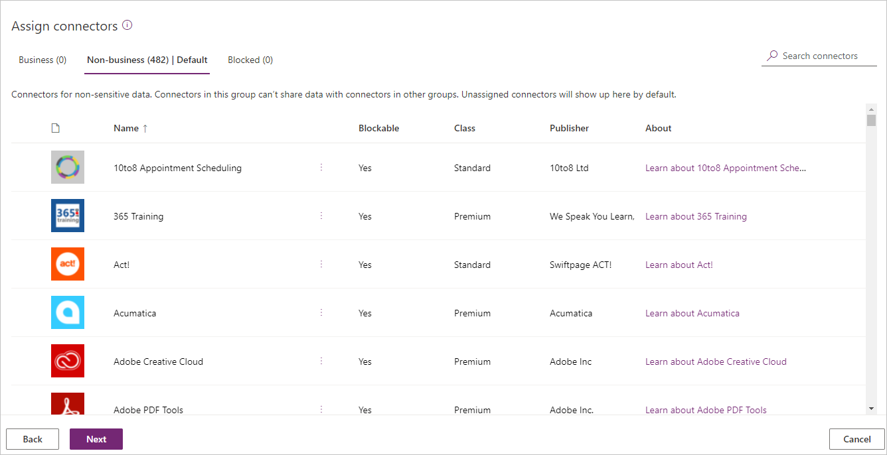
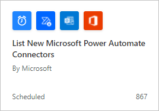

**Connectors** allow Microsoft Power Platform to send and receive data with other services such as Microsoft 365, Dataverse, Azure, Dropbox, and more. To control the flow of sensitive information, you can create rules to permit or prevent connectors from communicating with each other. DLP Policies allow you to assign connectors to one of three **data groups** to accomplish this task.

**Business** - Connectors that are processing business-related data.

**Non-business** (default) - Connectors that don't support valid business use cases.

**Blocked** - Connectors that are not to be used.

When a DLP policy is created, Microsoft assigns all connectors to the Non-business data group which is the **Default DLP data group**.

> [!div class="mx-imgBorder"]
> 

## Managing the default DLP data group

Whenever a new connector is made available, it will automatically be assigned to the default data group. New connectors can come from a variety of sources, including Microsoft, third-party connector providers, and custom connectors from inside your organization. An administrator can change the default data group by selecting the **Set default group** button and choosing the data group that they want to designate as the default data group.

Administrators need to understand the behavior of the default data group to avoid undesirable data leakage. For example, to prevent users from sending business data from Office 365 systems to consumer-based services like email and file sharing, an administrator places the Office 365 connectors in the Business data group. When Microsoft introduces a new Office 365 connector, that new connector will be automatically assigned to the default data group (in this case Non-Business). Now users can build a flow that includes business data from the new Office 365 connector and send that data to consumer-based services like email and file sharing.

## Receive notifications for new connectors

Administrators can be made aware of new connectors that have been recently published by using the **List New Microsoft Power Automate Connectors** flow template. The flow sends out an email when new connectors are added allowing the administrator to update the DLP policies.

> [!div class="mx-imgBorder"]
> 

## Custom connectors and data groups

Custom connectors pose a challenge for administrators as they do not appear in the DLP policy data groups. Just like Microsoft and third-party connectors, custom connectors are placed in the default data group. To assign a different data group, custom connectors require PowerShell or Microsoft Power Platform Management connectors. The exercise at the end of the module demonstrates how to apply a DLP policy to a custom connector.