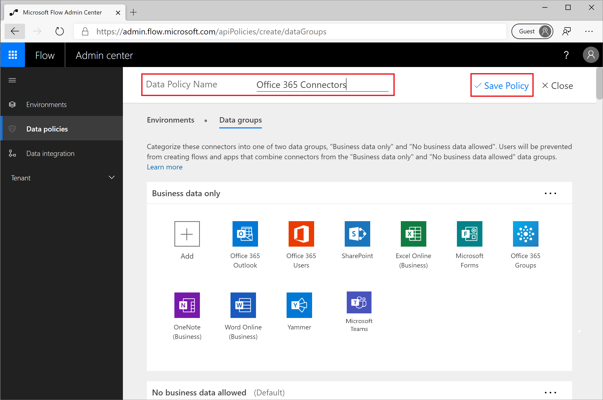

In the Plan and manage your Power Automate environment module, we 
completed a hands-on exercise that focused on building a DLP policy 
that supported Office 365 use cases. In this unit, we will further 
explain that DLP policy and also discuss some additional considerations.

In this DLP policy we included many popular Office 365 connectors
including the following:

| Connector Name          | Purpose                                                                                                                                                           |
|-------------------------|-------------------------------------------------------------------------------------------------------------------------------------------------------------------|
| Office 365 Outlook      | This connector allows makers to retrieve emails from an Office 365 mailbox and send emails through that mailbox.                                                  |
| OneDrive for Business   | The OneDrive for Business connector allows makers to store and retrieve documents from their OneDrive for Business account.                                       |
| Office 365 Users        | A connector that is used for obtaining meta data about Office 365 users, including user details, direct reports, photos and profiles.                             |
| SharePoint              | The SharePoint connector allows makers to interact with SharePoint features like reading/writing documents, communicating with custom lists and deleting content. |
| Excel Online (Business) | This connector allows makers to interact with spreadsheets by listing rows, adding rows or deleting rows in a spreadsheet.                                        |
| Microsoft Forms         | A popular connector that allows makers to receive input from a Microsoft Form and process it in a flow.                                                           |
| Office 365 Groups       | A connector used to manipulate groups, including adding/removing members from a group and creating group events.                                                  |
| OneNote (Business)      | The OneNote connector can be used to manipulate OneNote notebooks including adding sections and creating pages.                                                   |
| Word Online (Business)  | This connector allows makers to convert a Word Document to PDF and populate a Microsoft Word template.                                                            |
| Yammer                  | The Yammer connector allows makers to subscribe and post messages in the enterprise social media site.                                                            |
| Microsoft Teams         | Using the Microsoft Teams connectors, makers can subscribe to message posted within Teams channels, post messages and create channels.                            |

While the connectors that we just discussed represent connectors related
to Office 365 services, there are some other connectors that
administrators should consider including, even though they are not
related to Office 365. 

In some circumstances the following connectors may be useful for general 
purposes, like Approvals and Content Conversion, while others are available 
to help protect the organization through the automation of cyber security 
processes.

 | Connector Name             | Purpose                                                                                                                                                                                                                                                                                                                | Audience                      |
|----------------------------|------------------------------------------------------------------------------------------------------------------------------------------------------------------------------------------------------------------------------------------------------------------------------------------------------------------------|-------------------------------|
| Approvals                  | This connector is used to facilitate approvals in Power Automate. It is technically a connector so it needs to be considered when implementing DLP policies.                                                                                                                                                           | All Makers                    |
| Content Conversion         | The Content Conversion connector allows makers to convert HTML markup to plain text. It is useful when you need to remove all of the HTML markup so that you can store the raw text in another system.                                                                                                                 | All Makers                    |
| Microsoft Translator       | The Microsoft Translator connector allows a maker to detect languages, translate text and convert text to speech. It does not pose data leakage risks, but may be very helpful in multi-national organizations.                                                                                                        | All Makers                    |
| File System                | For organizations that are still dependent upon on-premises network shares, this connector will use the on-premises data gateway to provide a bridge between local file shares and Power Automate.                                                                                                                     | All Makers                    |
| Microsoft To-Do (Business) | This connector allows makers to get, list and create to-do items in the Microsoft To-Do service.                                                                                                                                                                                                                       | All Makers                    |
| PowerApps for Admins       | This connector allows administrators to modify app permissions, get a list of apps, get a list of custom connectors and set app owners.                                                                                                                                                                                | Environment and Tenant Admins |
| PowerPlatform for Admins   | This connector allows administrators to create environments, create environment DLP policies, create tenant DLP policies, delete environments, force environment syncs, list supported environments and more.                                                                                                          | Environment and Tenant Admins |
| PowerApps for App Makers   | This connector provides administrative capabilities, but in the context of an application and not the entire environment/tenant. Within this connector, an app owner can edit permissions, get app versions, get connections, publish an app, remove an app and more.                                                  | App owner/maker               |
| Flow management            | This connector provides administrative capabilities, but in the context of the flow owner. Within this connector, a flow owner can create connections, create flows, delete flows, get flow details, list my flows, list my environments and more.                                                                     | Flow owner/maker              |
| Microsoft Flow for Admins  | This connector has environment and tenant scope depending upon the connection that it is running under. As a result, this connector allows an admin to disable a flow, edit flow permissions, get flow user details, remove flow user details, remove flow and more.                                                   | Environment and Tenant Admins |
| Cloud App Security         | This connector is for use with the Microsoft Cloud App Security service. For organizations that are using this service, this connector allows Cloud Security Analysts to automate activities such as enabling security policies, getting cloud security alerts, tagging apps as sanctioned and more.                   | Cyber Security Analyst        |
| Microsoft Graph Security   | For organizations that are using Microsoft Graph Security, they can automate their security workflows by creating subscriptions, subscribing to alerts and more.                                                                                                                                                       | Cyber Security Analyst        |
| Microsoft Defender ATP     | Microsoft Defender ATP provides endpoint protection against malware and other malicious activities. Using the Microsoft Defender ATP, Cyber Security Analysts can automate actions such as isolating machines, perform investigation actions, removing application permissions, running antivirus scans and much more. | Cyber Security Analyst        |

You might ask why Power Platform and security related connectors
have been included in this list? The rationale is that automating
workloads shouldn't be restricted to app makers. Administrators and Cyber
Security Analysts also have increasing demands on their time and they
should be as efficient as possible.

When it comes to Cyber Security, you can no longer rely solely on
analysts querying logs around the clock. By taking advantage of triggers
for theses security services, alerts and notifications can be sent to
these teams where they can subsequently respond to emerging threats, in
near or real time. 

For some organizations, getting buy-in from security teams, to use the 
Power Platform may be challenging. However, once Cyber Security Analysts 
see the benefits, that could solve their own needs, they generally are more 
open to extending its use to other areas of the organization.
