In Module 2 we discussed strategies that deal with exceptions. The
scenario we outlined was SharePoint and Twitter connectors being used
within the same flow. The concern that an administrator may have is that
sensitive data could leak from SharePoint to Twitter. This scenario may
pose concerns for administrators. But, what if data flowed the opposite
way? Would an administrator be concerned if data from Twitter, made its
way to SharePoint? Probably not, because we are taking a public dataset
and bringing it into the enterprise.

DLP policies currently do not have a notion of directionality. But, this
is something that we can implement by using the Power Platform
Management connectors. In the following paragraphs we are going to
walkthrough how we can accomplish directional data governance.

The first thing we need to do is to create a DLP policy, from the [Power Automate Admin center](https://admin.flow.microsoft.com/?azure-portal=true), that includes
both the SharePoint and Twitter connectors in the Business data only
data group. By using this configuration, we are allowing makers to build
flows that include both of these connectors.

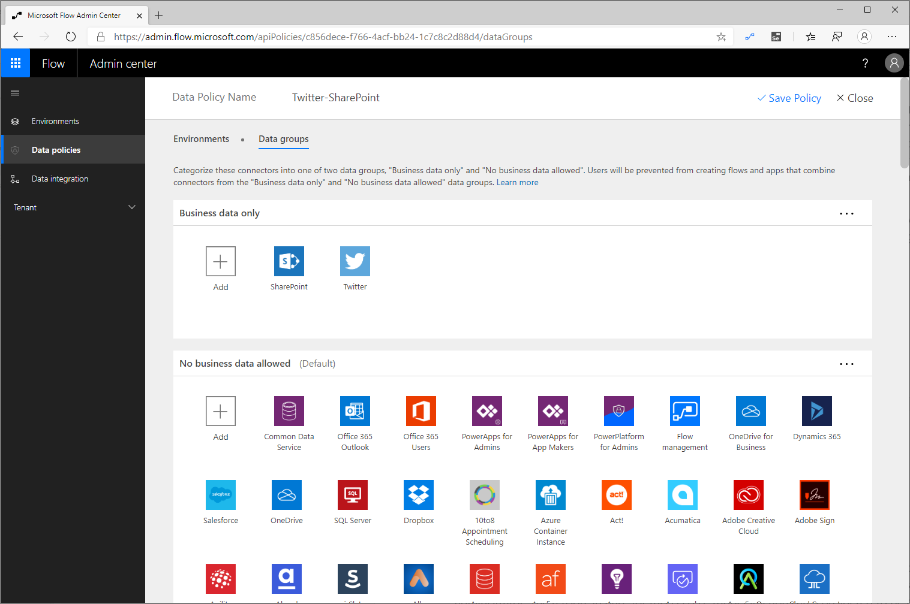

We will now transition to the [Power Automate Maker Portal](https://flow.microsoft.com/?azure-portal=true) and will log in using our
administrator account so we can build our governance flow. We will build
a scheduled flow that will run every hour.

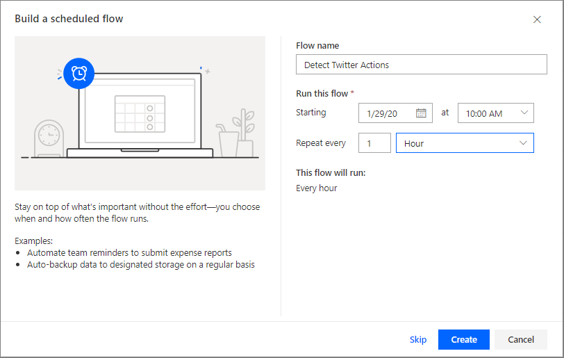

A Recurrence trigger will automatically be added to our flow. We will
now add an Initialize variable action to our flow. We will call this
variable previousTimestamp and will include an expression of
```ticks(addMinutes(utcNow(),-60))```. This expression will calculate the
number of ticks as of 60 minutes ago. The reason for including this is
that we want to see if any flows have been created or modified since the
last time our flow ran, which would have been 60 minutes ago.

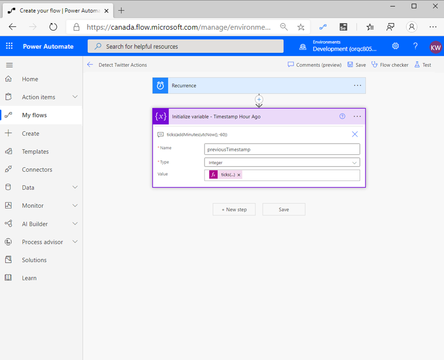

We also want to add another variable called isFlowAction that is of type
Boolean that has a default value of false. We will use this variable
later in our flow when we detect that a flow includes a Twitter action.

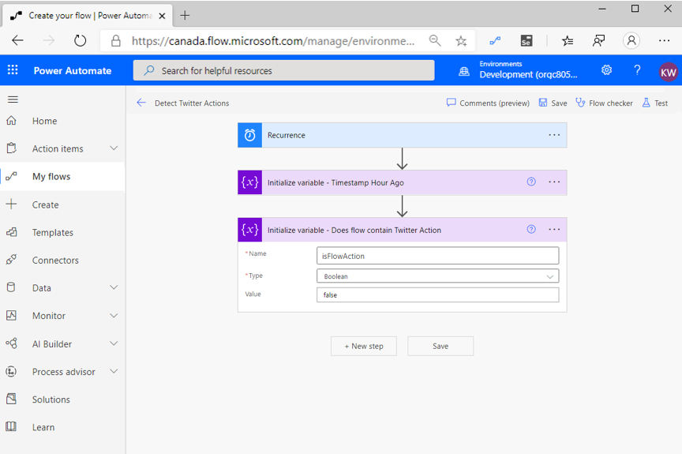

Next up, we will use the PowerPlatform for Admins connector and the List
Environments as Admin action that will provide our flow with a complete
list of environments in our tenant. We will subsequently loop through
each environment so that we can look for flows that include Twitter
actions.

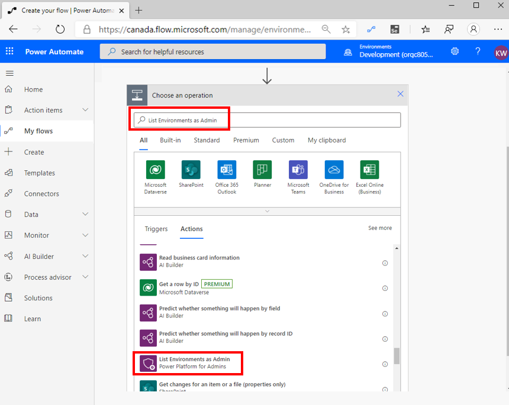

After we list all environments, we want to add the Flow management
connector and use the List Flows as Admin action that will provide a
listing of all flows for a given environment.

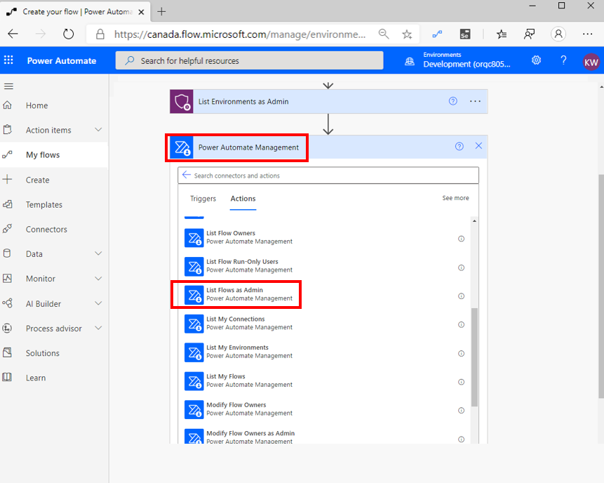

The List Flows as Admin requires the Name of an environment as an input
parameter. We will use the Name field that is returned from our List
Environments as Admin call. When we provide this input, an Apply to each
action will be automatically added which will allow us to iterate
through all environments.

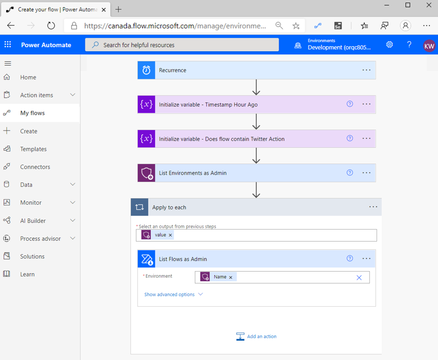

Since we are only interested in exploring recently modified flows, we
will add a Condition to our flow and will compare the ticks of the
flow's last modified timestamp to that of our variable that we
established earlier in our flow. To accomplish this, we will use an
expression to calculate the ticks of our last modified timestamp. Our
complete statement is
```ticks(items('Apply_to_each_2')?['properties']?['lastModifiedTime'])``` 
is greater than previousTimestamp.

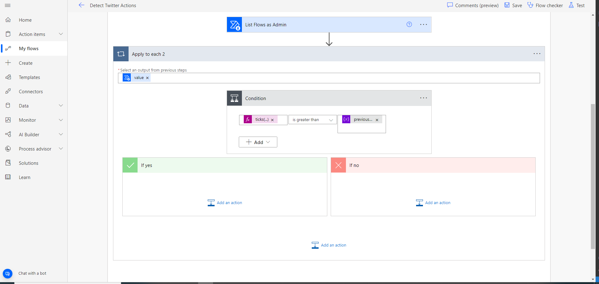

When we detect a flow has been modified within the past 60 minutes, we
want to ensure it doesn't belong to our administrator. This will help us
avoid an error when we try to add the administrator to be a co-owner of
a flow in a future step. To detect if the current flow belongs to our
administrator, we can use the Office 365 Users connector and the Get my
profile (v2) action. This will return information about the user who
established a connection to the connector, which in our case is the
administrator. We need to add the Office 365 Users action to the If yes
branch.

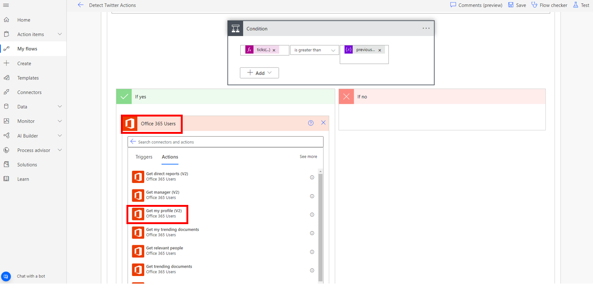

We will now add another condition that will check to see if the Creator
object ID (from the List Flows as Admin action) is not equal to Id (from
the Get my profile (V2) action). In the If yes branch, we will now add
the Edit Flow Owner Role as Admin action that belongs to the Microsoft
Flow for Admins connector. This action will add our administrator user
to be a co-owner of the flow. We need to do this to extract the flow
definition and this requires us to be a co-owner of the flow. We will
retrieve the flow definition in an upcoming step, but for now need to
provide the current Environment Name, current Flow Name and details
about our administrator user including email address, display name and
id. These values are accessible from our Get my provide (V2) action.

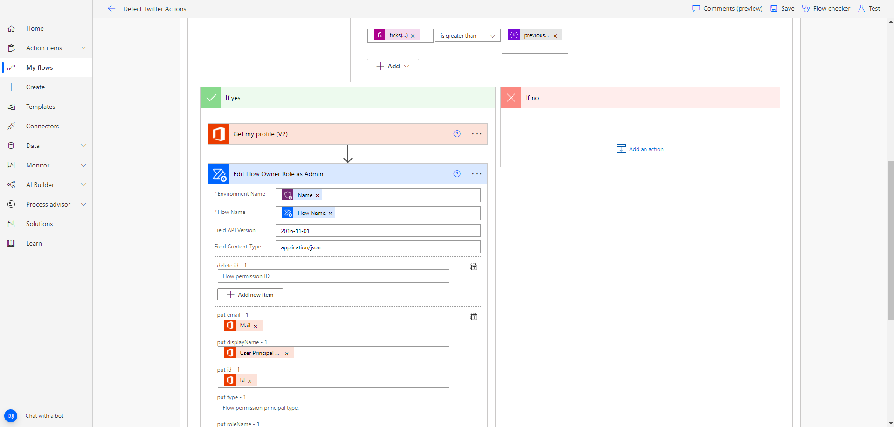

Once we have added our administrator account to be a co-owner of the
flow, we can call the Get Flow as Admin action from the Flow management
connector.

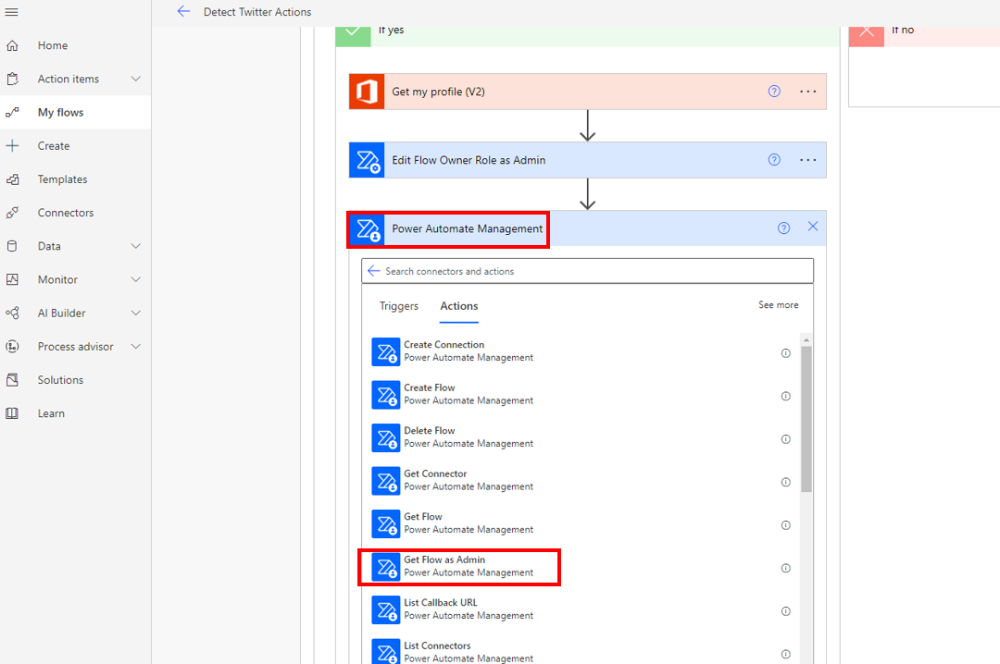

The inputs to the Get Flow as Admin action includes the current
Environment Name and Flow Name. The output of this action includes the
flow definition that will allow us to determine if there is a Twitter
action.

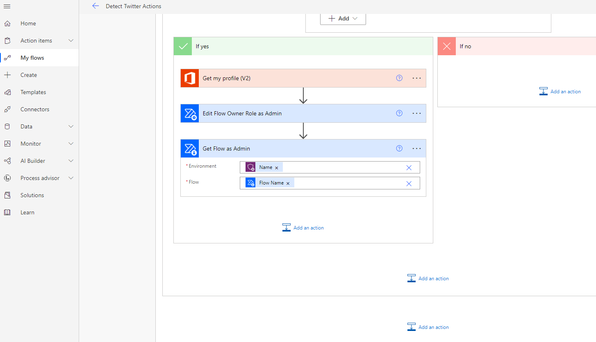

To check to see if a Twitter action is being used, we will add a
condition to our flow and check to see if the Action Api name (from the
Get Flow as Admin action) is equal to shared_twitter. Once we add this
condition, an Apply to each loop will be applied since the Action Api
name attribute is part of an array as each flow can have many actions.

Within our If yes, branch we will now update our isFlowAction variable
to be set to true since we have now found a flow that includes a Twitter
action. We will use this variable later in our flow to determine whether
we need to disable a flow and send the flow owner an email.

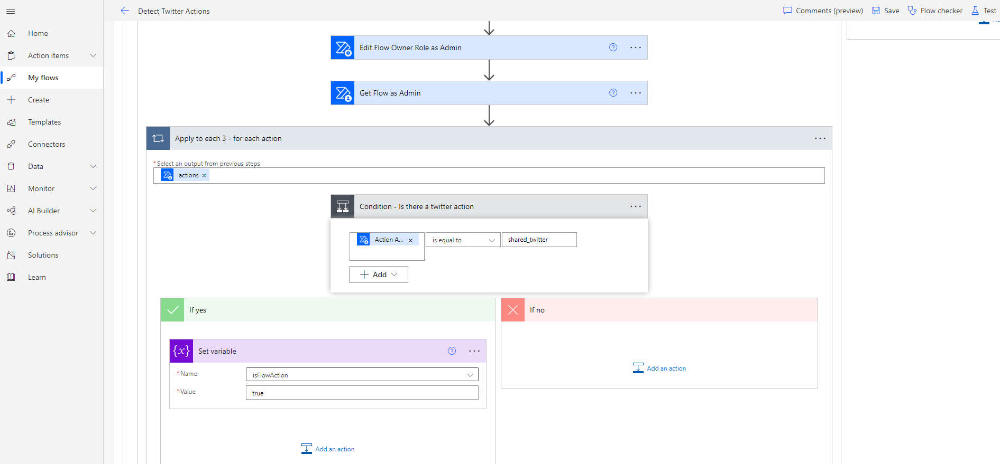

Outside the Apply to each that allows us to iterate through all actions
in our flow, we will add another condition. This one will check to see
if the value of our isFlowAction variable is true.

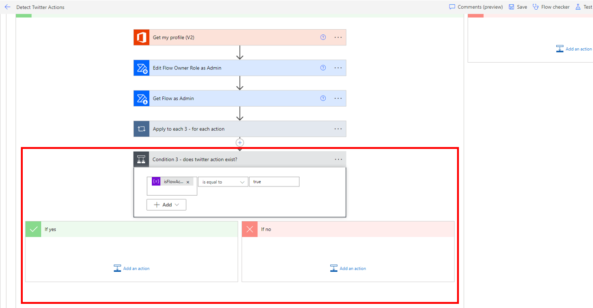

In the If yes branch, we will add the Microsoft Flow for Admins
connector and then select the Disable Flow as Admin action. This action
will allow us to disable the flow so that information cannot be sent to
Twitter. To call this action, we need to include the current Environment
Name and Flow Name.

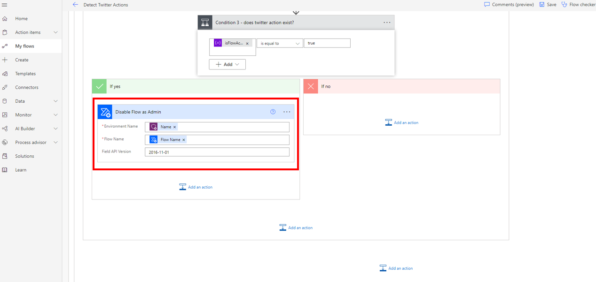

When we disable someone's flow, we want to send them an email so they
are aware that their flow is no longer running. To get the flow owner's
email address we will use the Office 365 Users connector and use the Get
user profile (V2) action to return the owner's email address. To get
their email address, we need to pass in the Creator object ID which can
be retrieved from the List Flows as Admin action.

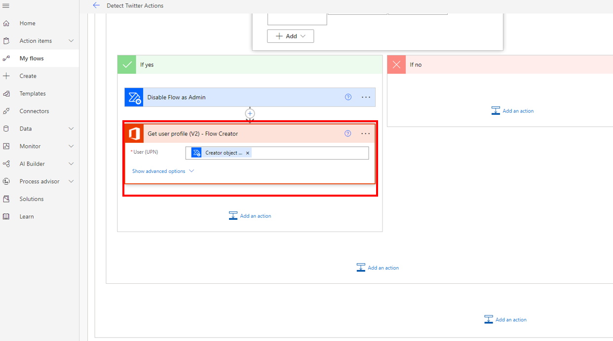

We will now send the flow owner an email by using the Office 365 Outlook
connector and the Send an email (V2) action. We can use information
returned from the Get user profile (V2) action to send this email
including the Mail and Given Name attributes. In addition, we can
include the name of the flow by including the Flow Display Name
attribute found in the List Flows as Admin output.

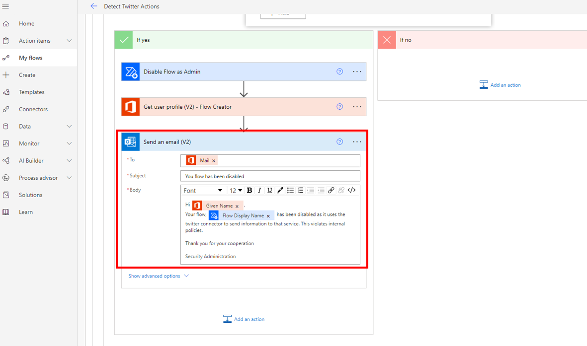

Since we are looping through all flows in our tenant, we need to set our
isFlowAction variable back to false so that we can look for other flows
that may have a Twitter action. We can now save our administrative flow.

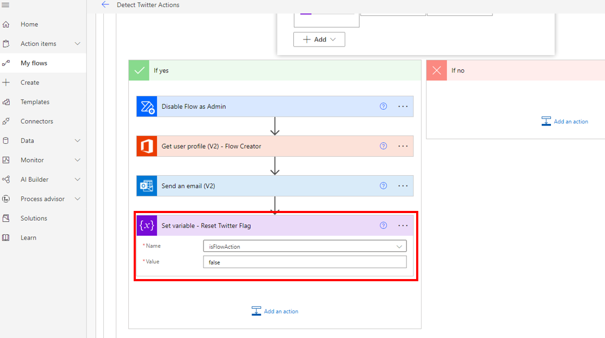

To test our flow, we will log into the Power Automate maker portal using
a different account and will create a simple flow that includes a
SharePoint trigger and a Twitter action. As you recall, this scenario
will not be blocked by our DLP policy, but it should get detected by the
administrative flow that we just created.

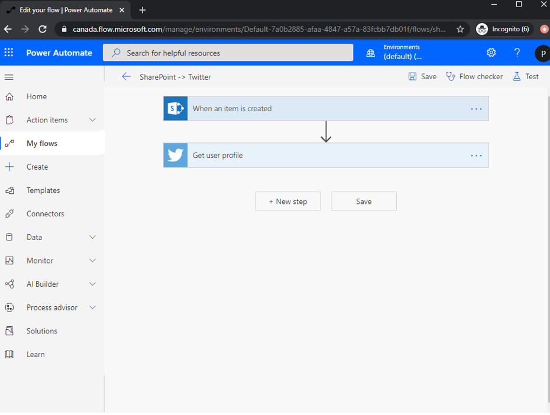

We can now run our Detect Twitter Actions flow that we previously
created as an administrator. When this flow runs, it should detect that
a flow was recently modified that includes a Twitter action. As a
result, an email will be sent to the flow owner.

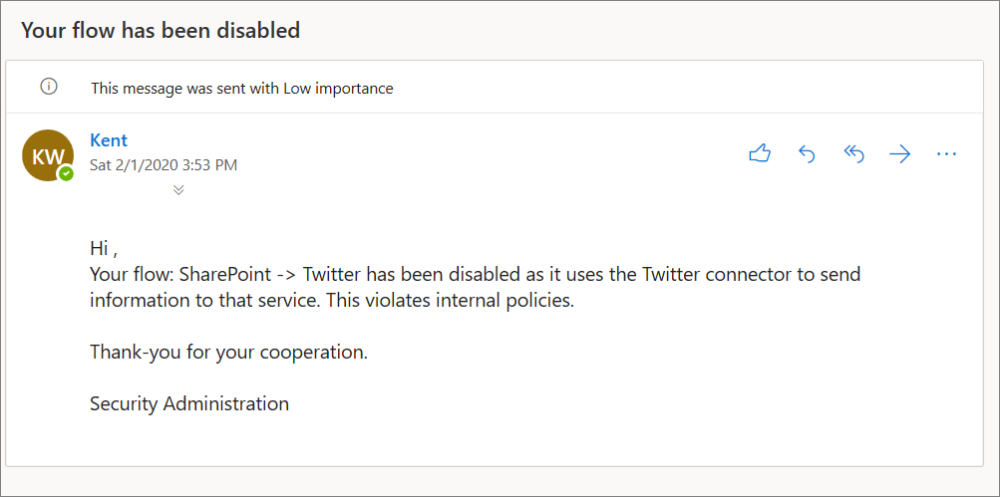

If we examine the SharePoint -> Twitter flow, we will discover that it
has been disabled as a result of our administrator disabling the flow.

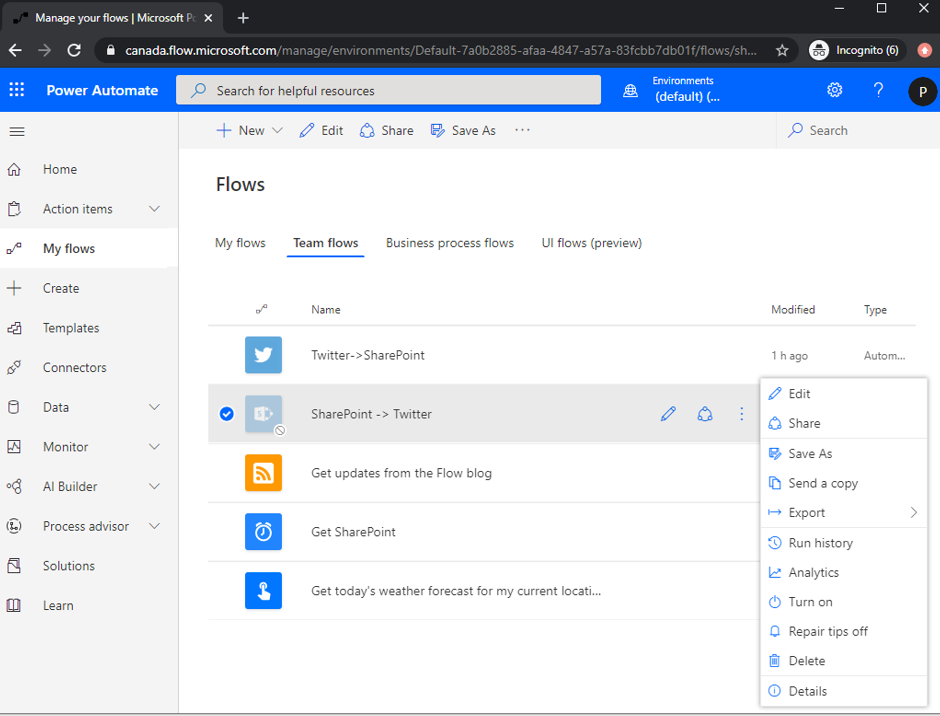

However, as we previously discussed, retrieving information from Twitter
and sending it to SharePoint, does not violate our governance rules. As
a result, we can create another flow, using our flow maker's account,
that includes a Twitter trigger and a SharePoint action. When we run our
Detect Twitter Actions governance flow, this flow remains functional and
does not get disabled as this is a permitted use case.


