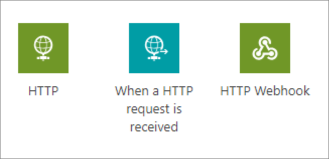
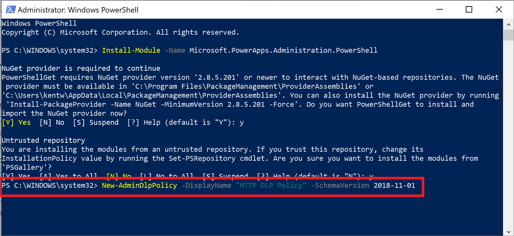
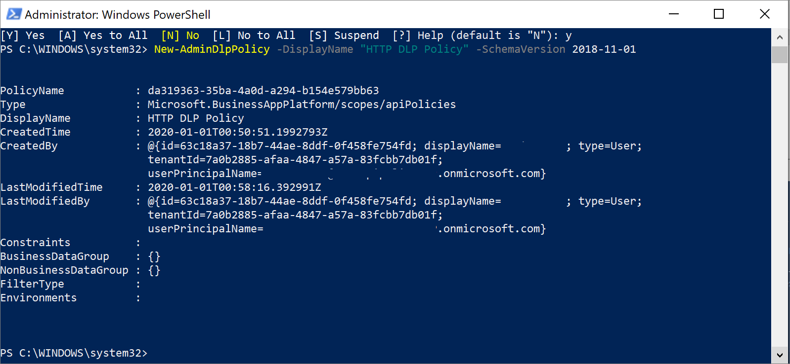
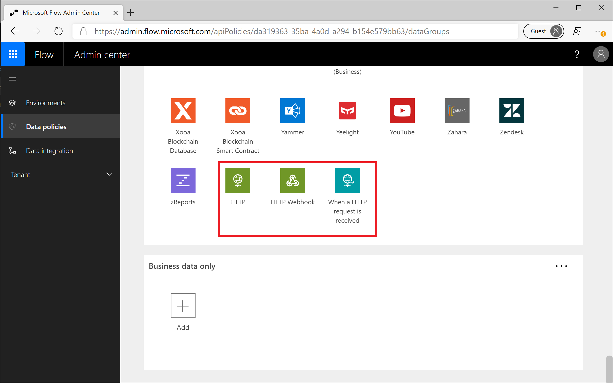

Another scenario that administrators may not be aware of is that HTTP
triggers and actions cannot be managed through the existing DLP editor
without some actions being performed by an administrator. The reason, in
part, for this is HTTP triggers/actions are considered to be built-in
and technically aren't a connector, even though they may have similar
characteristics.

However, due to customer feedback, Microsoft has made investments that
make it possible to manage the following triggers/actions:



Now it is important to understand that these triggers/actions can only be managed in DLP policies that have a [schema version](https://flow.microsoft.com/blog/introducing-http-and-custom-connector-support-for-data-loss-prevention-policies/?azure-portal=true) of 2018-11-01. By using a new schema version, it allows organizations to
make the decision as to whether or not they want to implement these
changes. Otherwise, there is a high potential that some flows will be
broken, depending upon how an organization wants to classify the
connectors as business or non-business. For example, if the HTTP action
was previously not managed and is being used with connectors from the
Business data only data group and is subsequently placed in the No
business data allowed data group then any flows using this configuration
will be suspended due to DLP violations.

DLP policies, using this new schema version, can be constructed using
either of the following:

-   Power Platform Management connector

-   Power Apps and Power Automate PowerShell Cmdlets

However, using PowerShell is the simplest path forward. Additional
information about PowerApps and Power Automate PowerShell Cmdlets can be
found [here](https://docs.microsoft.com/power-platform/admin/powerapps-powershell/?azure-portal=true).

After installing the pre-requisite PowerShell modules, we can run the
following statement ```(**New-AdminDlpPolicy -DisplayName "HTTP DLP
Policy" -SchemaVersion 2018-11-01**)``` which will create a new DLP policy
that includes support for HTTP when we include a **-SchemaVersion**
parameter of **2018-11-01**. Once we have executed the previous
statement, we will be asked to log in using our admin credentials.



Once the command has been executed, we will be provided a status output
that includes the internal **PolicyName** and other
attributes.



If we navigate to the [Power Automate Admin Center](https://admin.flow.microsoft.com/apiPolicies/?azure-portal=true), we will discover that our DLP Policy has been created.

> [!NOTE]
> Since we did not specify an Environment parameter when we
created this DLP policy, it will be applicable to the entire tenant.

Once we have explored this DLP Policy, we will find that our HTTP
triggers/actions have been included in our default data group, which in
this case is **No business data allowed**. These connectors can now be
managed just like any other connectors and can be added to the
**Business data allowed** data group.


