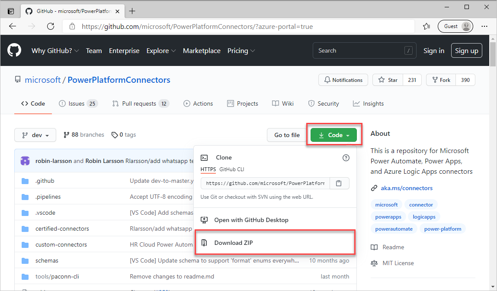
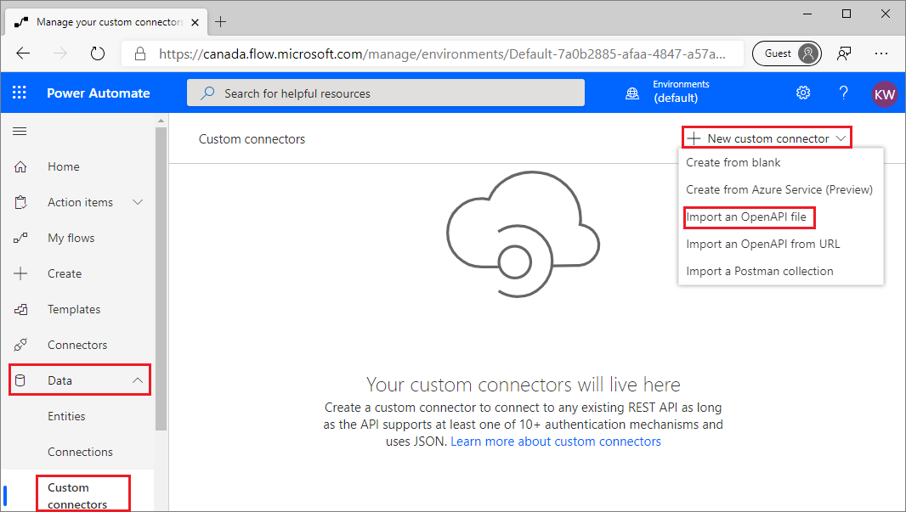
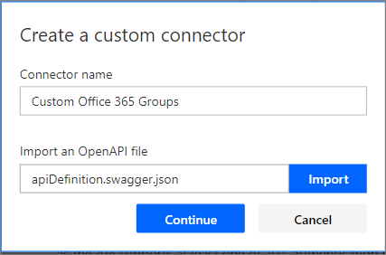
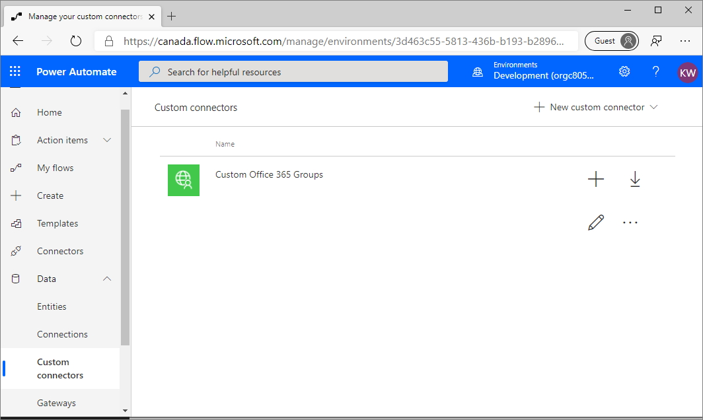
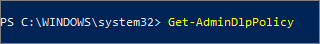
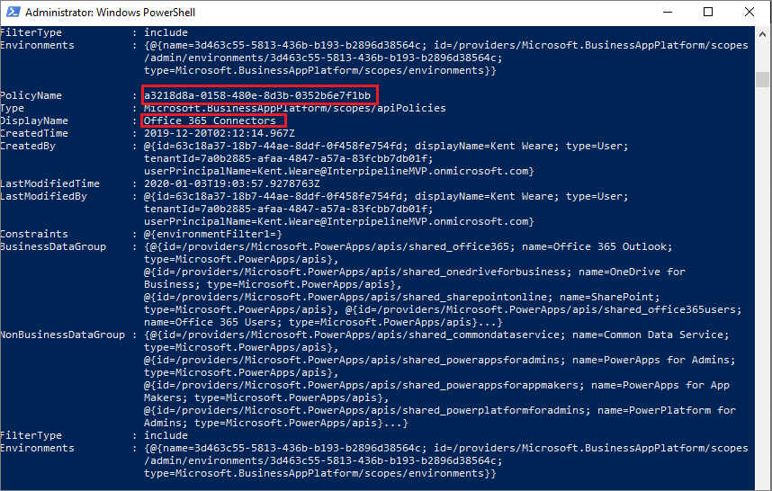
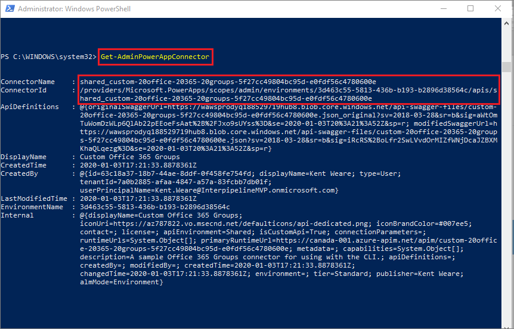
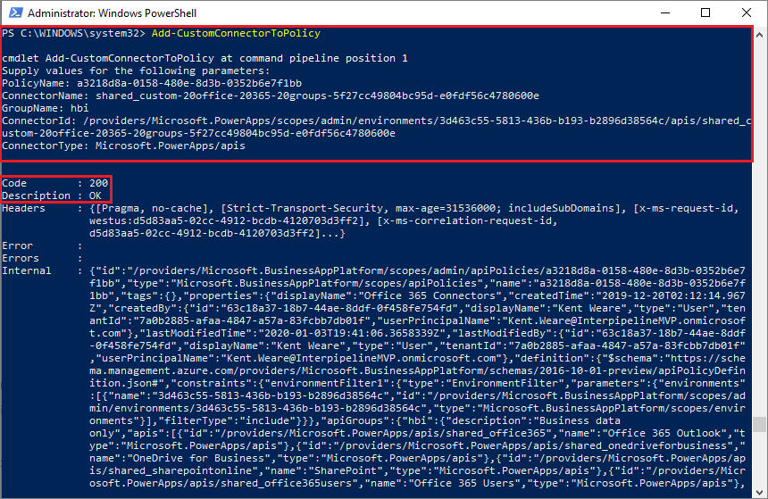
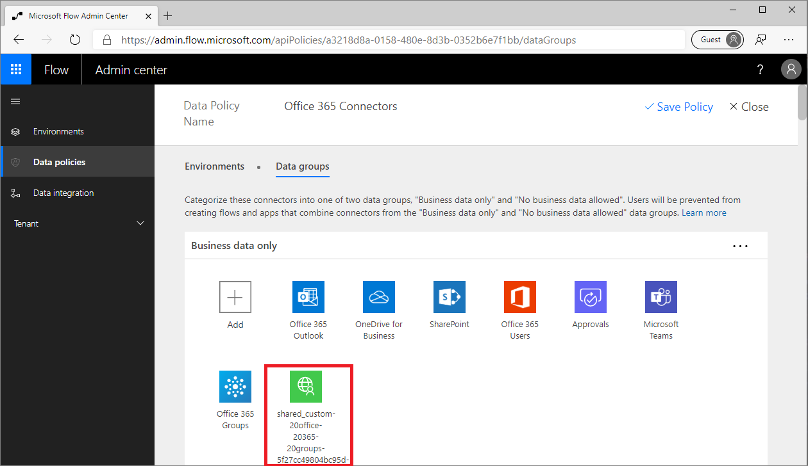

In this exercise, we are going to manage a Custom connector in a DLP
policy. To manage a Custom connector, we need to ensure that we have one
in our environment, so the first part of this exercise will be
publishing a Custom connector from GitHub. Once we have that connector
deployed, we will then manage it using the Powershell Cmdlets provided
by Microsoft.

### Publishing Custom connector

The Custom connector that we are going to deploy, comes from Microsoft's
GitHub repository. The connector's functionality is arbitrary, we just
need a custom connector for the purposes of DLP policy management.

The steps to install the Custom connector are as follows:

1.  Navigate to Microsoft's [Power Platform Github repository](https://github.com/microsoft/PowerPlatformConnectors/?azure-portal=true) in a web browser.

2.  Click on the **Clone or download** button, followed by clicking on the **Download ZIP** link. Make a note of where you save this zip file.

    

3.  Locate the zip file that you downloaded. Right-click on it in Windows Explorer and select **Extract All...**

4.  Navigate to the extracted folder and open the **PowerPlatformConnectors-master** folder.

5.  Open the **samples** folder.

6.  Open the **Office365Groups** folder.

7.  Make a note of the location of the **apiDefinition.swagger.json** file. We will need this file when we go to create our Custom connector in subsequent steps.

8.  Navigate to the [Power Automate maker portal](https://flow.microsoft.com/?azure-portal=true) in a web browser and log in.

9.  From the environment picker, select the environment that we created in Module 1. If you recall, we created an environment called **Development**. By selecting this environment, our Custom connector will only be deployed in this environment and will not be available in your default environment.

10. Within the left navigation, expand **Data** and then click on **Custom connectors**.

11. Click **+ New custom connector** and then **Import an OpenAPI file**.

    

12. Provide a **Connector name** of **Custom Office 365 Groups** and then locate the OpenAPI file (**apiDefinition.swagger.json)** via the **Import** button and then click on **Continue.** If you recall, this is the file that we located in step 7 of this exercise.

    

13. The Custom connector publisher wizard will now be displayed. There are no actions for us to complete on the **General** tab.

14. Click on the **Security** tab and then select an Authentication type of **No authentication**.

15. There are no further actions that we need to take on the Definition or Test tabs so we can click on the **Create connector** link to have our connector published.

16. In the upper left-hand corner, a message will appear, briefly, that indicates our custom connector has been published. Click the **Close** label to complete publishing the Custom connector.

17. You should now see your Custom connector available within the Custom connectors experience.

    

18. We have now completed publishing our Custom connector. In the next section, we will manage this Custom connector in a DLP policy.

### Manage custom connector in a DLP policy

As we have discussed earlier in this module, a Custom connector cannot currently be managed through the Power Automate Admin center's DLP experience, without some administrative actions. In this section, we are going to use the [Microsoft Power Apps and Power Automate PowerShell Cmdlets](https://docs.microsoft.com/power-platform/admin/powerapps-powershell/?azure-portal=true) for administrators.

In order to add a Custom connector to a DLP policy, there are some
unique identifiers for our Custom connector and DLP policy that we will
need to retrieve in order to provide them as inputs when adding our
Custom connector. These steps are also covered in the following section.

> [!NOTE]
> Prior to attempting the following actions, please ensure you meet the pre-requisites outlined earlier in this module.

1.  Launch **Windows PowerShell** and **Run as Administrator**.

    

2.  Import the required modules using the following commands:

    **Install-Module -Name Microsoft.PowerApps.Administration.PowerShell**

    **Install-Module -Name Microsoft.PowerApps.PowerShell -AllowClobber**

3.  If you are prompted to accept the change to *InstallationPolicy* value of the repository, accept [A] Yes to all modules by typing 'A' and pressing **Enter** for each module.

4.  List all of your DLP policies by executing the following command in the **Windows PowerShell** command-line tool: **Get-AdminDlpPolicy**

    

	> [!NOTE]
	> You will be prompted for credentials at this point. Please ensure the credentials that you are using have Environment or Tenant Administrator permissions.

5.  A list of DLP policies will be displayed. Look for the DLP policy that we created in **Module 2** called **Office 365 Connectors**. When you find it, please copy the **PolicyName,** which is represented as a GUID, to a text editor like Notepad.

    

6.  We now need to retrieve more details about our Custom connector. To do so, we need to type **Get-AdminPowerAppConnector** in the **Windows PowerShell** command-line tool. Once results are returned copy the **ConnectorName** and **ConnectorId** values to a text editor.

    

7.  Now type **Add-CustomConnectorToPolicy** in the Windows PowerShell command-line tool.

8.  When prompted, provide the **PolicyName** that you copied in step 5.

9.  Provide the **ConnectorName** value that you copied in step 6.

10. Provide the **GroupName** of **hbi** to put it into the **Business data only** data group. Provide **lbi** if you would rather put the Custom connector **No business data allowed** data group.

11. Now provide the **ConnectorId** which we also copied in step 6.

12. We will now be prompted to provide a **ConnectorType**. Provide a value of **Microsoft.PowerApps/apis**.

13. Our command should now run and we should be presented with a status **Code** of **200** and a **Description** of **OK**.

    

14. Let's now validate that our custom connector can be managed through DLP policies by navigating to the [Power Automate Admin center](https://admin.flow.microsoft.com/apiPolicies/?azure-portal=true) and explore our **Office 365 Connectors** DLP policy to ensure that our Custom connector appears in our **Business data only** data group. We can now manage this Custom connector, much like any other connector.

	

> [!NOTE]
> There is currently no way to rename the Custom connector from this experience.
