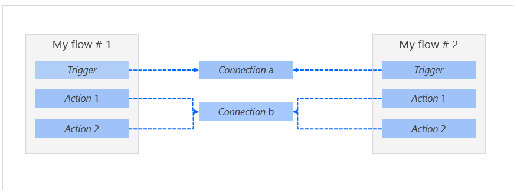
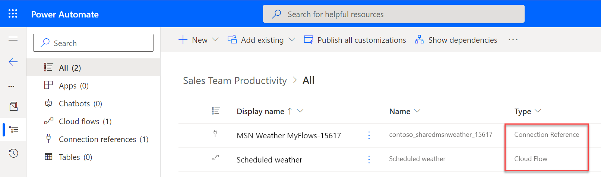
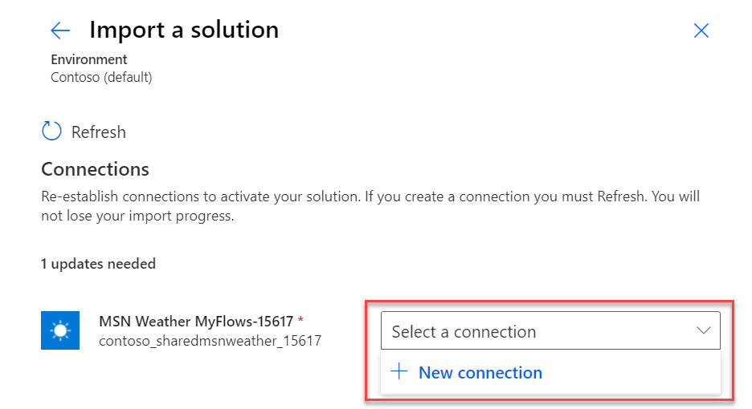
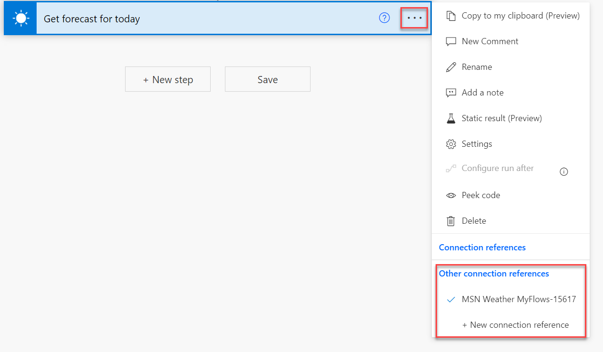
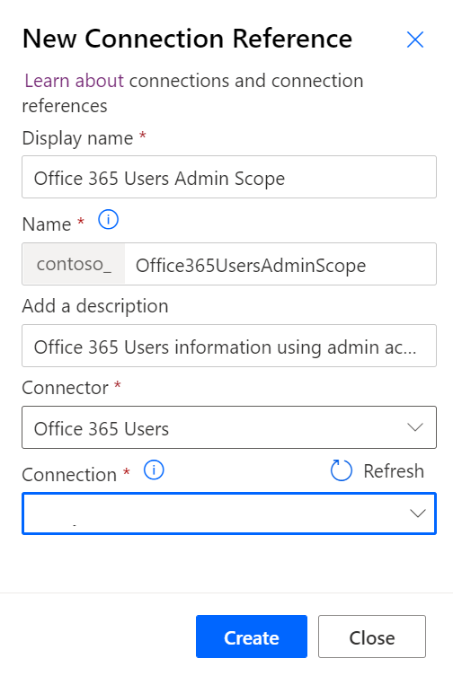
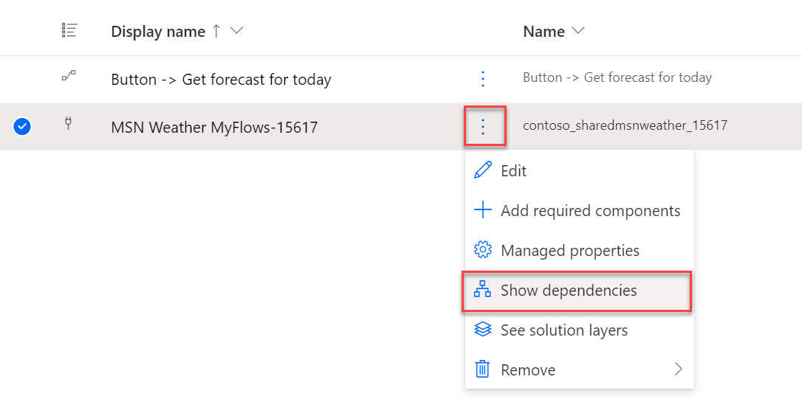
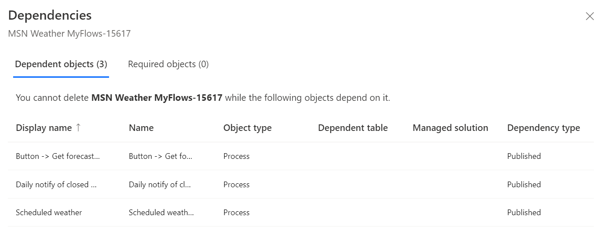

Connection references help make cloud flows in solutions easier to transport between Microsoft Power Platform environments by abstracting environment specific dependencies. This feature enables you to implement [healthy application lifecycle management (ALM) practices](/power-platform/alm/implement-healthy-alm/?azure-portal=true). For new cloud flows that are created in solutions, connection references are created automatically. However, understanding their purpose and how to manually set up connection references can help you optimize their use.

Power Automate cloud flows use connectors for triggers and to perform actions in a flow. When you use a connector, a connection is established by using your account information to the underlying service. In this example of a cloud flow that's not in a solution, your cloud flow has a direct dependency on the connection. Connections are specific to a Microsoft Power Platform environment. The following diagram illustrates how a cloud flow depends on the connection directly when it isn't using connection references.

> [!div class="mx-imgBorder"]
> 

If this same architecture was used with a cloud flow in a solution, the flow definition that is transported between environments for the cloud flow would need to be edited in each environment to change the flow definition. Good ALM practices call for only editing the flow definition in a development environment and not in downstream environments, such as test and production. To facilitate healthy ALM and to simplify the task of deploying solutions, you should use connection references with cloud flows in solutions.

Connection references are solution components that contain information about a connector. They allow the cloud flow trigger and actions to be bound to a connection reference instead of directly to a connection. Then, the connection reference binds to a connection in a unique way that doesn't modify the flow definition while maintaining healthy ALM practices. The following diagram illustrates how connection references are used.

> [!div class="mx-imgBorder"]
> 

A solution with cloud flows that uses connection references will list the cloud flow and one or more connection references on the solution object list.

> [!div class="mx-imgBorder"]
> 

When the solution is imported into another environment, the first time when a connection reference has been added, a prompt will display for a connection.

> [!div class="mx-imgBorder"]
> 

No further setup is needed after the import completes. The relationship between the connection reference and the connection will be maintained for future updates. To change a specific connection that's associated with a flow, you can edit the connection reference and change the selected connection.

## Set up triggers and actions

When you select a trigger or an action to add to your flow, the flow designer will check if a connection reference is already available for the connector; if not, a connection reference will be added. From a trigger or action card, you can select the ellipsis (**...**) menu to view the connection reference that's used and others that are available. From this menu, you can select another connection reference or add a new one. If you add a new connection reference from this menu, you won't have control over the name that's used.

> [!div class="mx-imgBorder"]
> 

Typically, you would want all steps in a flow to use the same connection reference. For some scenarios, using multiple connection references is important. For example, having multiple connection references allows you to set up different user account information for each connection. When you intend to use multiple connection references, it's best to manually pre-create them, as described later in this topic, so that you have unique, meaningful names.

Additionally, multiple cloud flows can use connection references. This detail is important to remember if you later change the connection that you use because it will change for all cloud flows that use the connection reference.

## Pre-create connection references

By pre-creating connection references in your solution, you can have control over the naming. You can create a new connection reference from Solution Explorer by selecting **+ New > More > Connection reference**.

> [!div class="mx-imgBorder"]
> 

The preceding example shows the creation of a connection reference for an admin service account that would be used in flows to perform elevated operations. Naming the connection reference to **Office 365 Users Admin Scope** clarifies that, when a connection is set up for this connection reference, an administrator service account should be used. The **Display Name** is important for knowing the intent of a connection reference. The name should be concise and unique to clarify the intended purpose.

If you didn't pre-create or only want to change a connection reference naming, you can edit the connection reference and change everything except the **Name** field that's used to uniquely identify the connection reference. By default, a connection reference name includes the target connector, the current solution name for context, and a random suffix to ensure uniqueness. Consider adjusting the default connection reference name to something that's unique and explains what it will be used for.

## Use existing connection references

Power Automate will try to use existing connection references from the current solution but also will look at them in other solutions in the same environment. If you look at your solution object list and can't find a connection reference for the connections that you're using after creating your flow, then your flow is probably using a connection reference from another solution. If that isn't an intended action, you'll need to use the pre-create process to add a new connection reference in your solution and then change your flow actions to use that connection reference. If you intend to share the connection, then you should select **Add existing > More > Connection references** and then choose the existing connection reference to add to your current solution.

## Remove connection references

Similar to other solution components, you can remove connection references from the current solution or physically delete them from the environment. A common reason to remove connection references is when they're no longer needed or when you consolidate connection references that have been automatically created. Before removing or deleting connection references, you should check if anything is using the connection reference. To do so, select the connection reference and then select **Show dependencies**.

> [!div class="mx-imgBorder"]
> 

The following image shows an example of the **Dependencies** page, which lists any solution component that depends on that connection reference.

> [!div class="mx-imgBorder"]
> 

If none of the dependencies are from your current solution, you can remove the connection reference from the solution without issue. If dependencies are listed, then you'll be blocked from physically deleting the connection reference. In that event, you'll need to edit each dependent component and remove their use of the connection reference before you can delete it.
