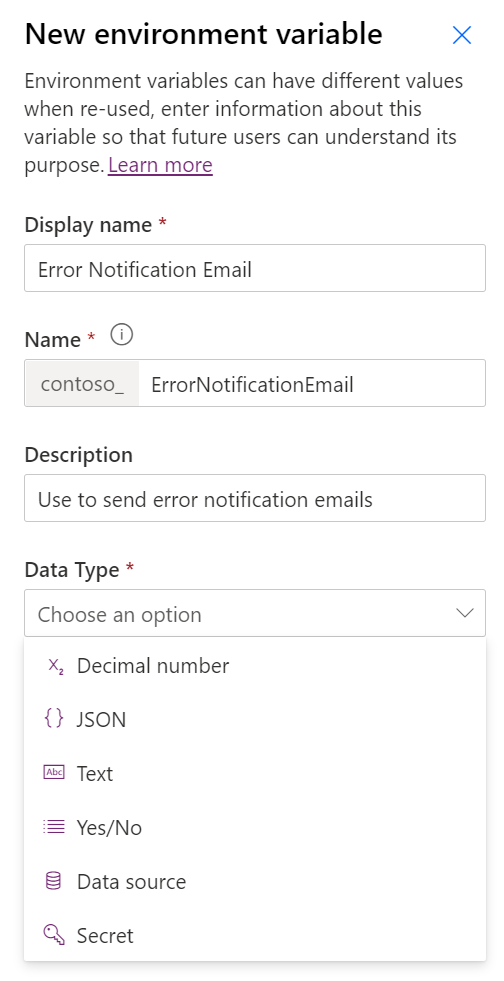
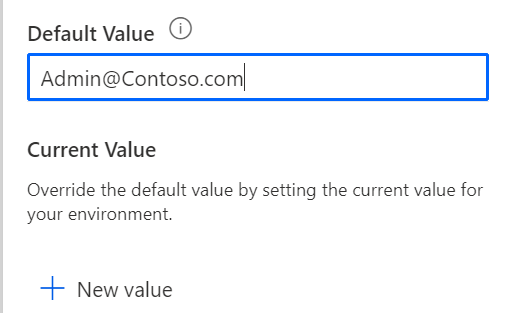
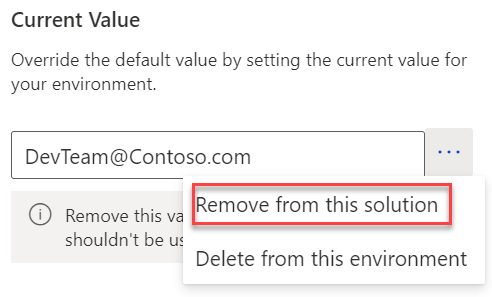
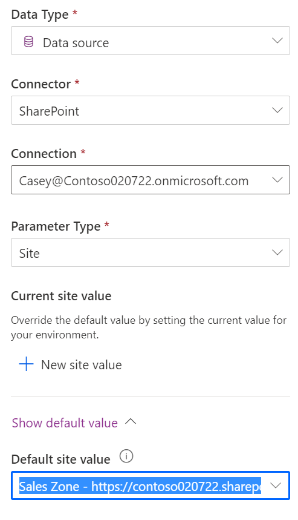
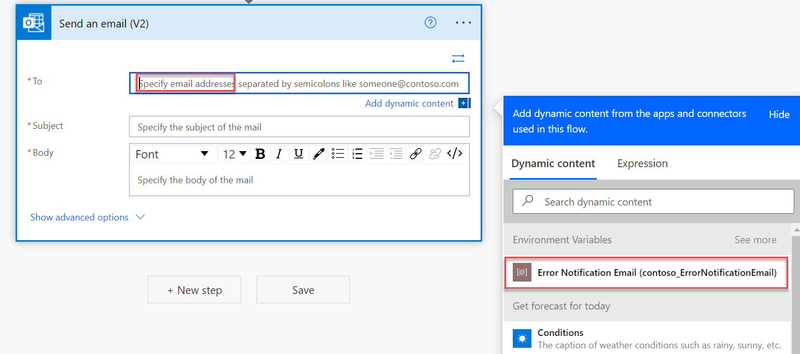

> [!VIDEO https://www.microsoft.com/videoplayer/embed/RE4R3SS]

When you build Power Automate cloud flows, it's common to have values that you specify on the flow steps that are specific to an environment that the flow is implementing in. For example, flow actions might refer to document name, external service URL, or email address for notifications that can vary between the environments, such as development, test, and production.

Environment variables allow separate definition and setup of those values from the cloud flow definition. Then, the environment variable can have a different value in each environment where the cloud flow is deployed. Other Microsoft Power Platform resources, such as Power Apps or custom connectors, can also use environment variables. After the environment variable values have been defined, cloud flows can replace hard-coded content with environment variable values, similar to how other dynamic content is used.

Environment variables consist of two parts definition and current value. The definition defines the data type of a variable and can contain a default value. The second part is a current value that can be optionally provided in each environment to override the default value. When a solution that contains an environment variable definition is imported into another environment, if a current value hasn't already been established, the import will prompt for the value.

You can create environment variables in a solution by selecting **+ New > More > Environment variable**. The following image shows an example of creating an **Error Notification Email** variable.

> [!div class="mx-imgBorder"]
> 

As you fill in the **Display Name** and **Name** fields, remember that the name should clarify purpose and be unique. For example, if you name the example variable **Email**, it would be too generic. You can change the **Display Name**, which is viewed by users, after creation. The **Name**, which is used internally and when the variable is programmatically accessed, isn't changeable to help prevent breaking anything that's consuming the variable value. The **Data Type** determines what type of values can be stored and is also not changeable after creation. Data types of **Data source** and **Secret** are unique and will be described later in this module.

After you have chosen a **Data Type**, you can set up a default value. A default value isn't required, but it's helpful if you have one. For example, if you have an **Expiration Days** variable, you might default it to 28 days, but it could be overridden by a current value in any environment. The following screenshot shows the process of providing a default value for the variable.

> [!div class="mx-imgBorder"]
> ]

You can also provide a current value for the environment. For example, in development, the DevTeam alias might be used.

> [!div class="mx-imgBorder"]
> ]

If you do set a current value, make sure that you open the variable for edit again and then remove the current value from the solution after the variable has been created. If you don't complete this action, the development environment's **Current Value** component will be included in exports of the solution. As a result, the development environment **Current Value** will be used in any other environment, such as test and production. To remove it from the solution but keep it set up for the development environment only, select **Remove from this solution**.

> [!div class="mx-imgBorder"]
> 

## Data source environment variables

The **Data type** of **Data Source** is designed to store the configuration of how to point a connection to a specific data source. After selecting **Data source** as the **Data type**, you'll be required to pick a connector that is supported for this type of configuration. Currently, only SharePoint is supported. For example, if SharePoint is selected, then you'll need to choose a **Parameter type** of **Site** or **List**. You'll need to set up a **Site** data source environment variable before you can set up a **List** environment variable. The following screenshot shows an example of creating a **Site** data source variable.

> [!div class="mx-imgBorder"]
> 

## Secret environment variables

The **Data type** of **Secret** is designed for referencing secrets that are stored in Microsoft Azure Key Vault. This type of variable requires other setup. For more information, see [Use Azure Key Vault secrets](/powerapps/maker/data-platform/environmentvariables?azure-portal=true#use-azure-key-vault-secrets-preview). Secret environment variables help prevent sensitive information from being accidentally exposed to the users or in the flow run history.

## Use environment variables

In your solution cloud flow, you can replace hard-coded values by referencing the environment variables. After you've defined variables in an environment, the available environment variables will be selectable from the **Dynamic content** pane. The following screenshot shows an example of using the **Error Notification Email** variable that you defined previously.

> [!div class="mx-imgBorder"]
> 

You can also use the parameters expression to get the value. For example, ***parameters(\'contoso_ErrorNotificationEmail\')*** would retrieve the same value.
