In this exercise, you'll create a cloud flow outside of a Dataverse solution.

> [!IMPORTANT]
> Use a test environment with Dataverse.

## Exercise 1: Create a cloud flow

In this task, you'll create a cloud flow that will send a daily weather notification for a certain city.

1.  Go to [Power Automate](https://powerautomate.microsoft.com/?azure-portal=true) and make sure that you're in the correct environment.

1.  Select **My flows**.

1.  Select **+ New flow > Scheduled cloud flow**.

1.  Enter **Daily weather** in the **Flow name** field, and in the **Repeat every** section, select **1 Day**. Select **Create**.

	> [!div class="mx-imgBorder"]
	> 

1.  Select **+ New step**.

1.  Search for **weather** and then select **Get forecast for today** (MSN Weather).

1.  Enter **Denver** or any city that you want for **Location**, select **Imperial** for **Units**, and then select **+ New step**.

	> [!div class="mx-imgBorder"]
	> 

1.  Search for **send email** and then select **Send me an email notification**.

1.  Enter **Today's weather** for **Subject**, select in the **Body** field, and then select **Day Summary** from the **Dynamic content** pane.

	> [!div class="mx-imgBorder"]
	> 

1. Type **with High** in the **Body** field and then select **Temperature High** from the **Dynamic content** pane.

1. Type **and Low** in the **Body** field and then select **Temperature Low** from the **Dynamic content** pane.

1. The **Send me an email notification** step should resemble the following image. Select **Save** and then wait for the flow to be saved.

	> [!div class="mx-imgBorder"]
	> 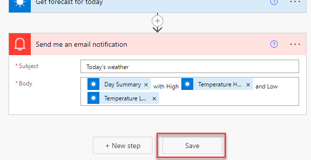

1. Select the back button.

	> [!div class="mx-imgBorder"]
	> 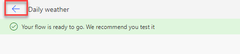

1. Select **Run**.

1. Select **Run flow**.

1. Select **Done**.

   The flow run should succeed.

	> [!div class="mx-imgBorder"]
	> 

1. Select the **App** launcher, right-click **Outlook**, and then select **Open in a new tab**.

	> [!div class="mx-imgBorder"]
	> 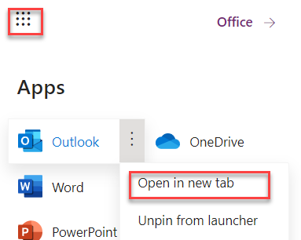

1. You should receive the email notification that's sent by the flow. Select to open the email.

   The email should resemble the following image.

	> [!div class="mx-imgBorder"]
	> 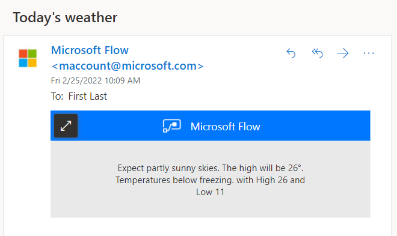

## Exercise 2: Create a solution and a publisher

In this exercise, you'll create a solution and a publisher, and then you'll add the cloud flow that you created to the solution.

### Task 1: Create a solution and a publisher

In this task, you'll create a solution and a publisher.

1.  Go to [Power Automate](https://powerautomate.microsoft.com/?azure-portal=true) and make sure that you're in the correct environment.

1.  Select **Solutions > + New solution**.

1.  Enter **My Automations** for **Display name**, **MyAutomations** for **Name**, and then select the **+ New publisher** button.

	> [!div class="mx-imgBorder"]
	> 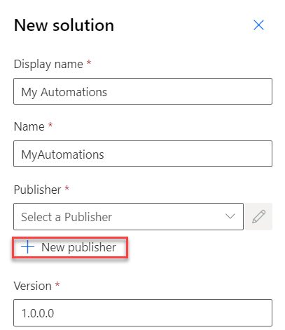

1.  Enter **Contoso** for **Display name**, **Contoso** for **Name**, **contoso** for **Prefix**, and then select **Save**.

1.  Select the **Contoso** publisher that you created, select **Publisher**, and then select **Create**.

1.  Don't navigate away from this page.

### Task 2: Add the cloud flow to your solution

In this task, you'll add the cloud flow to your solution.

1.  Make sure that you still have **Solutions** selected.

1.  Open the **My Automations** solution that you created.

1.  Select **Add existing** and then select **Automation > Cloud flow**.

1.  Select the **Outside Dataverse** tab.

1.  Select the **Daily weather** cloud flow that you created and then select **Add**.

	> [!div class="mx-imgBorder"]
	> 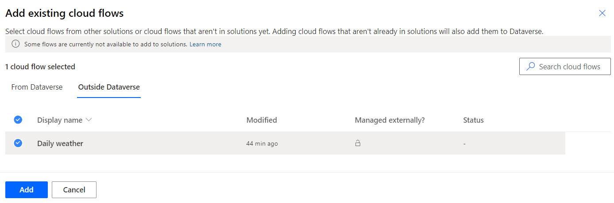

1.  Don't navigate away from this page.

## Exercise 3: Use environment variables

In this exercise, you'll create an environment variable for the weather location and then use the location in the cloud flow.

### Task 1: Create an environment variable

In this task, you'll create an environment variable.

1.  Make sure that you still have the **My Automations** solution selected.

1.  Select **+ New > More > Environment variable**.

	> [!div class="mx-imgBorder"]
	> 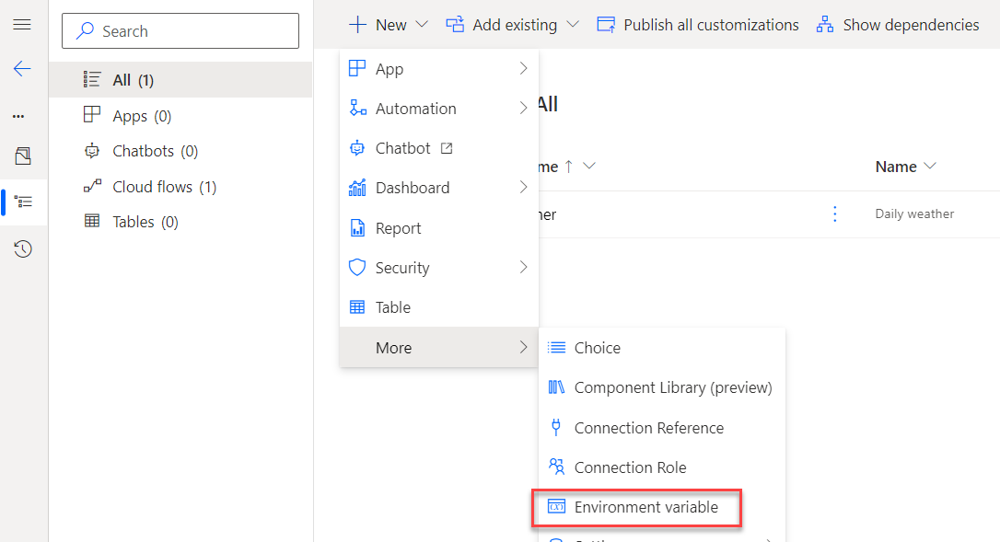

1.  Enter **Location** for **Display name**, **Location** for **Name**, **Text** for **Data type**, and then select the **+ New value** button.

1.  Enter **Seattle** for **Current Value** and then select **Save**.

	> [!div class="mx-imgBorder"]
	> 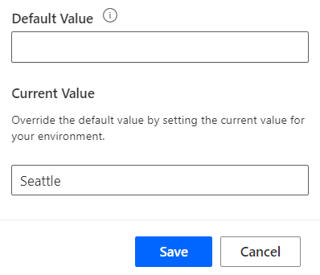

1.  Select to open the **Location** environment variable that you created.

1.  Select the ellipsis (**...**) button next to current value and then select **Remove from this solution**. You're removing the current value from the solution because you want other people who use this solution to provide their location.

	> [!div class="mx-imgBorder"]
	> 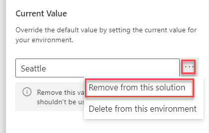

1.  Close the **Edit location** pane.

1.  Don't navigate away from this page.

### Task 2: Edit the flow

In this task, you'll edit the flow to use the environment location variable.

1.  From the solution, open the **Daily weather** cloud flow that you added to the solution.

1.  Select **Edit**.

	> [!div class="mx-imgBorder"]
	> 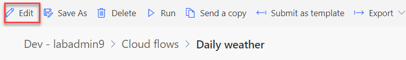

1.  Expand the **Get forecast for today** step.

1.  Remove the location text that currently reads **Denver**.

1.  Select the **Location** field, go to the **Dynamic content** pane, and then select **Location**.

	> [!div class="mx-imgBorder"]
	> 

1.  Expand the **Send me an email notification** step.

1.  In front of the **Body** text, add **In** and then select **Location** from the **Dynamic content** pane.

	> [!div class="mx-imgBorder"]
	> 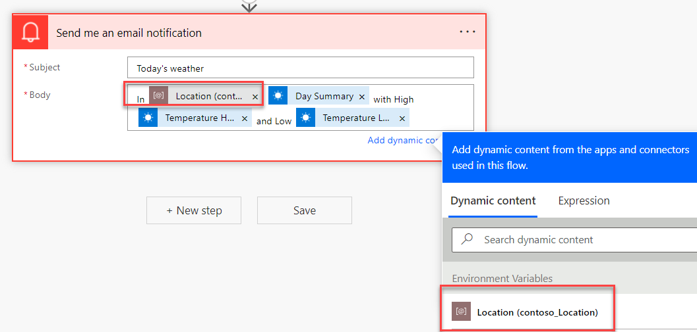

1.  Add a colon (**:**) after the location and then select **Save**.

1.  Wait for the flow to be saved.

1. Select **Test**.

1. Select **Manually** and then select **Test**.

1. Select **Run flow**.

1. Select **Done**.

   The flow should run successfully.

1. Select the **App** launcher, right-click **Outlook**, and then select **Open in new tab**.

	> [!div class="mx-imgBorder"]
	> 

1. You should receive the email notification that's sent by the flow. Select to open the email.

   The email should show the weather for Seattle.

	> [!div class="mx-imgBorder"]
	> 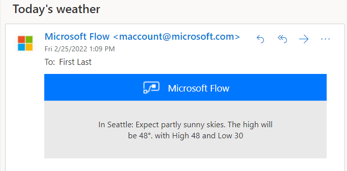

## Exercise 4: Export the solution

In this exercise, you'll export the solution that you created.

1.  Go to [Power Automate](https://powerautomate.microsoft.com/?azure-portal=true) and make sure that you're in the correct environment.

1.  Select **Solutions**, select the **My Automation** solution that you created, and then select **Export**.

	> [!div class="mx-imgBorder"]
	> 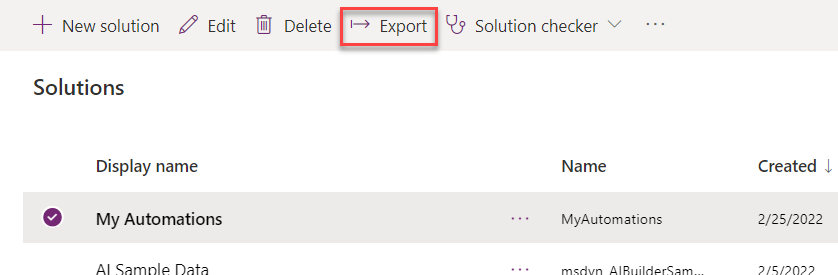

1.  Select **Publish** and then wait for the publishing to complete.

1. Select **Next**.

1. Select **Managed** and then select **Export**.

1. Wait for the solution to be exported.

1. Save the exported solution on your machine.

## Exercise 5: (Optional) Import the solution

In this exercise, you'll import the solution that you created into a new environment.

> [!IMPORTANT]
> You will need a second test environment.

1.  Go to [Power Automate](https://powerautomate.microsoft.com/?azure-portal=true) and make sure that you're in the correct environment.

1.  Select **Solutions > Import**.

	> [!div class="mx-imgBorder"]
	> 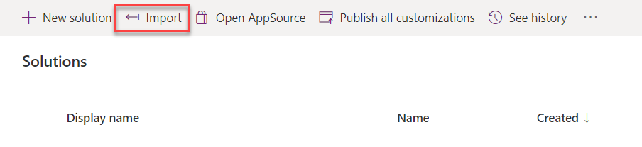

1.  Select **Browse**.

1.  Select the **MyAutomation_1_0_0_1_managed.zip** solution that you exported and then select **Open**.

1.  Select **Next**.

1.  Select **Next** again.

1.  You should be asked to provide a **Location**. Enter **Phoenix** for **Location** and then select **Import**.

	> [!div class="mx-imgBorder"]
	> 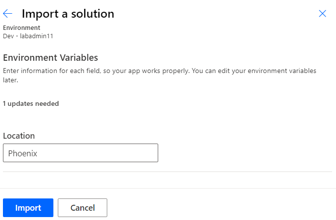

1.  Wait for the import to complete.

1. Open the **My Automations** solution that you created.

1. Open the **Daily weather** cloud flow inside the solution.

1. Select **Edit**.

1. Expand the weather step and then select **+ Add new connection**.

	> [!div class="mx-imgBorder"]
	> 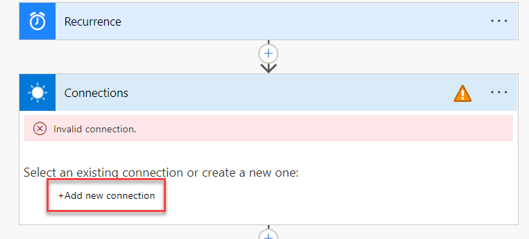

1. Expand the email step and then select **+ Add new connection**.

1. Select **Save** to save the flow and then wait for the flow to be saved.

1. Select the back button next to the flow name.

1. Select the **Turn on** button to turn on the flow.

1. Select **Run** to run the flow.

1. Select **Run flow**.

1. Select **Done**.

1. Select the **App** launcher, right-click **Outlook**, and then select **Open in new tab**.

	> [!div class="mx-imgBorder"]
	> 

1. You should receive the email notification that's sent by the flow. Select to open the email.

   The email should show the weather for Phoenix.

	> [!div class="mx-imgBorder"]
	> 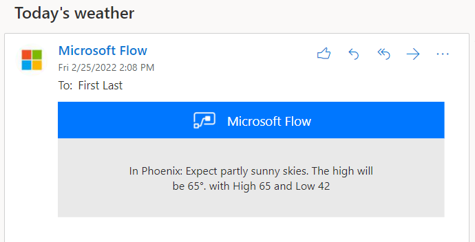
