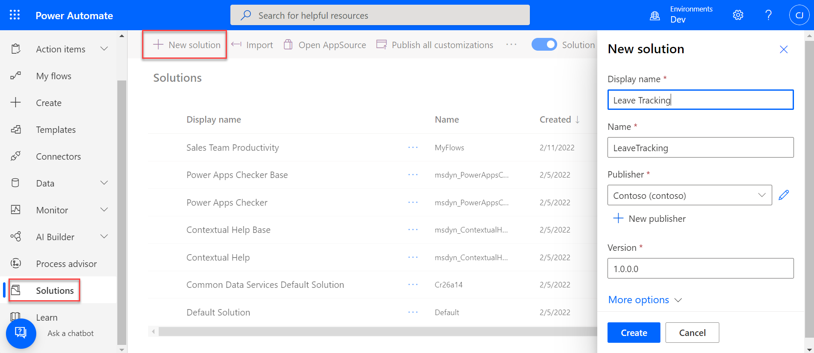
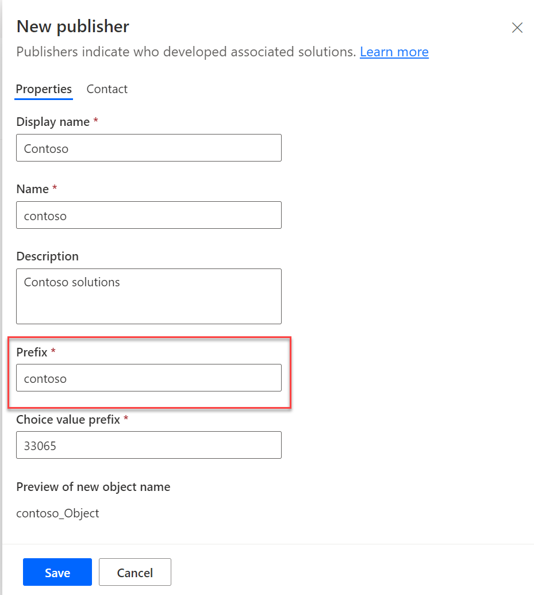
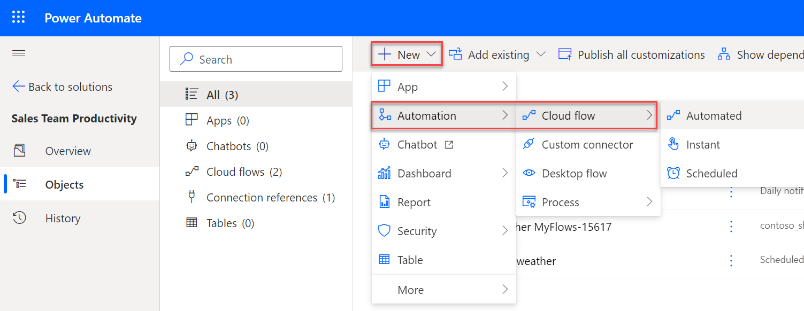
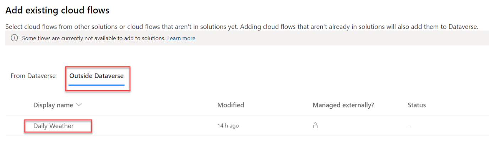
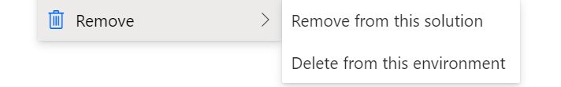

Solutions are the Power Platform mechanism for implementing [Application Life Cycle Management](/power-platform/alm/?azure-portal=true) (ALM) for Power Apps, Power Automate, and Power Virtual Agents. Some of the benefits of using solutions with cloud flows are:

-   Solutions act as a container to make it easier to manage related resources (solution components such as cloud flows and apps) together as a collection.

-   Solutions enable the transport of the collection of resources from one environment to another with a simple export and import actions. These actions can be fully automated eliminating manual deployment steps for cloud flows.

-   Connection references and Environment variables enable solution cloud flows to be less environment dependent. These features of solutions allow unique configurations in each environment the solution is deployed.

-   Solutions can be exported and stored in source control for version tracking. Using source control with solutions supports a single source of truth and improves the ability to manage collaboration on the collection of resources managed by the solution.

Power Automate cloud flows can be added as a solution component along with other resources like Power Apps and Dataverse table definitions. Solutions then act as a container for your components and allow you to transport them from one Power Platform environment to another. Solutions can also be exported and stored in source control as part of your ALM strategy.

You can only create solutions in a Power Platform environment with Microsoft Dataverse provisioned. Dataverse is used to track the components you add to solutions. Dataverse doesn't have to manage your data; you can just use it for managing solutions. New Dataverse environments come with two default solutions, Default and Common Data Service Default Solution. You can also create your own new solutions, and it's recommended that you create your own to contain the related components for your resources. When you create a new solution, you give it a unique name and associate it with a solution publisher. Remember when you choose a name it should represent all the components you plan to add not just the cloud flows. For example, the following shows creating a solution to contain apps and flows supporting Leave Tracking.

> [!div class="mx-imgBorder"]
> 

The solution publisher you choose will be used to identify new components you create in the solution. The prefix is prepended to the name of resources you create in the solution to help uniquely identify them. While you can select one of the two default publishers, it's recommended that you create your own with a prefix set to something that represents your company or product you're building. For example, the following creates a Contoso publisher.

> [!div class="mx-imgBorder"]
> 

## Adding cloud flows to solutions

New cloud flows can be created directly in a solution, or you can also add existing flows. To add directly, start in the solution of your choice and select + New.

> [!div class="mx-imgBorder"]
> 

You can choose Automated, Instant, or Scheduled, and if you aren't sure which one to choose, select any of them, and then select Skip when prompted to specify trigger details. You'll be able to choose the required trigger in the flow designer.

Once you save the flow, the flow definition will be stored in Dataverse and associated with the current solution and the built-in Default solution. A cloud flow can be associated with multiple solutions by using Add existing, but it's important to understand the solution component points to the same flow definition, and they're only references and not independent copies. If you change the flow from any solution in the environment, you see the change from all solutions the flow is associated with. The Default solution is special and allows you to see all the resources in an environment but should only be used for reference. Resources added to other solutions are also automatically associated with the Default solution for reference purposes.

If you create a new solution, you can add existing cloud flows as solution components using the Add existing option. You can Add existing cloud flows that are already in another solution, or flows created outside of a Dataverse solution. When adding one that was already in another solution the definition is already in Dataverse so the Add existing command will associate the flow as a solution component of the new solution too.

When you Add existing cloud flows created outside of a solution, the flow will be converted to store the flow definition in Dataverse. The flow will also be associated with the new solution. After conversion, the flow will only be listed in the solution and not in My Flows. Not all flows created outside Dataverse can be converted. If your flow doesn't show on the following list, check the current [limitations](/powerapps/maker/data-platform/solutions-overview?azure-portal=true#known-limitations).

> [!div class="mx-imgBorder"]
> 

## Removing solution cloud flows

Cloud flows in solutions can be removed from a solution or removed from the Dataverse environment.

> [!div class="mx-imgBorder"]
> 

**Remove from this solution** - This option simply removes the association from the current solution. The cloud flow definition isn't physically deleted. Other solutions that are associated with cloud flow, including Default will still have the cloud flow as a solution component. Using this option for example, you could remove from one solution and add to another to reorganize your solutions.

**Delete from this environment** - This option physically deletes the cloud flow definition from the Dataverse environment. As a result, any solution, including the Default, no longer will include the flow as a solution component because it was deleted. This should only be done when you no longer need the cloud flow.

In this article you learned the basics of adding and removing cloud flows from solutions. While you don't have to use solutions with cloud flows, there are many benefits to using solutions to manage the collection of resources (apps, flows etc.) you're building. In the rest of the module, you'll learn about connection references, environment variables and how to transport solutions between environments.
