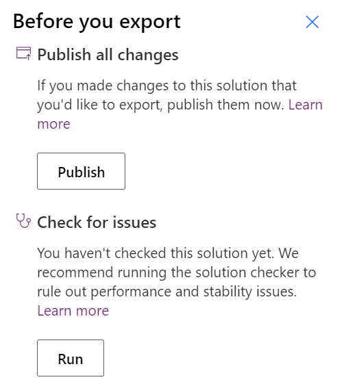
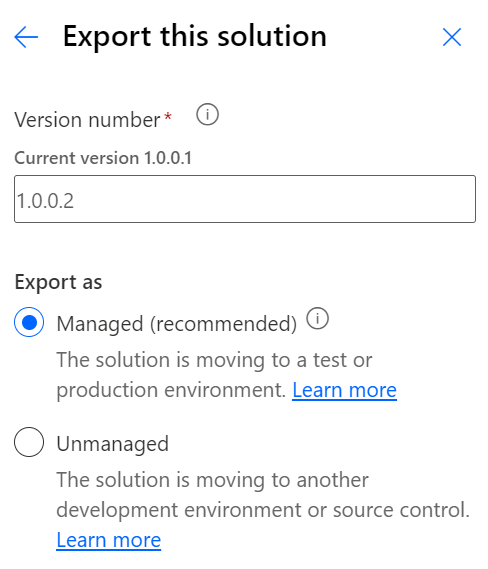
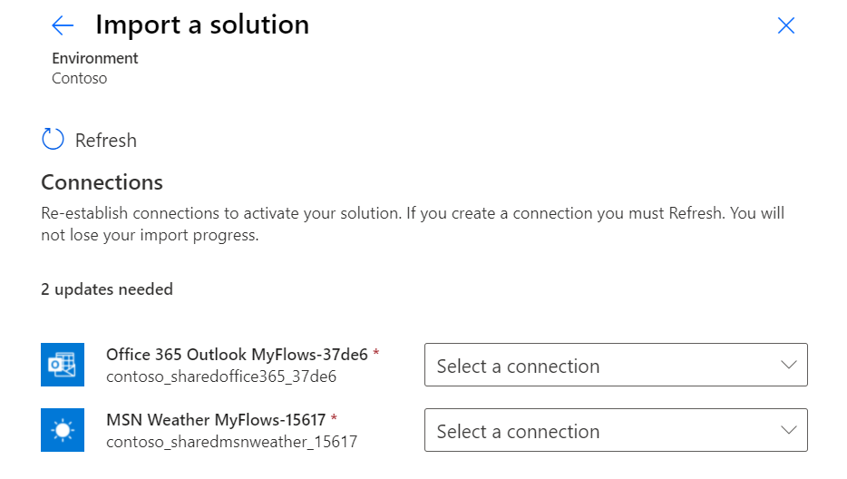
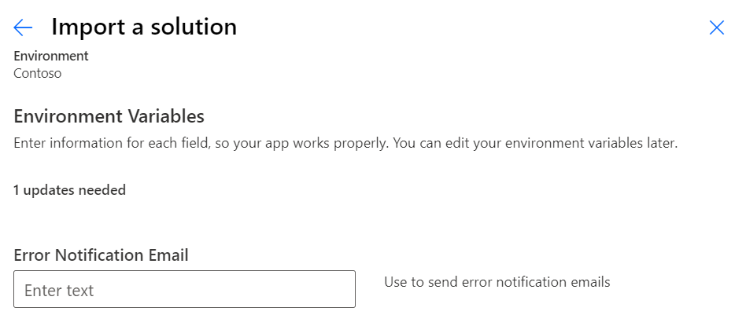

A key benefit of using solutions is the ability to import and export solutions from Microsoft Power Platform environments. This feature enables the following key use cases:

-   Import of an exported solution into other environments

-   Export of a solution for storing in source control

-   On-demand backup of solution components and the ability to restore solution components without restoring full environments

You can export and import solutions manually from Solution Explorer, or you can make importing and exporting automated by using [Microsoft Power Platform Build Tools](/power-platform/alm/devops-build-tools/?azure-portal=true).

## Managed and unmanaged solutions

A solution can be either managed or unmanaged. This designation will determine what you can do with the solution. Use unmanaged solutions in development environments while you make changes to your cloud flows and other solution components. Use managed solutions when you're deploying to an environment that isn't a development environment for that solution. The type of solution is determined by choice when you export, and it becomes active when the exported solution is imported into another environment.

For example, a common practice is to have a development environment with your solution (unmanaged) where you build your cloud flows and other solution components. Then, you would export an unmanaged version and a managed version of your solution when you're ready to publish to your test environment. You can keep the unmanaged solution safe as a backup copy of your work. You can also use tools like [SolutionPackager](/power-platform/alm/solution-packager-tool/?azure-portal=true) or [Microsoft Power Platform CLI](/powerapps/developer/common-data-service/powerapps-cli/?azure-portal=true) to extract the individual files from the exported unmanaged solution and then check them into source control like GitHub or Microsoft Azure DevOps. 

Additionally, you can use the unmanaged solution if you needed to re-create your development environment. For that reason, make sure that you always have an exported, unmanaged solution. When you import into the test environment, the managed version of the solution file will be used. After testing is successful, the same managed version will be imported into production. The key point is that any change to a solution component is only done in the development environment. To help enforce that notion, you can't directly change a managed solution component, which helps prevent accidental changes.

## Export solutions

Whenever you export solutions manually from Solution Explorer, you'll be prompted for some choices. The first choices are **Publish all changes** and **Check for issues**.

> [!div class="mx-imgBorder"]
> 

The **Publish all changes** option isn't required for cloud flows, but is a good idea if you have other solution components. Certain customizations that make changes to the user interface components require that they be published before export.

Check for issues by running an analysis on all your solution components. This analysis is similar to a flow checker, but for all components in your solution, and it'll warn you of issues. 

The second prompt is for a version number and for you to select **Managed** or **Unmanaged**.

> [!div class="mx-imgBorder"]
> 

By default, the version number is incremented whenever you export. Essentially, if you export a managed and unmanaged solution in the same session, they'll have different version numbers but will represent the same version. To avoid this situation, you can manually adjust the version to be the same for both versions.

For the **Export as** option, we recommend that you do the export twice, once for managed and once for unmanaged. Make sure that you have an unmanaged copy exported when you export a managed solution.

## Import solutions

To deploy a solution to another environment, you will import an exported solution file. You can import the managed or unmanaged solution file.

Importing an unmanaged solution should target development environments. After the import has completed, the solution components will have been merged into the environment. You won't be able to undo the action, and removing the solution will only remove the solution and not the solution components that are merged into the environment. If the solution already exists in the environment, an import will update and overwrite existing matching resources. All solution imports are additive and any solution component that's not in the new version will still exist in the environment after an update import completes. Make sure that you don't accidentally overwrite recent work since the last export and that you only import unmanaged solutions into intended environments.

Importing a managed solution should target non-development environments, such as test and production. Unlike unmanaged solutions, when you import a managed solution, it isn't merged the same way but creates its own customization layer to track and manage the changes that are made to the environment. Solution layering allows for tracking of changes that are made to the solution components of your managed solution. If you import an update to a managed solution, the default behavior is to process the import as an upgrade. The updated solution version is imported and then the older version is removed. When the older version is removed, solution components that are no longer in the new version will be removed from the environment. For example, if you deleted a cloud flow in development, when the newer version was imported to the test environment, the deleted flow would be removed from the test environment also. Removing a managed solution is like an uninstall; all solution components that aren't referenced by another solution will be removed, including their data. You should avoid manually updating cloud flows directly in environments where the solution is deployed as managed because it creates an unmanaged change that will prevent future updates. For example, if you fix a cloud flow in production, the next deployment of the import of a new version works well; however, your production cloud flow won't be updated. You can identify and resolve this issue by using the [solution layer management features](/powerapps/maker/data-platform/solution-layers/?azure-portal=true). You can also avoid this problem by only making changes in your development environment.

For either type of solution import, you'll be prompted to update any connection references that weren't previously established.

> [!div class="mx-imgBorder"]
> 

Additionally, if environment variables are in the solution that don't have a value, you'll be prompted to provide a current value for this environment.

> [!div class="mx-imgBorder"]
> 

Solution imports and exports will run in the background, and you'll be notified of their completion.
