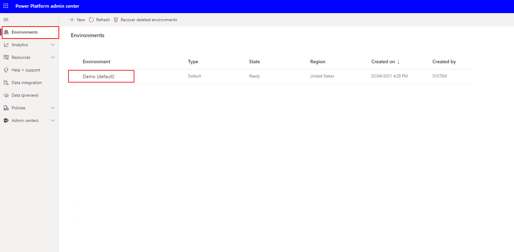
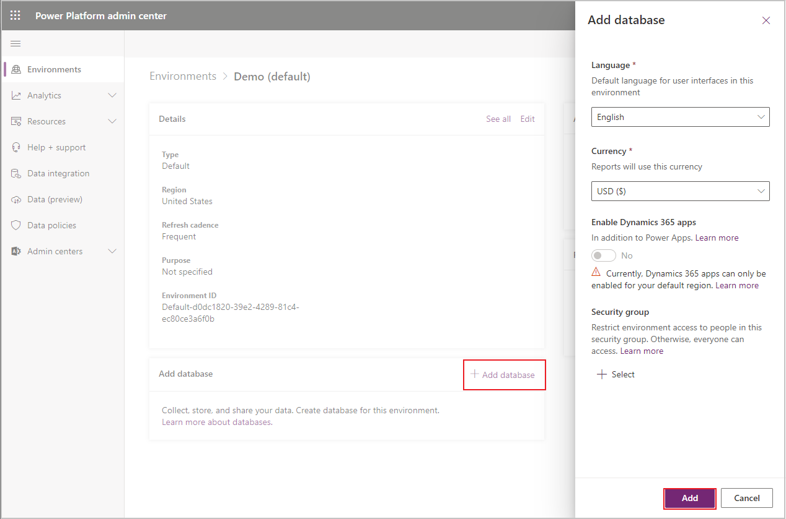
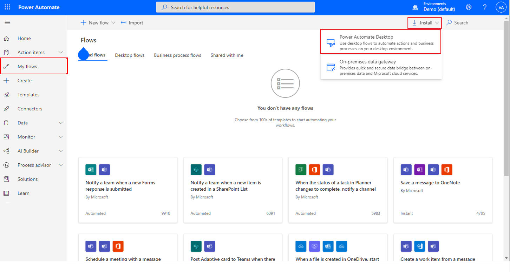
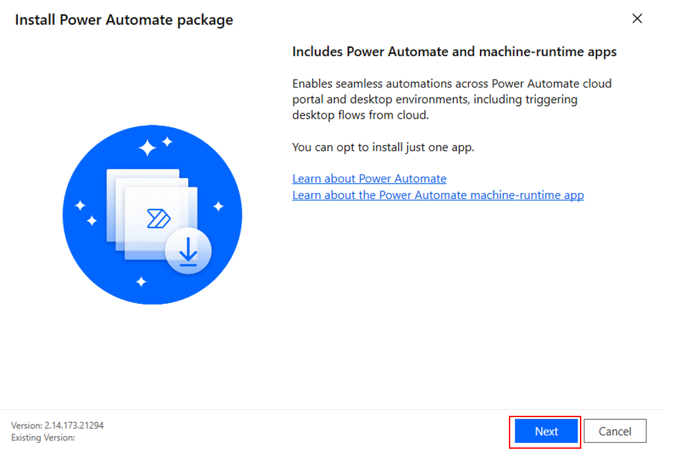
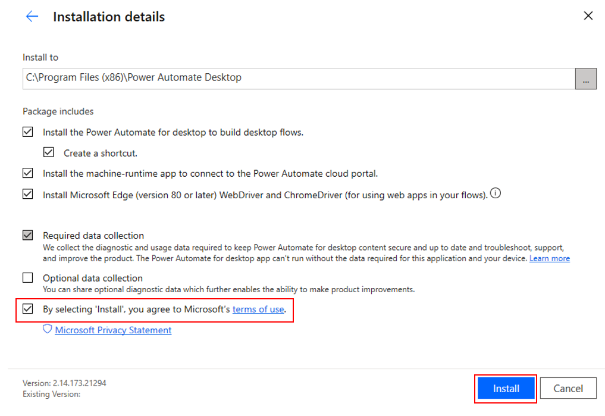
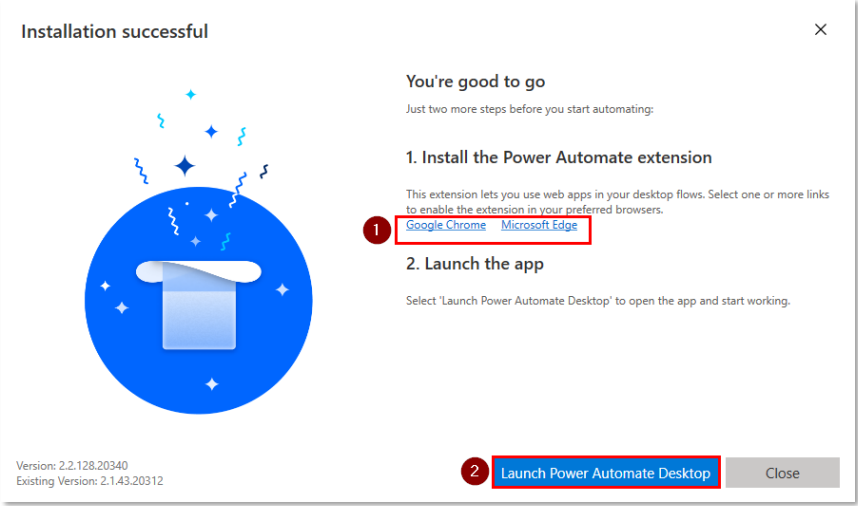

Creating and running automation systems in Power Automate requires you to have access to make changes to the environments in your tenant, and ensure you have the appropriate licenses and permissions. If you do not already have admin access to a valid tenant, you may want to take a few minutes and [start a free trial](https://www.microsoft.com/microsoft-365/enterprise/office-365-e3?activetab=pivot%3aoverviewtab&azure-portal=true). In addition, you will need a Power Automate user plan with attended RPA license to complete this module. You can sign up for a free trial [here](https://flow.microsoft.com/pricing/?azure-portal=true) if you don't already have this license.

If you completed the module Build your first Desktop Flow, feel free to skip to the next unit.

## Create a trial environment with database

Once you are logged in to a valid tenant, navigate to the [admin center](https://admin.powerplatform.microsoft.com/environments/?azure-portal=true). We will need to create a trial environment with a database. Select **Environments** and choose your automatically created environment, the **default**.

If you are using an existing tenant rather than creating a trial for this exercise, you can use the default environment or create a new one to keep it separate from your existing solutions.

> [!div class="mx-imgBorder"]
> 

Now that you are in your chosen environment, add a database by clicking **Add database**. In the subsequent dialog box, feel free to specify the requested values, but you can simply keep the defaults and press **Add**. You may be prompted to sign in again before creating your database. Upon doing so, your database should provision appropriately.

> [!div class="mx-imgBorder"]
> 

Creating your database may take up to one minute, but afterward, you are good to continue to the next steps!

If you are using a trial environment, consider setting up a profile in your browser to prevent you from being signed out of your existing Microsoft Account.

## Software installation

The following exercises will require various software to be installed on your computer. The following steps will guide you through the download and installation of Power Automate Desktop, required extensions, and the Contoso Invoice App.

If you have already installed Power Automate Desktop, ensure you are running the latest available version.

### Power Automate Desktop

Navigate to [Power Automate](https://flow.microsoft.com/?azure-portal=true) and sign in with the account you used to create your environment and database. Once there, click **My Flows**, **Install**, and **Power Automate Desktop**.

> [!div class="mx-imgBorder"]
> 

Once the download completes, click the file to open and run the installer. Choose **Next** and on the subsequent screen, check the final box and click **Install**. This will install the Power Automate Desktop and the browser extensions for Microsoft Edge and Google Chrome.

> [!div class="mx-imgBorder"]
> 

> [!div class="mx-imgBorder"]
> 

Once the installation is complete, click on the link of your preferred browser and follow the instructions to enable the extension. Once the extension is enabled, you can launch the Power Automate Desktop App.

> [!div class="mx-imgBorder"]
> 

After launching the app, sign in using the account which you used to set up your environment and database.

## Contoso Invoice App

One of the major benefits of using desktop flows is the ability to perform actions on desktop applications. For the flow you will create, you will use an invoicing application to explore the concepts and actions available to you in desktop flows. After completing the module, you can use what you have learned to run desktop flows on your own applications and automate existing processes.

Download the Contoso Invoice App. Then open the application and familiarize yourself with all the elements.

If you don't have a desktop app created to define inputs and outputs, do so now by following this module or on your own.
