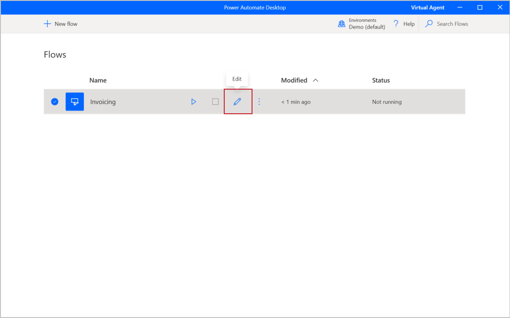
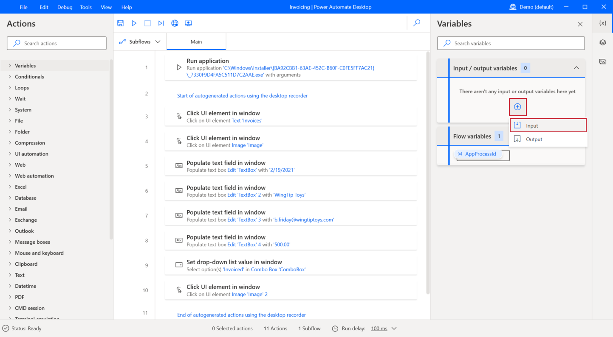
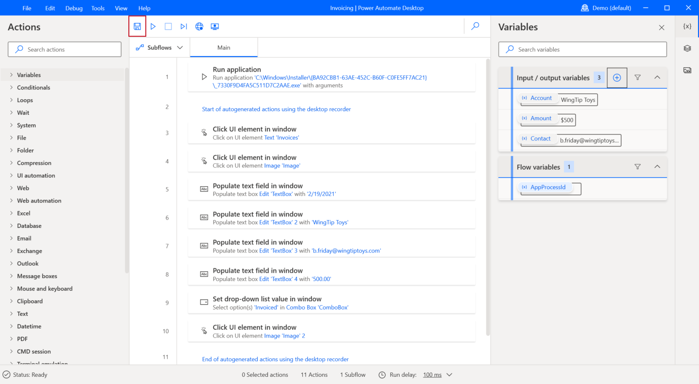

Variables allow information to change or be variable for every run of your flow. If you're using a flow for any type of data entry, you'll need variables to define the fields that you need to enter. Input variables are information that you enter into the flow before or during the run. Output variables are outcomes that the flow gives back to you after the run. Power Automate for desktop provides you with the ability to receive input values from cloud flows and return values by using output variables. As a result, your automations can be seamlessly integrated. To define input variables, begin in your Power Automate for desktop app and then open the designer by editing a desktop flow.

> [!div class="mx-imgBorder"]
> 

When you're in the designer, select the plus (**+**) icon under the **Input/output variables** section and then select **Input**.

> [!div class="mx-imgBorder"]
> 

The **Variable type** can be **Input** or **Output**. This example uses input; output variables will be covered later. The **Variable name** will be used and referenced inside the desktop flow. The **External name** will be used outside the desktop flow, and the **Description** field will give you more information on the variable, which can be especially helpful if you have many different input and output variables in the same desktop flow. The **Default value** allows you to define a value if no input is provided. The **Data type** field helps to further define your variable and how Power Automate will handle it. For example, using the data type of **Sensitive text** will encrypt the values, which helps offer security on sensitive data. You can use this data type for passwords to open secure programs or for other personal or private information. You can set your own values for your variable, or you can use those that are displayed in the following screenshot. Select **Create** to finish your variable.

> [!div class="mx-imgBorder"]
> 

Continue to select the plus (**+**) icon and then create more input variables for your flow. If you are using the desktop flow that is built on the Contoso Invoice app, define two more variables based on the following values.

**Variable 2**

- **Variable type** - Input

- **Variable name** - Contact

- **Data type** - Text

- **Default value** - `b.Friday@wingtiptoys.com`

- **External name** - Contact email

- **Description** - Contact email

**Variable 3**

- **Variable type** - Input

- **Variable name** - Account

- **Data type** - Text

- **Default value** - WingTip Toys

- **External name** - Account Name

- **Description** - Name of the account being invoiced

After you have finished defining your input variables, select **Save**.

> [!div class="mx-imgBorder"]
> 

Now that you've defined the input variables, you can set their use in the desktop flow.
