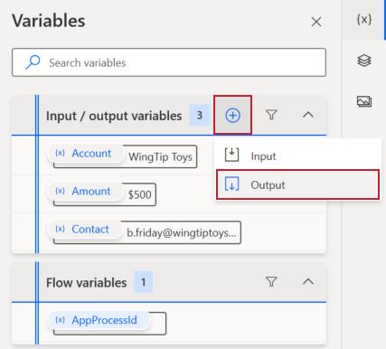

The main difference between input and output variables is where they're defined. Input variables are defined before the flow runs and have a default value in case they aren't defined. Contrarily, output variables are defined along the process of the flow, whether it is an invoice number after the desktop flow enters and saves the invoice, or whether it's a total or ID field. Many scenarios occur in which you will need to enter information and will also need to read information in automated processes.

To define an output variable, select the plus (**+**) icon beside the **Input/output variables** section and then select **Output**.

> [!div class="mx-imgBorder"]
> 

Fewer parameters are required for you to define as part of an output variable. The reason is because the information is being pulled from the process of running the flow. You don't need a default or to define the data type. For the values that do require definition, you can use values that are relevant to your solution, or if you're using the Contoso Invoicing app, you can use the values that are shown in the following screenshot.

> [!div class="mx-imgBorder"]
> 

This example only requires one output variable, but you can define others as your process dictates.

Now that you know how to define output variables, you can continue to the next unit, where you'll learn how to use them.
