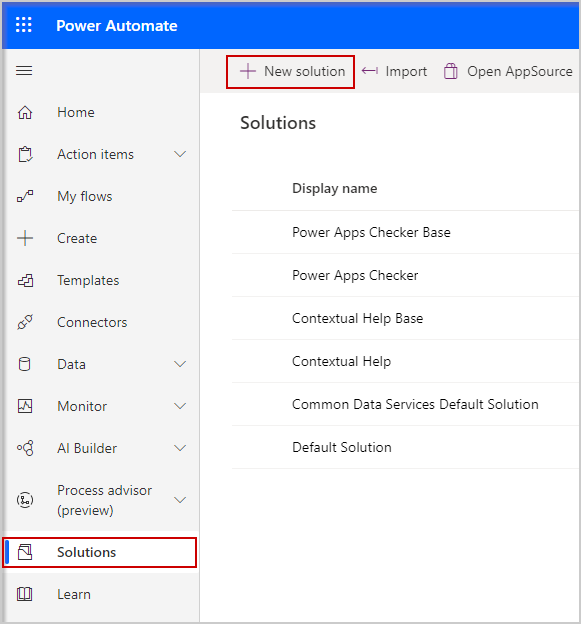
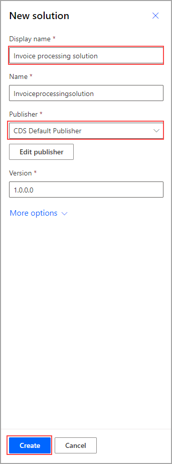
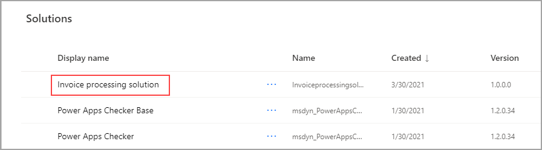
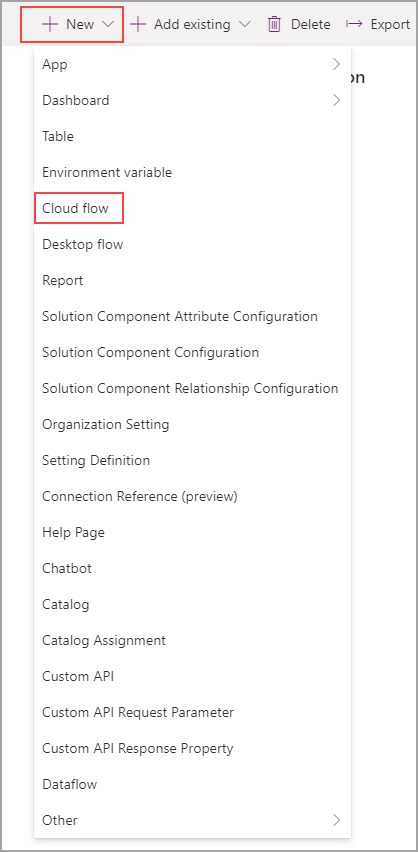
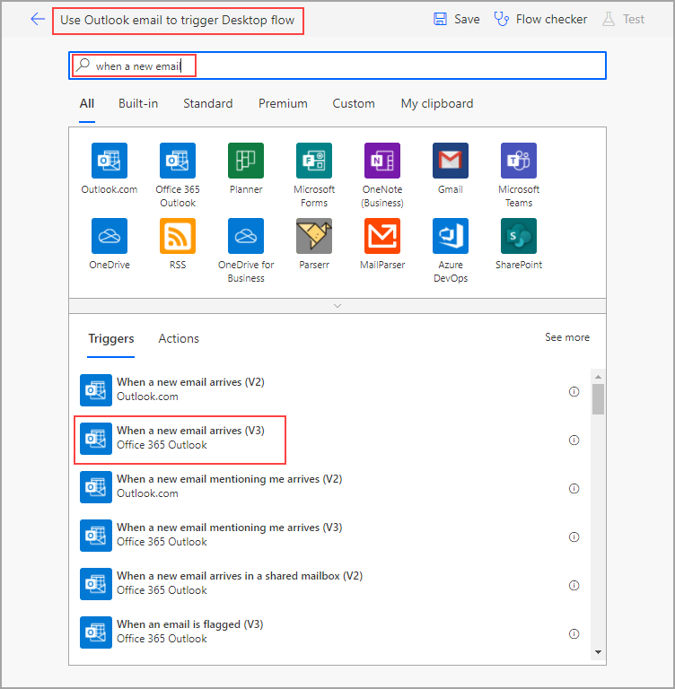
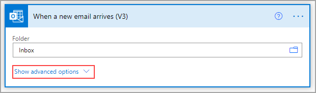
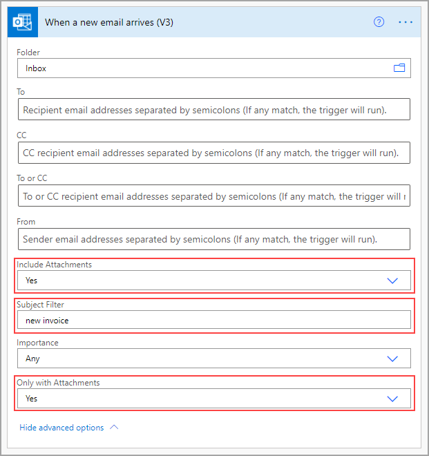
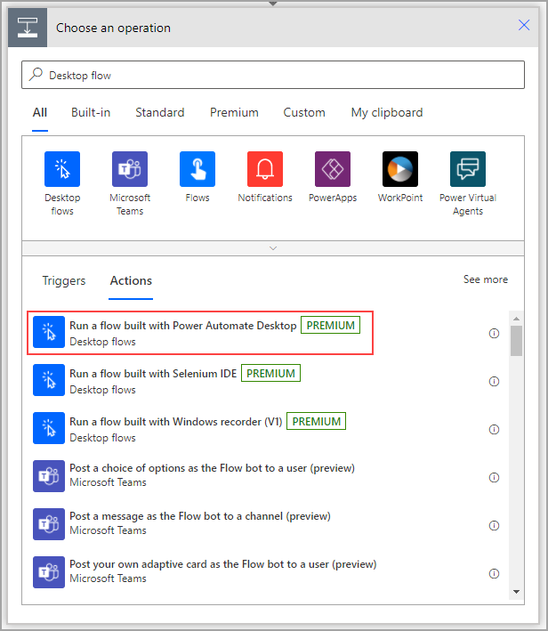
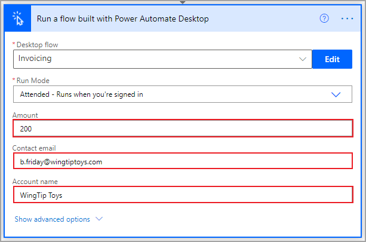

Now that you have a desktop flow, you are ready to create a solution in Power Automate. Solutions are groups of apps and flows that are packaged together to help you better organize your data. In addition to having the ability to logically group your flows and apps by topic or project, you can import or export entire solutions rather than doing so for each flow. Flows that are built inside solutions are called solution-aware flows. You can't move a non solution-aware flow into a solution, so if you think you will need a solution, start with one from the beginning to avoid rebuilding your flow. Go to powerautomate.microsoft.com to get started, select **Solutions** on the left navigation menu, and then select **New solution**.

> [!div class="mx-imgBorder"]
> 

Set the display name for your solution. In this case, the display name is **Invoice processing solution**, but you can choose whatever fits your needs. Notice that the name fills in automatically as you set the display name. Solutions are built on Microsoft Dataverse and the names can't use spaces, which allows for easier calling inside of other apps and solution-aware flows. Set the publisher as **CDS Default Publisher** and then select **Create**.

> [!div class="mx-imgBorder"]
> 

After you have selected create, the **Solutions** screen will populate with your new solution. Select the name (in this case **Invoice processing solution**) to open it.

> [!div class="mx-imgBorder"]
> 

This screen is where you will create and edit flows that are specific to this solution. To create a new solution-aware flow, select **New** and then **Cloud flow**.

> [!div class="mx-imgBorder"]
> 

Rename your flow. The following flow has been named **Use Outlook email to trigger a Desktop flow**, but you can choose whatever name you want. Search the actions to find **When a new email arrives (V3)**.

> [!div class="mx-imgBorder"]
> 

Always use the latest version of the action that you are seeking, which will ensure that you have access to new features that have been released.

You might need to wait a moment for Outlook to sign in. When you see the **Folder** option, which should automatically be populated with **Inbox**, select **Show advanced options** and ensure that **Include Attachments** and **Only with Attachments** have **Yes** selected. In the **Subject Filter** field, enter **new invoice**.

> [!div class="mx-imgBorder"]
> 

> [!div class="mx-imgBorder"]
> 

Select **New step** and then search for and select the **Run a flow built with Power Automate Desktop** action.

> [!div class="mx-imgBorder"]
> 

If you haven't already configured your gateway connection, use the **Gateway name** drop-down menu to select the appropriate gateway.

If you don't see your gateway, you might need to delete this step and re-create it to refresh the list. If your gateway still doesn't appear, you might need to restart the gateway on your PC and then retry the process.

The next two fields request your credentials to sign in to your computer. If you are unsure what to put in the **Domain and username** field, you can open a command prompt window by opening the **Start** menu, entering **CMD** in the search box, and then pressing the **Enter** key. When the command prompt opens, enter **Set user** and then press the **Enter** key.

Several lines of code will appear. Separate the **user domain** and the **username** with a backslash (\\), as shown in the following screenshot. Select **Create**.

> [!div class="mx-imgBorder"]
> 

After you have connected to your desktop, Power Automate will prompt you for information that is specific to your desktop flow. Use the drop-down menu to select the name of your desired flow (in this case **Invoicing**), and then in the **Run Mode** drop-down menu, select **Attended - Runs when you're signed in**.

> [!div class="mx-imgBorder"]
> 

When you have chosen your desktop flow, input variables that you have defined in your flow will be requested. The following screenshot shows that the invoice flow is requesting an **Amount**, a **Contact email**, and an **Account name** to feed into the Contoso Invoicing app. Put some placeholders in these fields for now, though you can use information from the email or attachments later. You can also use the output variables that are provided by the desktop flow in later actions. **Save** your flow.

> [!div class="mx-imgBorder"]
> 

Now that you have configured your desktop connection and created a cloud flow to trigger your desktop flow and provide inputs, you can test that everything is functioning properly.
