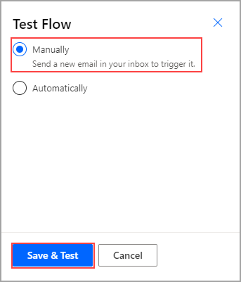
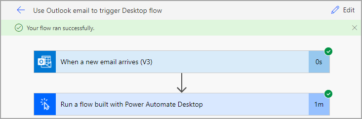

The simplest way to build robotic process automation (RPA) is to take one small step at a time and build and test that step. First, you created the desktop flow to perform actions on the invoicing app. Next, you created the input and output variables, or the information that would change every time that the flow ran. Then, you configured a gateway and built a cloud flow that will allow you to connect to the other resources that exist in your organization. Finally, you have created a solution and a trigger starting in Outlook. Now, you will test these new steps to ensure that everything is performing as expected.

Select **Test** in the upper-right corner of the screen and then select **Manually > Save & Test**.

> [!div class="mx-imgBorder"]
> 

Open the Power Automate Desktop application and send yourself an email with an attachment and the subject line "New invoice." The flow will appear with indications on each step to show you where your flow is in the process. Avoid interacting with your mouse or keyboard while the flow is running because it might interrupt the process. When the testing is complete, the following screen will appear to indicate that your flow ran successfully.

> [!div class="mx-imgBorder"]
> 

Now you have completed the process to build a solution with a cloud flow that is triggered with Outlook.
