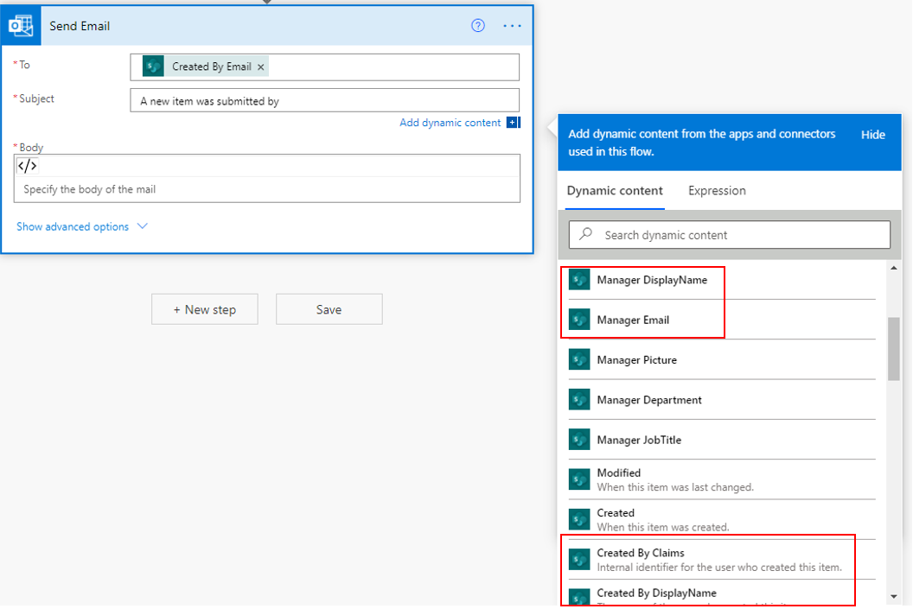

By using the **Office 365 Outlook** and **Mail** connectors in Power Automate, you can send emails for workflows; however, be aware that emails are sent as if a user has sent them.

As shown in the following screenshot, the **To** field can be populated by entering only the user's email address. This workflow is applicable when an email notification is expected to be sent to and from users.

> [!div class="mx-imgBorder"]
> 

Additionally, you can create flows that send email notifications directly from `SharePointOnline.com`. You can use the **Send an HTTP request to SharePoint** action to create emails that come directly from SharePoint Online through the `no-reply@sharepointonline.com` mailbox.

### Video

The following video shows an email notification that is sent directly from SharePoint when a list in the site is used to reserve conference rooms for meetings.

> [!VIDEO https://www.microsoft.com/videoplayer/embed/RWCP6W]
