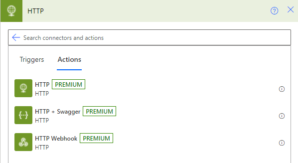

The SharePoint connector includes actions that allow you to create, edit, and delete items without using a single line of code. However, this HTTP method helps make it easier for you to filter and identify the items in a single action.

The **Send an HTTP request to SharePoint** action in the SharePoint connector is the primary focus of this module. A premium HTTP connector also exists, which you can use to perform similar actions.

> [!div class="mx-imgBorder"]
> 
