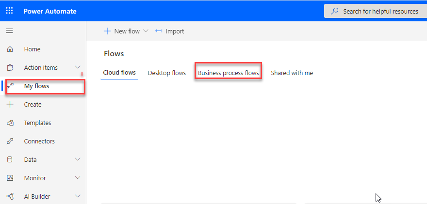

A business process flow is a series of ordered work steps that a user completes within a business process. In Microsoft Power Automate, a business process flow is composed of a series of discrete stages that leads a user along a path toward process completion. Each stage contains one or more columns, called data steps, that you should complete before proceeding to the next stage in the business process flow.

A business process flow visually guides a user through stages within a process and shows progress toward process completion. A user can also see which stages that they have completed and which stages that they still need to complete within an instance of a process.

Business process flows can be configured to require users to enter certain columns,  data steps, before completing the stage. If needed, you can also allow users to jump stages. All data collected while you are completing a business process flow is stored in one or more tables in Microsoft Dataverse.

> [!NOTE]
> To complete this exercise, you will need access to an account that has permission to create tables and columns in Dataverse and you need a Power Apps or Dynamics 365 license. Ask your Power Platform administrator for proper permissions or sign in and create a personal Power Apps and Power Automate development environment by using the Power Apps Community Plan (which is free). Sign up by accessing the Power Apps Community Plan page.

The following illustration shows a simple business process flow as shown as a component of a model-driven solution in Power Apps.

> [!div class="mx-imgBorder"]
> 

Business process flows are created and managed by using Power Automate, and they are available for out-of-the-box tables and for your own custom tables. Microsoft has many prebuilt business process flows, or you can create your own. Additionally, a table can have none, one, or many business process flows associated with it. Business process flows are customizable to fit many organizational needs.

> [!TIP]
> Business process flows are meant to guide users through steps that are required to complete a business process. You must have a valid Power Apps Dynamics 365 license or a valid Power Apps license to create or use a business process flow.
