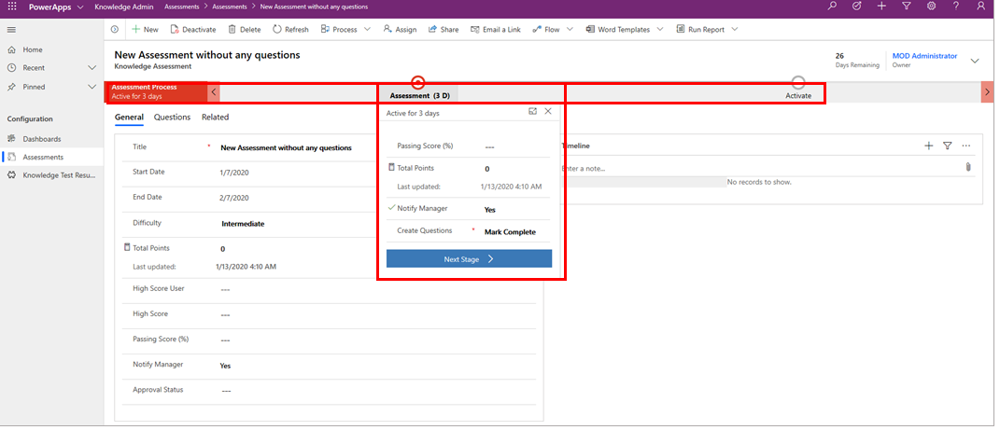

A Business Process Flow is a series of ordered work steps a user
completes within a business process. In Microsoft Power Automate, a
Business Process Flow is composed of a series of discrete Stages that
lead a user along a path towards process completion. Each stage contains
one or more fields (called data steps) that should be completed before
proceeding to the next stage in the Business Process Flow.

A Business Process Flow visually guides a user through stages within a
process and shows progress towards process completion. A user can also
easily see which stages they have completed and which stages still need
to completed within an instance of a process. Business Process Flows can
be configured to require users enter certain fields (data steps) before
completing the Stage and if needed, you can also allow users to jump
stages. All of the data collected while completing a Business Process
Flow is stored in one or more entities in Common Data Service.

The illustration below shows a simple Business Process Flow with two
stages for adding questions to a survey. Also note the Business Process
Flow is shown as a component of a model driven solution in PowerApps.

Business Process Flows are created and managed using Microsoft Power
Automate (formerly called Flow) and they are available for
out-of-the-box entities and even your own custom entities. Microsoft has
many pre-built Business Process Flows or you can create your own.
Additionally, an entity can have none, one, or many business process
flows associated with it. Business process Flows are very customizable
to easily fit many organizational needs.

> [!TIP]
> Business Process Flows are meant to guide users through steps required to complete a business process.
