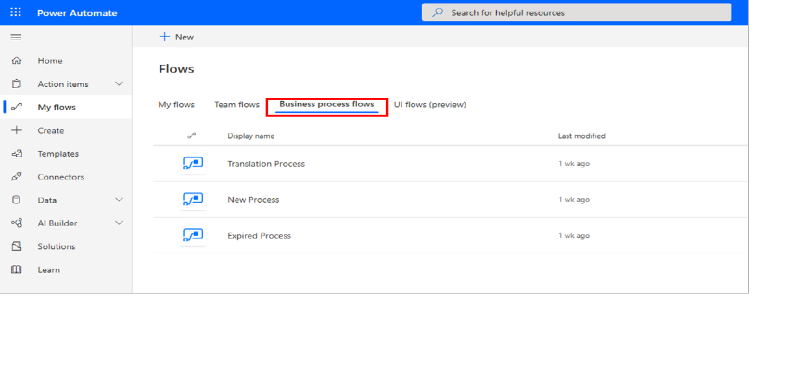
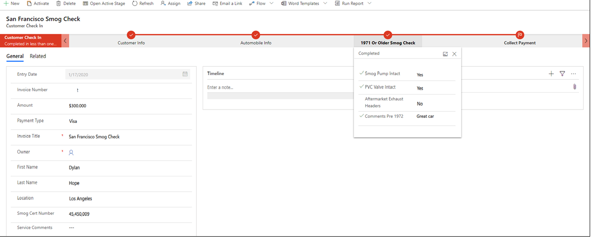

A business process flow is a visual guide that is meant to help users
complete a business process using a set of predefined stages. There is
no time limit on how long a business process can run. There are no
limits on how long a stage can be open. All data associated with the
business process flow can ONLY be stored in one or more entities in
Common Data Service and you cannot associate a business process flow
with another data source "behind" it. 

Common Data Service has many different out-of-the-box business process 
flows available that can be used as is, or modified to fit your needs.

A Power Automate flow does not have any visual components like a
business process flow. Power Automate flows can be configured to work
with many different data sources and a flow can connect to many
different data sources within the same flow. A flow can be configured to
"time-out" if not completed in a certain time and can be triggered to
move between steps based upon data or user interaction. Flows support
complex logic and looping and a Power Automate flow can call
another Power Automate flow as needed.

### Business process flows value to organizations 

Business process flows allow organizations to easily and quickly
standardize how processes are completed and what data is collected at
each stage. Business process flows support logical branching so they can
be used to standardize many common business processes within an
organization.

business process flows offer the following benefits:

-   Improved outcomes

-   Consistent stages and work steps across all instances of the process

-   Improved data collection and reporting

-   Decreased time to complete the process

-   Predictable outcomes

Business process flows are easy to set up and administer. Business
process users close to business operations and processes can easily
create new business process flows or modify out-of-the-box business
process flows using Power Automate. 

Business process flows can be customized based upon security roles 
allowing access to the appropriate stages and steps based upon a 
security role. Finally, the process of each instance of a business 
process flow can be monitored and the data from the process flow can 
be used in Power BI dashboards and reporting for simplified administration.

### Business process flows and the larger Power Platform

business process flows are deeply integrated with the Microsoft Power
Platform. They are created, customized, and managed using Power
Automate. You can manage or create new business process flows by
launching Power Automate and selecting the business process flows under
My Flows in Power Automate as shown below.

They can be launched as a component of a model-driven Power App or a stand-alone 
application within Power Automate (called an immersive business process flow) 
as shown below.

As mentioned previously, all data associated with a business process
flow is stored in one or more Common Data Service entities (custom or
standard). You could launch an instant Power Automate flow in
conjunction with a business process flow to store data outside of Common
Data Service if needed. Finally, you can easily create Power BI
dashboards from the data collected within the business process flow.

As you have now learned, business process flows are deeply integrated
within the Microsoft Power Platform and offer powerful ways to
improve how you manage common business processes.