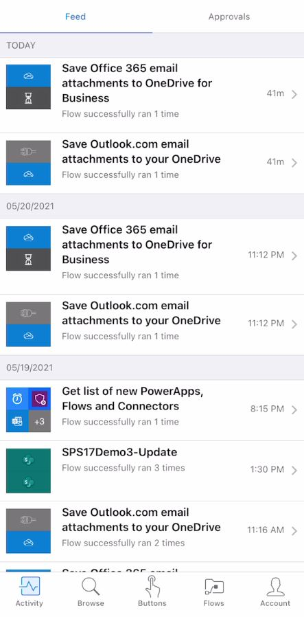

Both the maker and the user of the flows will need the Power Automate app on their smartphones. The maker can build the flow directly in the app and the user needs the app to use it.

### Download, install, and sign in to the mobile app

Follow these steps to download, install, and sign in to the mobile app:

1. Go to the **App Store** of your smart phone or tablet and search for
    **Power Automate**.

   > [!div class="mx-imgBorder"]
   > 

1. Download the app.

1. Sign in with your Microsoft 365 credentials.

### Go to the Buttons tab

When opening the Power Automate mobile app in your smartphone, you'll see the top horizontal pane and the
bottom pane. The top pane contains the **Feed** and **Approvals** options. By
default, **Feed** is selected. The bottom pane contains the
**Activity**, **Browse**, **Buttons**, **Power Automates**, and
**Account** options. By default, **Activity** is selected.

On the bottom pane, select the **Buttons** option to see all the existing
buttons that you've created.

> [!div class="mx-imgBorder"]
> 

### Explore the Buttons tab

The **Buttons** tab will display all the existing buttons that you've
already created. This tab is where you select the button and
trigger the flow. Each button will have an ellipsis (**...**) on its
bottom right that you can select to share the button.
