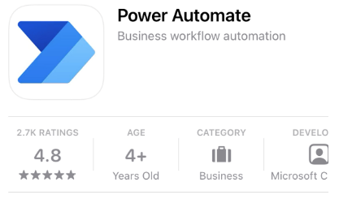
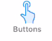

### Download, install and login into the mobile app

-   Go to the **App Store** of your smart phone or table and search for
    **Power Automate**.

    

-   Download the app.

-   Login using your Office 365 credentials.

### Navigate to the Buttons tab

Opening the app, you will see the top horizontal navigation and the
bottom. The top navigation contains **Feed** and **Approvals**, by
default **Feed** is selected. The bottom navigation contains
**Activity**, **Browse**, **Buttons**, **Power Automates** and
**Account**. By default, **Activity** is selected.

In the bottom navigation, you can click on **Buttons** to see all the existing buttons you have
created.

 

### Explore the Buttons tab

The button tab will show you all of the existing buttons you have
already created. This is where you come to click on the button and
trigger the flow. Each button will have **...** or ellipses to its
bottom right to share the button.