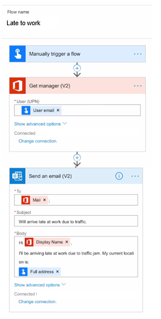

Trigger tokens are data points that are known and available to the
device on which the button flow is running. These tokens are dependent
on factors such as time and the geographic location of the device at a
given moment.

When you run a flow from a virtual button on a smart phone, the date,
time, and the current address where the phone is located are
automatically available for use. You can use these trigger tokens to
build useful flows that will minimize repetitive tasks such as providing
your location to someone or tracking how much time you spent on a
particular job or service call.

The following list describes the button trigger tokens that are available for
you to use when creating your button flows.

| Parameter        | Description                                                                     |
|------------------|---------------------------------------------------------------------------------|
| City             | The city in which the device that's running the flow is located.                |
| Country/Region | The country/region in which the device that's running the flow is located.      |
| Full address     | The full address where the device that's running the flow is located.           |
| Latitude         | The latitude in which the device that's running the flow is located.            |
| Longitude        | The longitude in which the device that's running the flow is located.           |
| Postal Code      | The postal code in which the device that's running the flow is located.         |
| State            | The state in which the device that's running the flow is located.               |
| Street           | The street on which the device that's running the flow is located.              |
| Timestamp        | The time in the area where the device that's running the flow is located.       |
| Date             | The date in the area where the device that's running the flow is located.       |
| Username         | The username of the person who is signed in to the device that's running the flow.      |
| User email       | The email address of the person who is signed in to the device that's running the flow. |

Trigger tokens provide you with rich functionality to add to your flow
when you create a button. Consider a scenario where you want to
send a notification email to let your manager know that you'll be late to work.

The prerequisites for this example are a Microsoft account with access to Microsoft Power Automate.

The following steps can help you create a Microsoft Power Automate mobile app for
your Android or IOS smart phone.

1.  In your Microsoft Power Automate app, select the **Flows** icon, which is available at the bottom of the app. Select the plus icon (**+**) in the upper right.

1.  You should see a menu option slide up from the bottom. Select the **Create from blank** option.

1.  In the **Connectors** field, select the **Flow button for mobile** option. If you don't see the option, then search for it by using **Search all connectors and triggers** and then select it.

1.  In the **Manually trigger a flow** trigger, select **+ Add an input**. Select **Text** by selecting **Input**, deleting Input, and then entering **Reason**. Select **Done** in the upper right of the page.

1.  Select **+ New step**.

1.  Select **Add an action**.

1.  In the **Connectors** field, select the **Office 365 Users** option. If you don't see the option, then search for it by using **Search all connectors and triggers** and then select it.

1.  Select **Office 365 Users Get Manager (V2)**.

1. Enter your email address in the **User (UPN)** field.

1. Select **+ New step**.

1. Select **Add an action**.

1. In the **Connectors** field, select the **Office 365 Outlook** option. If you don't see the option, then search for it by using **Search all connectors and triggers** and then select it.

1. Select **Office 365 Outlook Send an email (V2)**.

1. Select **To**. In the **Get manager (V2)** field, select **See more** and then **Mail**. Select **Done**.

1. In the **Subject** line, enter **Will arrive late for work due to traffic**. Select **Done**.

1. Select **Body**, enter **Hi**, and then add a space. Then, in the **Get Manager (V2)** field, select **See more** and then select **Display Name**.

1. Select **Return** to take the cursor to the next line and then enter, **I'll be arriving to work late due to a traffic jam. My current location:** 

1. Select **Return** to take the cursor to the next line.

1. In the **Manually trigger a flow** field, select **See more**. Select **Full address** and then select **Done**.

1. Give your flow a name such as **Late to work** and then select **Create** in the upper right of the page.

   Your flow should resemble the following image.

	

1. When you select the **Buttons** option that is available on the bottom of the page, you should see a circular button called **Late to work**. When you select the button, you can add the **Reason** and then select **Done** in the upper right of the screen.

1. Select **Done** to be redirected to the **Buttons** screen.
